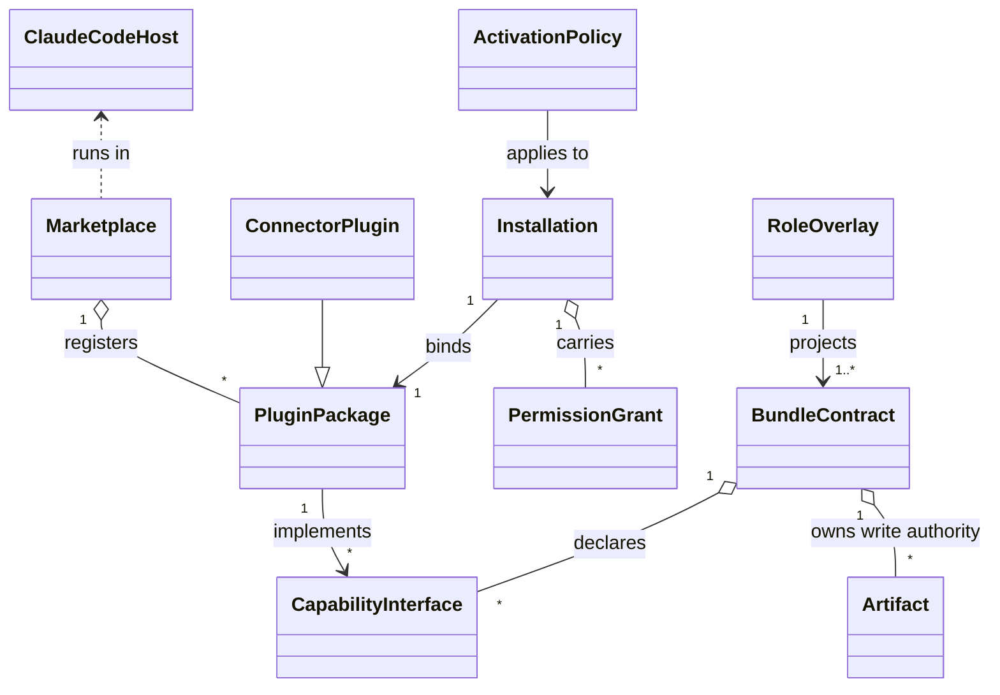
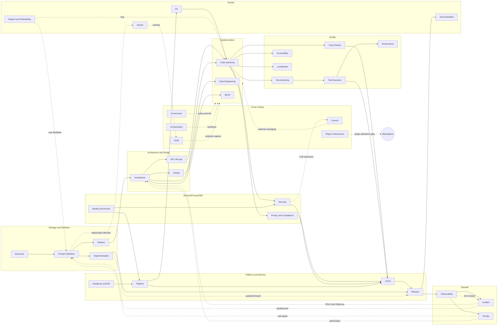

# ARCHITECTURE.md

**Status:** Pass A output — the load-bearing contract for the AI Agent Team marketplace for Claude Code.
**Downstream consumers:** Pass B (`PLUGIN-SPECS.md`), Pass C (`GOVERNANCE.md`).
**Audience:** Single-org internal marketplace. Claude Code is the primary plugin format. Multi-agent portability is aspirational only.

---

## 1. Design Principles

- **Claude Code native.** Built on `.claude-plugin/plugin.json`, `.claude-plugin/marketplace.json`, skills, subagents, MCP/LSP servers, slash commands, hooks, monitors, and managed settings. No OCI/WASI/custom registry reinvention.
- **Bundle Contracts, not packages.** Bundle Contracts name authoritative artifacts and capability interfaces. Plugin Packages are concrete implementations. Multiple plugins MAY compete on the same interface.
- **Artifact-write-and-decision-authority disjointness.** One bundle owns each authoritative artifact's write path and decision authority. Shared reads, shared connectors, and competing providers are permitted.
- **Platform services are non-bypassable.** Audit append, permission enforcement, secret brokering, schema validation, artifact CAS writes, mutable-reference writes, event delivery, and workflow durability are platform — never bundle-owned.
- **Contract-first handoffs.** Every artifact crossing a bundle boundary is wrapped in an `ArtifactEnvelope` with explicit state, data classes, provenance, and signature.
- **Least privilege; explicit blast radius.** Permissions are resource-scoped, expiring, approval-bound, and labelled with risk tier and blast radius.
- **Idempotency by default.** Every `ToolInvocation` carries an idempotency key; retries are safe.
- **Universal `InvocationContext`.** Every primitive call carries tenant, principal, workflow root, parent, idempotency key, budget envelope, trust label, depth, and fanout budget.
- **Reversibility preferred.** Irreversible operations are tagged and gated by HITL with separation of duties, delegation, and break-glass.
- **AI-agent threats first-class.** Prompt injection, exfiltration, poisoned context, and excessive agency are designed for from day one (OWASP LLM Top 10).
- **Standards-aligned.** Agile, DevOps, SRE, OWASP ASVS, OWASP LLM Top 10, WCAG 2.2, SOC 2, ISO 27001, NIST AI RMF, SLSA, MCP — no invented frameworks.
- **Schema evolution.** Schemas evolve additively; readers tolerate unknown fields; breaking changes parallel-run with explicit deprecation.
- **Aspirational portability.** Bundle Contracts and Capability Interfaces are vendor-neutral in name; a future adapter could target Copilot or Codex without bundle changes. No MVP work.

---

## 2. Entity Model



**Entity definitions:**

- **Claude Code Host** — non-pluggable runtime: CLI/IDE, permission engine, hook engine, subagent runtime, MCP host, settings hierarchy. Platform.
- **Marketplace** — non-pluggable platform: registry, manifest index, capability index, admission, lifecycle, conformance harness, audit sink, permission broker, secret broker.
- **Bundle Contract** — canonical SDLC capability domain; declares authoritative artifacts and capability interfaces. NOT a package.
- **Capability Interface** — stable, versioned, abstract call signature within a bundle (e.g., `reviewDiff` v1: `PullRequest → ReviewVerdict + ReviewComment[]`).
- **Plugin Package** — concrete Claude Code plugin (`.claude-plugin/plugin.json` + skills + subagents + MCP/LSP refs + slash commands + hooks + monitors + native settings) plus `.agent-team/contract.json`, implementing ≥1 Capability Interface.
- **Connector Plugin** — Plugin Package that wraps a single external system (GitHub, Jira, Figma, Datadog) via MCP; exposes typed read/write resources and tools.
- **Installation** — workspace's bound state of a Plugin Package at a version, with a resolved permission grant.
- **Activation Policy** — when a plugin's capability is invoked (eager via hook, lazy via slash command, on artifact event, on subagent dispatch).
- **Role Overlay** — human-facing label projecting ≥1 Bundle Contract. Read-only; introduces no new capabilities.

**Cardinality summary:**

- A Bundle Contract MAY be implemented by zero, one, or many Plugin Packages.
- A Plugin Package MAY implement Capability Interfaces from one or more Bundle Contracts.
- The Marketplace and Claude Code Host are platform — neither Plugin Packages nor Bundle Contracts.
- Multiple Plugin Packages MAY compete on the same Capability Interface within a Bundle Contract.

---

## 3. Layered Architecture

| # | Layer | Type | Owns |
| --- | --- | --- | --- |
| 1 | Claude Code Host | Platform (non-pluggable) | CLI/IDE, permission engine, hook engine, subagent runtime, MCP host, settings hierarchy |
| 2 | Marketplace Control Plane | Platform (non-pluggable) | Registry, manifest index, capability index, admission, conformance harness, audit sink, permission broker, secret broker, plugin deprecation/quarantine |
| 3 | Artifact & Context Plane | Platform (non-pluggable) | Artifact CAS, schema registry, lineage DAG, mutable-reference index, retention/legal-hold, redaction enforcement, workflow engine |
| 4 | Connector Plane | Pluggable, platform-curated | MCP-based wrappers for external systems with typed read/write contracts |
| 5 | Bundle Contract Layer | Canonical, first-party authored | The 35 SDLC bundle contracts (see §8) |
| 6 | Plugin Implementation Layer | Fully pluggable | Concrete Claude Code plugins providing skills / subagents / MCP servers / LSP servers / slash commands / hooks / monitors |
| 7 | Role / Governance Layer | Platform-curated | Role overlays, RACI, HITL approval authority, evidence requirements |

**Non-bypassable invariants.** Audit append, permission enforcement, secret brokering, schema validation, artifact CAS writes, mutable-reference writes, event delivery, and workflow durability are PLATFORM services and MUST NOT be owned by a Bundle Contract or Plugin Package. The thin **Audit Bundle** may expose query/export/evidence-pack composition; the thin **Orchestration Bundle** may own workflow templates and arbitration policies. Neither owns the kernel path.

---

## 4. Claude Code Native Mapping

| Abstract Primitive | Claude Code Mechanism |
| --- | --- |
| Prompt | Skill body; slash command body |
| Resource | Skill markdown; MCP resource; file reference |
| Tool | MCP tool; built-in tool gated by `settings.json` |
| Permission | `settings.json` allow/deny lists; hook-based PEP (Permission Enforcement Point) |
| Agent | Subagent (`subagent_type`) with persona + model binding + tool/prompt allowlist |
| Model | Claude model id (opus / sonnet / haiku); aspirational adapter for non-Claude |
| Connector | MCP server plugin |
| LSP Connector | `.lsp.json` / `lspServers` — typed editor/code-graph integration (completions, diagnostics, hover, references) |
| Hook | `settings.json` / `hooks/hooks.json` (PreToolUse, PostToolUse, UserPromptSubmit, Stop, SessionStart, SessionEnd, SubagentStop, …) |
| Monitor | `monitors/monitors.json` or `experimental.monitors` background process notifications |
| **Routing primitive** | YAML frontmatter `name` + `description` (+ optional `triggers`/`anti_triggers`) on every skill / slash command / subagent — see §6.x Skill Frontmatter Contract |
| Bundle Contract | First-party authored; lives in marketplace metadata (`.agent-team/contract.json`) |
| `ArtifactEnvelope` | Repo file / blob ref + envelope metadata in the artifact substrate |
| `InvocationContext` | Propagated via subagent context, MCP context fields, monitor notifications, hook payloads, and platform correlation for built-in tools |

---

## 5. Packaging Model

### 5.1 Plugin layout

```text
my-plugin/
  .claude-plugin/
    plugin.json              # native Claude Code plugin manifest
  .agent-team/
    contract.json            # marketplace / Bundle Contract sidecar metadata
    conformance.yaml         # conformance suite (golden inputs/outputs, adversarial tests)
  skills/
    <skill-name>/SKILL.md    # skills with frontmatter and optional local refs/scripts
  agents/
    *.md                     # subagent definitions
  commands/
    *.md                     # slash commands
  hooks/
    hooks.json               # plugin hook definitions
  monitors/
    monitors.json            # optional background monitor definitions
  bin/
    *                        # optional executables added to PATH while enabled
  settings.json              # native plugin defaults (currently agent/status-line only)
  .mcp.json                  # MCP server config
  .lsp.json                  # LSP server config
```

All Claude Code component files live at the plugin root. `.claude-plugin/` contains only Claude Code metadata such as `plugin.json`. Marketplace-specific metadata lives under `.agent-team/` so `claude plugin validate --strict` can be used without relying on ignored custom fields.

### 5.2 Native Claude Code `.claude-plugin/plugin.json` sketch

```json
{
  "name": "code-review-claude",
  "displayName": "Code Review",
  "version": "1.0.0",
  "description": "Code review skills, agents, hooks, and MCP wiring",
  "author": {"name": "Internal DevTools"},
  "repository": "https://git.example.com/agent-team/code-review-claude",
  "license": "UNLICENSED",
  "keywords": ["sdlc", "code-review"],
  "skills": "./skills/",
  "commands": "./commands/",
  "agents": "./agents/",
  "hooks": "./hooks/hooks.json",
  "mcpServers": "./.mcp.json",
  "lspServers": "./.lsp.json",
  "experimental": {
    "monitors": "./monitors/monitors.json"
  },
  "userConfig": {
    "workspace_id": {
      "type": "string",
      "title": "Workspace id"
    }
  },
  "dependencies": []
}
```

### 5.3 Agent-team sidecar `.agent-team/contract.json` sketch

```json
{
  "$schema": "https://agent-team.internal/schemas/plugin-contract.v1.json",
  "name": "code-review-claude",
  "version": "semver",
  "publisher": "internal-team-id",
  "description": "string",
  "bundle_contracts_touched": ["code-review"],
  "capability_interfaces_implemented": [
    {
      "id": "reviewDiff", "version": "1",
      "schema_in": "PullRequest@v1",
      "schema_out": ["ReviewVerdict@v1", "ReviewComment@v1[]"]
    }
  ],
  "artifacts_authored": ["ReviewComment", "ReviewVerdict"],
  "artifacts_consumed": ["PullRequest", "UserStory", "ADR"],
  "surfaces": {
    "skills": ["review-diff", "suggest-refactor"],
    "subagents": ["code-reviewer"],
    "mcp_servers": ["github-pr"],
    "lsp_servers": [],
    "slash_commands": ["/review"],
    "hooks": [{"event": "PostToolUse", "matcher": "Bash:git push"}],
    "monitors": []
  },
  "connector_dependencies": ["connector-github"],
  "egress_domains": ["api.github.com"],
  "permissions_required": [
    {"scope": "git:review", "risk_tier": "low", "approval_policy": "auto"}
  ],
  "model_class_requirements": ["sonnet | opus"],
  "data_classes_handled": ["internal", "confidential"],
  "risk_tier": "medium",
  "hitl_surfaces": ["request-changes-on-critical-paths"],
  "conformance_suite_ref": ".agent-team/conformance.yaml",
  "eval_attestations": [{"suite": "code-review-golden-v1", "score": 0.94, "date": "2026-01-15"}],
  "admission_signature": "...",
  "compatible_with": ["claude-code >= managed-baseline"],
  "deprecation_policy": {"notice_period_days": 90, "successor": null},
  "update_strategy": "patch:auto, minor:auto, major:approval"
}
```

### 5.4 Marketplace catalog `.claude-plugin/marketplace.json` sketch

```json
{
  "name": "cortex",
  "owner": {
    "name": "Internal DevTools",
    "email": "devtools@example.com"
  },
  "metadata": {
    "pluginRoot": "./plugins"
  },
  "plugins": [
    {
      "name": "code-review-claude",
      "source": "code-review-claude",
      "description": "Code Review Bundle Contract implementation",
      "version": "1.0.0",
      "category": "sdlc",
      "tags": ["code-review", "mvp1"],
      "strict": true
    }
  ]
}
```

### 5.5 Distribution

Internal git-based Claude Code marketplace. The Claude Code marketplace catalog points to plugin `source` locations; the Marketplace Control Plane signs the `.agent-team/contract.json` admission state. No public publisher tiers; no federated registries.

### 5.6 Discovery

Lookup is by **Capability Interface + schema version**, never by plugin name. The capability index resolves `(bundle_contract, capability_interface, schema_version)` to one or more `(plugin_package, version)` candidates.

### 5.7 Activation lifecycle

```text
proposed → reviewed → admitted → installed → permissioned → activated
        → updated → deprecated → quarantined → uninstalled
```

| Transition | Trigger | Owner |
| --- | --- | --- |
| `proposed → reviewed` | Submitter files admission request | Marketplace |
| `reviewed → admitted` | Conformance suite + security + privacy reviews pass; trust authority signs | Marketplace + Plugin Conformance + Security + Privacy |
| `admitted → installed` | Workspace admin installs | Workspace admin |
| `installed → permissioned` | Admin approves required permission grants | Permission Broker + admin HITL |
| `permissioned → activated` | First invocation OR eager hook subscription | Activation Policy |
| `activated → updated` | New version published; abbreviated review | Marketplace |
| `* → deprecated` | Plugin author OR marketplace policy | Marketplace |
| `* → quarantined` | Compromise detected OR conformance regression | Marketplace + Security |
| `deprecated\|quarantined → uninstalled` | Workspace admin removes | Workspace admin |

**Plugin deprecation is a Marketplace concern (MVP0)**, distinct from the Sunset Bundle's domain-capability sunsets.

### 5.8 Isolation

Rely on Claude Code's existing tool permissions, managed settings, hook gates, plugin cache, and subprocess boundaries. The Marketplace adds:

- **Per-plugin permission caps**: a plugin cannot self-declare permissions above its admitted risk tier.
- **Managed baseline configuration**: audit hooks, permission PEP hooks, MCP allowlists, and quarantine blocks are delivered through managed settings / wrapper policy, not plugin-contributed hooks.
- **MCP server allowlist**: only marketplace-admitted MCP servers may be invoked.
- **Monitor review**: plugin monitors are treated as unsandboxed background processes and require admission review.
- **Native + sidecar validation**: `claude plugin validate --strict` for Claude files; sidecar schema + conformance gate for `.agent-team/`.

### 5.9 Session lifecycle (platform-owned)

The platform owns the canonical SessionStart and SessionEnd hooks. Plugin-contributed lifecycle hooks run **after** platform hooks at SessionStart and **before** them at SessionEnd; they cannot reorder or remove platform hooks.

| Phase | Owner | Responsibilities |
| --- | --- | --- |
| SessionStart | Platform | Load workspace state index; apply managed permission baseline; emit `TelemetryEvent` session-start; assert workspace state schema versions; create `markers/current-task-active.json` if absent |
| SessionStart | Plugins (after platform) | Plugin-specific banners, cache warm-up |
| SubagentStop | Platform | Emit subagent completion `TelemetryEvent`; persist pending `ArtifactEvent`s |
| SessionEnd | Plugins (before platform) | Best-effort flush; cleanup of plugin-scoped temp state |
| SessionEnd | Platform | Flush telemetry to durable audit sink; sweep workspace state per retention policy; promote completed artifacts from workspace tier to durable CAS; close audit correlation IDs |

### 5.10 Hook-script contract

POSIX shell is the documented default for hook scripts. Plugins MAY declare a non-default language (Node, Python, Go) in `.agent-team/contract.json`, in which case the conformance harness verifies the runtime is available on the platform CI image.

| Aspect | Contract |
| --- | --- |
| Input | JSON on stdin: `{event, matcher_captures, invocation_context, workspace_root}` |
| Output | JSON on stdout: `{action: proceed\|block\|warn, message?, attributes?}`. Exit code 0 = proceed, non-zero = block for PreToolUse, warn for PostToolUse |
| Side effects | Writes to workspace state require a path under `.agents/state/<owning-bundle>/`; cross-*path* writes (a bundle writing under another bundle's owned subdir) are a conformance defect. Composite artifacts use per-contributor subdirs at the same parent. |
| Telemetry | One JSON line per important step on stderr (or FD3); platform captures into `.agents/state/telemetry/` buffer |
| Timeout | Declared in `hooks.json`; default 30s; platform fails closed on timeout |

---

## 6. Capability Primitives

Nine primitives, strictly distinct. Conflating them is a defect.

### 6.1 Prompt

- **Schema:** `{ name, version, description, input_schema, output_schema, examples[], rate_class, model_class_hint }`.
- **Claude Code surface:** skill body / slash command body.
- **Lifecycle:** declared in manifest; immutable post-publish; new versions require semver bump.
- **Invocation:** synchronous; inputs validated.
- **Caching:** definitions cached by content hash; outputs not cached at this layer.
- **Audit:** `{ caller_plugin, prompt_id, prompt_version, input_hash, output_hash, model_id, latency_ms, token_cost, invocation_context_id }`.

### 6.2 Resource

- **Schema:** `{ uri_template, name, mime_type, content_hash, provenance, freshness_ttl, data_classes[] }`.
- **Claude Code surface:** skill markdown / MCP resource / file reference.
- **Lifecycle:** content-addressable; updates publish new hashes; old hashes remain resolvable.
- **Invocation:** URI resolution returns content; ETag-style conditional fetches.
- **Caching:** aggressive at content hash; mutable refs via versioned index.
- **Audit:** `{ caller_plugin, resource_uri, content_hash, fetch_timestamp, invocation_context_id }`.

### 6.3 Tool

- **Schema:** `{ name, version, input_schema, output_schema, side_effect_class, idempotency_key_required, requires_permissions[], egress_domains[], timeout_ms, retry_policy }`.
- **`side_effect_class`** ∈ `{ pure, read_only, write_local_artifact, write_external, irreversible }`.
- **Claude Code surface:** MCP tool / built-in tool.
- **Lifecycle:** semver; deprecation requires notice and migration.
- **Invocation:** permission tokens attached; inputs validated; `InvocationContext` propagated.
- **Caching:** `pure` tools cacheable by `(name, version, input_hash)`; nothing else.
- **Audit:** full request/response, latency, permissions used, idempotency key, retry attempts, policy result.

### 6.4 Permission

- **Schema:** `{ scope (resource-scoped, e.g., 'github:repo:platform:write'), audience, expiry, approval_policy (auto | human_required | two_person), risk_tier, blast_radius (none | workspace | global), conditions, granted_by, granted_at, revocable_by }`.
- **Claude Code surface:** installation permission grants + managed/project `settings.json` allow/deny + hook-based PEP.
- **Lifecycle:** granted at install or just-in-time; auto-revoked at expiry; revocable on incident.
- **Invocation:** presented at every tool invocation; platform verifies before tool runs. Fail-closed.
- **Caching:** tokens cached for TTL only.
- **Audit:** every grant/refresh/use/denial/revoke event logged.

### 6.5 Agent

- **Schema:** `{ id, version, persona, instruction_template, model_class, tool_allowlist, prompt_allowlist, memory_policy, conformance_suite_ref, hitl_surfaces[] }`.
- **Claude Code surface:** subagent (`subagent_type`).
- **Lifecycle:** declared in manifest; immutable per version; persona changes require new version.
- **Invocation:** dispatched via the Agent tool with `subagent_type`; `InvocationContext` propagated; child invocations link via `parent_invocation_id`.
- **Caching:** persona definitions cached by content hash.
- **Audit:** every dispatch and completion event.

### 6.6 Model

- **Schema:** `{ provider, model_id, version, data_retention_class (zero | short | provider_default), allowed_data_classes[], context_window, cost_class }`.
- **Claude Code surface:** model id used by subagents and base assistant (opus / sonnet / haiku).
- **Lifecycle:** platform-managed bindings. Bundles MAY require `data_retention_class=zero` for restricted data classes.
- **Aspirational adapter:** Copilot/Codex adapters could bind Models from those providers without touching Bundle Contracts.

### 6.7 Connector

- **Schema:** `{ name, version, external_system, auth_method, supported_resources[], supported_tools[], rate_limit, webhook_support, error_mapping }`.
- **Claude Code surface:** MCP server plugin.
- **Lifecycle:** admission as a Connector Plugin; Installation state plus managed/project settings must allowlist the connector.
- **Reuse rule:** bundles consume Connector Plugins by name; no bundle inlines an integration to an external vendor.

### 6.8 LSP Connector

- **Schema:** `{ name, version, language_id, request_scopes[] (completions | diagnostics | hover | references | semantic_tokens | …), trust_label_of_returned_content, rate_limit, command }`.
- **Claude Code surface:** `.lsp.json` / `lspServers` in `plugin.json`.
- **Purpose:** typed editor/code-graph integration for code-author / code-reviewer agents — diagnostics without round-tripping to a build, semantic completions, references.
- **Lifecycle:** admitted as part of a Plugin Package; review at update.
- **Risk:** **low** by default (read-only structural info); elevated to **medium** if the LSP can execute code (e.g., code-runner LSPs).
- **Audit:** LSP request hash + returned-content data class on every invocation.

### 6.9 Hook

- **Schema:** `{ event_type, matcher, command, ordering_priority, bypass_policy }`.
- **Event types:** `SessionStart | Setup | UserPromptSubmit | UserPromptExpansion | PreToolUse | PermissionRequest | PermissionDenied | PostToolUse | PostToolUseFailure | PostToolBatch | Notification | SubagentStart | SubagentStop | TaskCreated | TaskCompleted | Stop | StopFailure | TeammateIdle | InstructionsLoaded | ConfigChange | CwdChanged | FileChanged | WorktreeCreate | WorktreeRemove | PreCompact | PostCompact | Elicitation | ElicitationResult | SessionEnd`.
- **Claude Code surface:** `settings.json` hook.
- **Bypass policy:** platform-owned audit/PEP hooks are delivered through managed settings or wrapper policy and are `not_bypassable` by plugin authors. Plugin-contributed hooks default `bypassable_by_admin`.

### 6.10 Monitor

- **Schema:** `{ name, command, description, when, risk_tier, output_data_classes[], bypass_policy }`.
- **Claude Code surface:** `monitors/monitors.json` or `experimental.monitors`.
- **Lifecycle:** declared by plugin; admitted with the plugin; re-reviewed on command, `when`, or output-class changes.
- **Invocation:** Claude Code starts monitor processes when active; output lines become notifications Claude can react to.
- **Security note:** monitors run unsandboxed at hook-like trust level and are skipped where the Monitor tool is unavailable, so high-risk monitors require explicit Marketplace review and managed settings approval.
- **Audit:** monitor start/stop, stdout notification hashes, errors, and Marketplace quarantine actions are logged.

### 6.11 Skill Frontmatter Contract (the routing primitive)

Claude Code routes user intent to a skill, slash command, or subagent by matching the user's request against the YAML frontmatter of each candidate. The frontmatter is therefore the **routing contract**, not decorative metadata. Bad frontmatter is a defect, not a UX nit.

**Required frontmatter fields:**

```yaml
---
name: <kebab-case, plugin-prefixed; e.g., engineering.review-diff>
description: |
  **Use when:** <one or more concrete intents that should trigger this surface>

  **Do NOT use when:** <explicit anti-triggers naming neighboring surfaces by name>

  **Inputs:** <artifact schemas or input shape this surface expects>
  **Outputs:** <artifact schemas this surface emits, OR "ephemeral" for methodology>
type: capability | methodology                        # required
produces_authoritative_artifacts: true | false        # required; methodology MUST be false
capability_interface_id: <interface-id-from-pass-a>   # required if type=capability
bundle_contract_id: <bundle-id-from-pass-a>           # required if type=capability; forbidden if type=methodology
visibility: public | internal | hidden                # optional; default public
triggers: [<phrase or regex>, ...]                    # optional
anti_triggers: [<phrase or regex>, ...]               # optional
---
```

**Methodology references live in the body, not the frontmatter.** A capability skill that uses `methodology.plan-work` writes the reference into its procedure (e.g., "Before implementing, invoke `methodology.plan-work` inline"). Conformance greps the body for `methodology.<name>` references and fails admission if any reference is to an unadmitted skill. We do not keep a `references_skills:` YAML field — the canonical authoring vocabulary stays inside the open AgentSkills standard so the same `SKILL.md` can be emitted unchanged to Codex and Copilot (which would silently ignore a non-standard field).

**Anti-patterns (defects):**

- Marketing language ("powerful AI-driven …").
- Descriptions that restate the surface name without inputs/outputs/anti-triggers.
- Missing **Do NOT use when** section.
- Descriptions whose **Use when** overlaps a neighbor's **Use when** — must split, rename, or one must dispatch to the other.

**Validation:**

- `claude plugin validate --strict` MUST pass (native fields).
- The conformance harness re-runs golden intent → surface routing fixtures to detect regressions when a description changes.
- A reused **Use when** phrase across two plugins of the same workspace is a marketplace-admission blocker.

The Skill Frontmatter Contract is the single mechanism for routing — there is no platform-side router that overrides Claude Code's matching.

### 6.12 Methodology Skills (a distinct skill category)

Not every skill ties to a Bundle Contract. **Methodology skills** are cross-cutting, produce no authoritative artifacts, and are designed to be composed inside capability skills. They live in a Methodology Layer that is orthogonal to (not inside) the Bundle Contract Layer.

Examples of methodology skills shipped at MVP1 / P1:

| Skill | Use when | Triggered by |
| --- | --- | --- |
| `brainstorm` | open-ended ideation on any topic | "help me brainstorm…", "what are the options for…" |
| `plan-work` | decompose a goal into verifiable steps | "how should I approach…", "plan this…" |
| `mentor` | explain a concept tailored to the asker's level | "teach me…", "I don't understand…" |
| `research` | gather and cite information from authoritative sources | "research…", "what does the spec say about…" |
| `self-learn` | self-directed learning + synthesis notes | "I want to learn…", "get me up to speed…" |
| `clarify` | ask structured clarifying questions | implicit; pulled in by other skills |
| `verify` | "does this actually solve the stated problem?" before completion | end-of-task; pulled in by capability skills |
| `debug` | systematic debugging methodology | "why doesn't this work?" |
| `decompose` | problem decomposition | "break this down" |
| `estimate` | sizing/estimation with confidence bands | "how long would…" |
| `risk-assess` | risk assessment for a decision | "what could go wrong with…" |
| `tdd` | test-driven development discipline | invoked by `propose-pr` |
| `read-code` | orienting in an unfamiliar codebase | "what does this codebase do?" |
| `pair-program` | pair programming patterns | "let's pair on this" |
| `retro` (technique) | retrospective methodology (distinct from `Delivery.runRetro` artifact producer) | "let's retro this" |
| `hypothesis-test` | hypothesis-driven investigation | "let's figure out why…" |

**Differences from capability skills:**

| Axis | Capability skill | Methodology skill |
| --- | --- | --- |
| Owns an authoritative artifact? | Yes | **No** — `produces_authoritative_artifacts: false` |
| Claims a Bundle Contract? | Yes (`bundle_contract_id` required) | **No** — cross-cutting |
| Claims a Capability Interface? | Yes (`capability_interface_id` required) | Optional; usually none |
| Promotes outputs to durable CAS? | Yes on `proposed → approved` | Rarely; outputs are ephemeral or workspace-tier notes |
| Workspace-state subdir | Per bundle (e.g., `.agents/state/prs/`) | `.agents/state/methodology/<skill>/` (owned by `methodology`) |
| Composed inside other skills? | Sometimes | **Yes, by design** |
| Disjointness rule applies? | Yes (artifact write authority) | N/A — no authoritative artifacts |
| Routes by `description`? | Yes | Yes |
| Subject to conformance gate? | Yes | Yes |

**Rules:**

- A methodology skill MUST NOT write to any authoritative-artifact subdir of the workspace state tier. The platform's PreToolUse PEP hook enforces this.
- A capability skill MAY reference a methodology skill **inline in its body** (e.g., "Before implementing, invoke `methodology.plan-work`"). The reference is a directive to the model to read and follow the methodology skill in the *current* context — there is no `Task` dispatch and no fresh subagent. Conformance greps every admitted skill's body for `methodology.<name>` tokens and fails admission if any referenced methodology skill is not also admitted.
- Methodology composition is inline, never via subagent dispatch. Subagents cannot spawn further subagents in Claude Code, and methodology dispatch via subagent would lose the parent's working state. Subagent dispatch is reserved for cross-*capability* handoff (engineering → quality → security) through the workspace.
- Methodology skill outputs are **ephemeral by default**. If a capability skill wants to persist a methodology output, the capability skill (not the methodology skill) is responsible for writing the authoritative artifact.
- Methodology skills MAY appear as slash commands (e.g., `/brainstorm`, `/plan`, `/mentor`) AND as auto-routable skills.

**Composition example:**

```markdown
---
name: engineering.propose-pr
type: capability
produces_authoritative_artifacts: true
capability_interface_id: implementChange
bundle_contract_id: code-authoring
description: |
  ...
---

## Procedure

1. **Before implementing**, invoke `methodology.plan-work` inline to
   decompose the change into ≤ 5 verifiable steps. Read the
   `plan-work` SKILL.md in the current context and follow it; do NOT
   dispatch a subagent.
2. **For each step**, invoke `methodology.tdd` inline to enforce
   test-first.
3. Generate the diff.
4. **Before opening the PR**, invoke `methodology.verify` inline to
   confirm the change actually solves the user story.
5. Open the PR (this step writes the authoritative `PullRequest` artifact).
```

Cross-capability dispatch (e.g., engineering produces a `PullRequest` and quality reviews it) goes through the workspace and subagent boundary, *not* through inline composition. The orchestrator dispatches the next-bundle subagent with the workspace path; the subagent reads the artifact, does its work, writes its own subdir, and returns.

**Packaging.** Methodology skills ship in a dedicated **`methodology`** Plugin Package that implements **zero Bundle Contracts**. It is admitted via the standard conformance + admission flow. See `PLUGIN-SPECS.md` §Plugin Packaging Strategy.

**Why a separate plugin rather than embedded in capability plugins?** Avoiding duplication: 10 capability plugins × their own `brainstorm` = 10 competing implementations and 10 maintenance burdens. One canonical `methodology` with the option for domain plugins to ship specialized variants under the competing-providers rule (e.g., `security.threat-model-walkthrough` as a security-tuned `brainstorm`) at P1+.

### 6.13 Subagent runtime constraints

Claude Code's subagent runtime imposes constraints that shape the orchestration model. These are not design preferences — they are physical limits of the host platform.

- **Subagents cannot nest.** A subagent dispatched via the `Agent` tool cannot itself dispatch further subagents. This means workflow topology is at most two levels deep: orchestrator → workers. Loops and iteration must happen *inside* one subagent (bounded; see below) or be re-driven by the orchestrator reading workspace state.
- **Subagents start with a fresh context window and see only their prompt string.** The orchestrator's reasoning history does not bleed into a worker. The only durable channel between orchestrator and worker is the workspace (§10.0 Tier 2). Workers return a single final message.
- **Forked subagents (`CLAUDE_CODE_FORK_SUBAGENT=1`) inherit the parent's context and prompt cache.** Forks are cheaper than fresh subagents when a side task needs the same context the parent already loaded (e.g., "explore this hypothesis without polluting the main thread"). Use forks for read-only exploration; use fresh subagents for cross-capability hand-off.
- **Bounded iteration.** Any inner loop (review-fix-recheck, plan-implement-verify) inside a single subagent MUST cap at five iterations before escalating to HITL. Unbounded loops are conformance violations.
- **Parallel writers need worktree isolation.** When the orchestrator fans out ≥ 2 subagents that will write code (not just read or write workspace state), each writer SHOULD run in its own git worktree to avoid clobbering the working tree. The platform `marketplace.workflow-router` allocates worktrees per writer when the workflow template declares `parallel_writes: true`.
- **Fanout budget is per-orchestrator, not global.** `InvocationContext.fanout_budget` (§7) caps the number of subagents one orchestrator may dispatch. Default is 4; raise per workflow template only with a documented justification.
- **Cancellation propagates downward only.** When an orchestrator cancels (timeout, HITL deny, budget breach), in-flight subagents receive cancellation signals via MCP and write a `cancelled` envelope state to their workspace subdir. The orchestrator does not auto-resume; resumption is an explicit `/resume <workflow-id>` action that reads the partial state.

These constraints are why methodology composition is inline (§6.12) — methodology dispatch via subagent would force a fresh context, losing the parent's working state, and would consume a fanout-budget slot.

---

## 7. Invocation Context

`InvocationContext` is the universal envelope propagated through every primitive call.

```text
InvocationContext {
  invocation_id              # unique per call
  audit_correlation_id       # links to AuditEvent
  tenant_id                  # workspace id (single-org)
  principal {
    type                     # user | service_account | parent_agent
    id
    on_behalf_of             # delegated calls
  }
  workflow_id                # nullable; set when inside a named workflow
  parent_invocation_id       # nullable for workflow root
  idempotency_key
  budget_envelope {
    tokens_remaining
    dollars_remaining
    wall_clock_remaining_ms
  }
  data_residency_policy
  redaction_policy
  trust_label                # trusted | untrusted_user_content | untrusted_external
  depth                      # call depth from workflow root
  fanout_budget              # remaining concurrent child invocations
  bundle_contract_in_scope
  capability_interface_in_scope
}
```

### 7.1 Propagation rules

- **Skill → tool**: skill execution carries IC; tool calls inherit; `depth++`; `fanout_budget--`; budget envelope passed down.
- **Subagent → subagent**: dispatching subagent's IC becomes `parent_invocation_id`; child IC has fresh `invocation_id`; child's budget envelope is a subset of parent's remaining.
- **Hook → tool**: hook execution inherits IC of the triggering call; cannot escalate `trust_label` or budget.
- **Monitor → notification**: monitor output is tagged with the active plugin, session, workspace, and current workflow when available; platform correlates it to an IC or creates a read-only monitor IC.
- **MCP tool → external system**: IC carried in tool input metadata; egress filtering applied per `data_residency_policy` and connector allowlist.
- **Built-in tool → audit**: built-in Claude tools cannot be assumed to carry arbitrary metadata. Platform hooks correlate tool events to the active IC by session, tool-use id, workspace, and `audit_correlation_id`.
- **Workflow step → workflow step**: IC durable in workflow state; each step gets a copy with fresh `invocation_id`.

### 7.2 Platform behavior on limit breach

- `depth > MAX_DEPTH`: fail-closed; audit; HITL escalation via `ApprovalRequest`.
- `fanout_budget < 0`: queue or fail-closed per workflow policy.
- `budget_envelope` exhausted: fail-closed; `ApprovalRequest` for explicit budget extension.
- `trust_label = untrusted_*` reaching an `irreversible` tool: forced HITL.

---

## 8. Bundle Contracts

35 Bundle Contracts. Disjointness is **artifact-write-and-decision-authority**, not absolute capability exclusivity. Plugin Packages may compete on the same Capability Interface.

| # | Bundle Contract | Authoritative Artifacts | Capability Interfaces (sample) | Sample Primitives | Artifact States Written |
| --- | --- | --- | --- | --- | --- |
| 1 | Discovery | `OpportunityBrief`, `MarketSignalCluster`, `InterviewSynthesis` | `synthesizeInterviews`, `clusterFeedback`, `sizeOpportunity`, `prioritizeOpportunities` | Skills: `synthesizeUserInterviews`, `competitiveScan`. Subagent: `market-researcher`. Connector: GitHub Insights | draft, proposed, approved |
| 2 | Product Definition | `PRD`, `EpicSpec`, `UserStory`, `Roadmap`, `OKR` | `draftPRD`, `decomposeEpic`, `writeAC`, `linkEpicToOKR` | Skill: `draftPRD`. Subagent: `product-manager`. Connector: Jira/Linear/Productboard | draft, proposed, approved, superseded |
| 3 | Delivery | `SprintPlan`, `EstimateSet`, `RetroNotes`, `ImpedimentLog`, `VelocityReport` | `planSprint`, `estimateStory`, `runRetro`, `forecastVelocity` | Skill: `planSprint`. Subagent: `scrum-master`. Connector: Jira/Calendar | draft, approved |
| 4 | Architecture | `ADR`, `SystemDesignDoc`, `NFRSpec`, `TechDebtEntry`, `TechRadar` | `proposeADR`, `defineNFRs`, `selectTechnology`, `reviewArchitecture` | Skill: `proposeADR`. Subagent: `system-architect`. Connector: Confluence/Backstage | draft, proposed, approved, superseded |
| 5 | API Lifecycle | `APIContract`, `APIVersionPlan`, `APIDeprecationNotice` | `defineAPIContract`, `evolveAPIVersion`, `planAPIDeprecation` | Skill: `defineOpenAPISpec`. Subagent: `api-designer`. Connector: API registry | draft, proposed, approved, superseded, archived |
| 6 | Design | `UISpec`, `Wireframe`, `DesignTokenSet`, `MicrocopyBundle` | `produceWireframe`, `designComponent`, `proposeDesignToken`, `writeMicrocopy` | Skill: `produceWireframe`. Connector: Figma/Storybook | draft, proposed, approved |
| 7 | Code Authoring | `CodeChange`, `PullRequest`, `RefactoringPlan` | `implementChange`, `refactor`, `scaffoldComponent`, `applyDependencyUpgrade` | Subagent: `code-author`. Slash: `/implement`. Connector: GitHub | draft, proposed |
| 8 | Code Review | `ReviewComment`, `ReviewVerdict` | `reviewDiff`, `suggestRefactor`, `assessMaintainability` | Subagent: `code-reviewer`. Hook: PostToolUse(git push). Connector: GitHub PR | draft, approved |
| 9 | Test Authoring | `TestSuite`, `ContractRegistration`, `FixtureSet` | `writeUnitTest`, `writeIntegrationTest`, `writeContractTest`, `writeE2ETest` | Subagent: `test-author`. Slash: `/write-tests` | draft, approved |
| 10 | Test Execution | `TestRun`, `CoverageReport`, `FlakeReport` | `runTestSuite`, `triageFailure`, `detectFlake`, `summarizeRun` | Subagent: `test-runner`. Connector: CI | approved |
| 11 | Performance | `PerfBenchmark`, `LoadTestReport`, `ProfileTrace`, `ChaosExperimentRecord` | `defineLoadProfile`, `runLoadTest`, `runChaosExperiment`, `recommendOptimization` | Subagent: `perf-engineer`. Connector: k6 / Chaos Mesh | approved |
| 12 | Security | `SecurityFinding`, `Vulnerability`, `SBOM`, `ThreatModel`, `PenTestReport` | `runSAST`, `runDAST`, `runSCA`, `threatModel`, `generateSBOM`, `triageFinding` | Subagent: `appsec-engineer`. Connector: Snyk/Semgrep/CodeQL | proposed, approved, revoked |
| 13 | Privacy & Compliance | `PrivacyImpactAssessment`, `DataInventory`, `DataFlowMap`, `ComplianceEvidence`, `DSARRecord`, `DataErasureRecord` | `runPIA`, `tagPII`, `mapDataFlows`, `assertControlEvidence`, `runDSARWorkflow` | Subagent: `privacy-engineer`. Connector: OneTrust/BigID | proposed, approved |
| 14 | Identity & Access | `IdentityPolicy`, `RoleDefinition`, `AccessReview`, `BreakGlassRecord` | `defineRBAC`, `runAccessReview`, `provisionIdentity`, `recordBreakGlass` | Subagent: `iam-engineer`. Connector: Vault / IdP | draft, approved, revoked |
| 15 | Data Engineering | `DataSchema`, `DataPipeline`, `DataContract`, `SchemaMigrationPlan`, `DataQualitySLO` | `designSchema`, `buildPipeline`, `applyMigration`, `defineDataContract` | Subagent: `data-engineer`. Connector: dbt / Airflow / Snowflake | draft, approved, superseded |
| 16 | ML/AI | `ModelArtifact`, `ModelEvalReport`, `PromptVersion`, `ModelCard` | `trainModel`, `evaluateModel`, `runSafetyEval`, `versionPrompt`, `promoteModel`, `rollbackModel` | Subagent: `ml-engineer`. Connector: MLflow / W&B | draft, approved, superseded, revoked |
| 17 | Experimentation | `ExperimentPlan`, `ExperimentResult`, `ExposureLog`, `Guardrail` | `designExperiment`, `analyzeExperiment`, `defineGuardrail` | Subagent: `experiment-analyst`. Connector: LaunchDarkly / Statsig | draft, approved, archived |
| 18 | Platform | `IaCPlan`, `K8sManifest`, `EnvDefinition`, `NetworkPolicy`, `QuotaPolicy` | `provisionEnvironment`, `applyIaC`, `defineNetworkPolicy`, `manageQuota` | Subagent: `platform-engineer`. Connector: Terraform / Kubernetes | draft, approved, superseded |
| 19 | Resilience & DR | `BackupPolicy`, `RestoreRecord`, `DRRunbook`, `RTORPOSpec`, `BCPPlan` | `defineBackupPolicy`, `runRestoreDrill`, `defineRTORPO` | Subagent: `dr-engineer`. Connector: cloud backup APIs | draft, approved, archived |
| 20 | CI/CD | `PipelineDefinition`, `BuildArtifact`, `BuildProvenance`, `PipelineRun` | `definePipeline`, `runPipeline`, `signArtifact`, `publishImage` | Subagent: `cicd-engineer`. Connector: GitHub Actions / GitLab CI | approved |
| 21 | Release | `ReleaseRecord`, `RolloutPlan`, `FlagChange`, `RollbackRecord` | `planRollout`, `defineFlagStrategy`, `progressRollout`, `rollback`, `decideGoNoGo` | Subagent: `release-manager`. Connector: LaunchDarkly / ArgoCD | draft, approved, archived |
| 22 | Observability | `SLO`, `Dashboard`, `Alert`, `MetricCatalog`, `LogSchema`, `TraceSchema` | `defineSLO`, `instrumentService`, `tuneAlerts`, `composeDashboard` | Subagent: `observability-engineer`. Connector: Datadog / Prometheus | draft, approved |
| 23 | Incident | `IncidentRecord`, `Postmortem`, `RCAReport`, `IncidentTimeline` | `triageAlert`, `runIncidentBridge`, `authorPostmortem`, `proposeFollowUps` | Subagent: `incident-commander`. Connector: PagerDuty / Slack | draft, approved |
| 24 | FinOps | `CostReport`, `BudgetAlert`, `OptimizationRecommendation`, `CapacityPlan` | `attributeCost`, `forecastSpend`, `recommendOptimization` | Subagent: `finops-engineer`. Connector: AWS CUR / GCP Billing | approved |
| 25 | Documentation | `DocPage`, `APIReference`, `Runbook`, `ChangelogEntry`, `RFC` | `draftRunbook`, `generateAPIDoc`, `writeChangelog`, `authorRFC` | Subagent: `tech-writer`. Connector: Docusaurus / Backstage TechDocs | draft, approved, superseded |
| 26 | Support & Customer Onboarding | `SupportTicket`, `EscalationRecord`, `OnboardingFlow`, `CSAT` | `triageTicket`, `draftCustomerReply`, `composeOnboardingFlow` | Subagent: `support-engineer`. Connector: Zendesk | draft, approved |
| 27 | Localization | `LocaleBundle`, `TranslationMemory`, `LocaleQAReport` | `extractStrings`, `reviewTranslation`, `validateLocale` | Subagent: `i18n-engineer`. Connector: Crowdin / Lokalise | draft, approved |
| 28 | Accessibility | `WCAGFinding`, `AccessibilityReport`, `A11yRemediationPlan` | `auditWCAG`, `proposeRemediation`, `validateAssistiveTech` | Subagent: `a11y-specialist`. Connector: axe-core | draft, approved |
| 29 | Developer Experience | `GoldenPath`, `DXMetric`, `ToolingProposal` | `defineGoldenPath`, `measureDX`, `proposeTooling` | Subagent: `dx-engineer`. Connector: Backstage | draft, approved |
| 30 | Governance | `LegalReview`, `VendorAssessment`, `EthicsReview`, `BoardUpdate`, `LicenseRecord` | `reviewLicense`, `assessVendor`, `runEthicsReview`, `composeBoardUpdate` | Subagent: `governance-officer`. Connector: Ironclad / DocuSign | proposed, approved |
| 31 | Stakeholder Comms | `StakeholderUpdate`, `CustomerComms`, `PublicStatement`, `StatusUpdate` | `draftExecUpdate`, `composeCustomerComm`, `preparePublicStatement` | Subagent: `comms-officer`. Connector: Statuspage / Mailchimp | draft, approved |
| 32 | Sunset | `DeprecationNotice`, `CapabilityMigrationPlan`, `ArchivalRecord` | `planDeprecation`, `composeEOLNotice`, `archiveCapability`, `verifyTrafficDrain` | Subagent: `sunset-owner`. Connector: API gateway | draft, approved, archived |
| 33 | Plugin Conformance & Eval | `ConformanceSuite`, `EvalFixture`, `PluginEvalReport`, `ConformanceVerdict` | `runConformance`, `runGoldenEval`, `runAdversarialEval`, `produceVerdict` | Subagent: `conformance-tester`. Suite-runner connector | approved |
| 34 | Orchestration (thin) | `WorkflowTemplate`, `ArbitrationPolicy`, `EscalationDirectory` | `defineWorkflow`, `arbitrateConflict`, `escalateToHuman`, `composeSLABreachNotice` | Subagent: `workflow-router`. Workflow engine itself is platform | approved |
| 35 | Audit (thin) | `EvidencePack`, `ProvenanceQuery`, `ComplianceExport` | `queryAuditLog`, `exportEvidence`, `verifyProvenance` | Subagent: `audit-officer`. Audit append itself is platform | approved |

### 8.1 Disjointness rule (per-path)

> One bundle is the **accountable owner** of each authoritative domain artifact's write *path* and decision authority. Other bundles MAY read, derive, comment on, or request changes. Multiple Plugin Packages MAY implement the same Capability Interface within a bundle. Shared connectors, shared platform services, shared read access, and parallel writers on *different* paths are all permitted.

Disjointness is enforced at the granularity of `.agents/state/` **path segments**, not the logical artifact. A composite artifact (e.g., a multi-reviewer `review.json`) is the union of per-bundle path-segment writes. Concretely, the `/review` fan-out where engineering, security, and accessibility all produce findings on the same PR writes:

```text
.agents/state/reviews/<pr-id>/
├── engineering/finding-001.json    # written by engineering
├── security/finding-001.json       # written by security
└── a11y/finding-001.json           # written by quality (a11y bundle)
```

The orchestrator subagent merges these into a single `ReviewVerdict` envelope at workspace `→` durable promotion. **Single-writer-per-path** under `.agents/state/` is enforced by the platform's PreToolUse hook; the *logical artifact* may have multiple contributors as long as their paths do not overlap.

The rule applies to **both tiers** of persistent state:

- **Durable CAS** (§10.1): each authoritative artifact schema has exactly one owning bundle that may write `proposed → approved → revoked` transitions on its own envelope. Composite artifacts are promoted by the orchestrator (e.g., `marketplace.workflow-router`) after merging per-bundle contributions.
- **Workspace state** (§10.0 Tier 2): each top-level subdirectory under `.agents/state/` has exactly one owning bundle. Nested contributor subdirs (`.agents/state/<owner>/<artifact-id>/<contributor-bundle>/`) are allowed when the orchestrator declares the composite layout in the workflow template. Per-path write authority is enforced by the platform's PreToolUse hook on file-mutating tools.

**Methodology skills do not participate in the disjointness rule.** They produce no authoritative artifacts (§6.12) and therefore have no artifact write authority to contest. Their workspace subdir `.agents/state/methodology/<skill>/` is owned by the `methodology` plugin and contains only ephemeral notes that are swept by the platform `SessionEnd` hook unless a capability skill explicitly promotes them.

### 8.2 Non-obvious accountability pairs

- **Code Authoring vs Code Review.** Authoring writes `CodeChange`/`PullRequest`; Review writes `ReviewComment`/`ReviewVerdict`. Review never edits code; Authoring never approves its own diff (SoD).
- **Security vs Code Review.** Review owns correctness/maintainability/style; Security owns `SecurityFinding`/`Vulnerability`/`SBOM`. SAST findings are Security's; nit comments are Review's.
- **Security vs Architecture (threat modelling).** Security owns `ThreatModel` artifact and findings; Architecture owns `SystemDesignDoc` and reviews trust boundaries. They cross-reference; they do not co-own.
- **Privacy & Compliance vs Security.** Security owns exploitability; Privacy owns data-use lawfulness. PII discovery is Privacy; SQLi is Security.
- **Test Authoring vs Test Execution.** Authoring writes `TestSuite` (paths under test directories); Execution writes `TestRun`. **Code Authoring may NOT write test logic** — that capability belongs solely to Test Authoring. No co-location.
- **Observability vs Incident.** Observability writes `SLO`/`Alert`/`Dashboard`; Incident writes `IncidentRecord`/`Postmortem`. Alert *definition* vs alert *response*.
- **Platform vs CI/CD.** Platform writes `IaCPlan`/`EnvDefinition`/`NetworkPolicy`; CI/CD writes `PipelineDefinition`/`BuildArtifact`.
- **CI/CD vs Release.** CI/CD writes signed `BuildArtifact`; Release writes `ReleaseRecord`/`RolloutPlan`/`RollbackRecord`.
- **Documentation vs Stakeholder Comms.** Docs writes for builders/users (technical); Comms writes for execs/customers/public (non-technical). Rule: **Support originates 1:1 reactive; Comms originates 1:many proactive.**
- **Governance vs Privacy.** Privacy is data-law-specific; Governance is broader (IP, ethics, vendor, board).
- **Sunset vs Privacy on retention.** Sunset writes `ArchivalRecord`; Privacy writes `DataErasureRecord`. Sunset MUST invoke Privacy for retention/erasure decisions.
- **Plugin Conformance & Eval vs Test Execution.** Conformance writes `ConformanceVerdict`/`PluginEvalReport` for *Plugin Packages*; Test Execution writes `TestRun` for application code.
- **Orchestration & Audit are thin.** They own only higher-level artifacts (`WorkflowTemplate`, `EvidencePack`). The actual workflow engine and audit append path are platform services.

### 8.3 Read/derive relationships

Every bundle MAY read any bundle's approved artifacts (subject to ACLs and data class). Notable cross-bundle reads:

- All bundles read `ADR`, `NFRSpec` (Architecture).
- All bundles read `PrivacyImpactAssessment` for data-touching work.
- Stakeholder Comms reads `IncidentRecord`, `ReleaseRecord`, `BoardUpdate`.
- Audit reads everything (read-only).
- Plugin Conformance reads every Plugin Package's `conformance_suite_ref`.

---

## 9. Plugin Boundary Heuristics & Competing-Providers Rule

### 9.1 MUST split (separate Plugin Packages)

1. **Artifact write authority differs** — pieces write authoritative artifacts owned by different bundles.
2. **Permission risk tier differs** — `low` vs `irreversible` cannot share a package.
3. **Failure-domain isolation required** — a failure in one must not degrade the other.
4. **Release cadence differs by an order of magnitude** — daily-shipping plugin cannot ship inside a quarterly plugin.
5. **HITL surface differs materially** — auto-approve vs two-person-approval cannot share a package.
6. **Practitioner skill domain differs** — maintainers would not be the same team.

### 9.2 MAY co-locate

1. Same connector dependency as the sole external surface.
2. Tight workflow coupling with no independent invocation site.

### 9.3 Anti-rules

- **No co-location escape clauses.** If two bundles "may colocate" a capability, that capability belongs to exactly one bundle — fix the bundle list.
- Do not split a coherent workflow into many plugins to inflate the package count.

### 9.4 Competing-Providers Rule

When two Plugin Packages implement the same Capability Interface:

1. **Admin pin per workspace** (default selection).
2. **Conformance score** (from `ConformanceVerdict`).
3. **Reported quality eval score** (from `PluginEvalReport`).
4. **Recency of admission** (tie-breaker).

Per-workflow override is allowed (a `WorkflowTemplate` may specify provider preference). On failover, the Marketplace selects the next-ranked provider and emits an audit event.

---

## 10. Shared Artifact Substrate

The substrate has **three tiers**. An artifact's tier determines its durability, ownership, and audit posture. Bundles iterate cheaply in the workspace tier and **promote** to the durable tier (signed `ArtifactEnvelope`, full provenance) on state transition `draft → proposed` or higher.

### 10.0 Three tiers

1. **Ephemeral tier** — in-memory, per-invocation, lives inside the `InvocationContext`. Used for intra-call working state (prompt scratchpads, partial tool results). Never persisted. Not audited beyond aggregate telemetry.
2. **Workspace tier** — filesystem at `.agents/state/` inside the workspace root. Git-ignored by default (except `.agents/state/markers/`). Survives across sessions. Used for intermediate artifacts agents iterate on cheaply (intakes, draft blueprints, review scratchpads, telemetry buffer, feedback log, `markers/current-task-active.json`). Retention-policy-bound; swept by the platform's SessionEnd hook. **One owning bundle per top-level subdirectory** (see §8.1 disjointness).
3. **Durable tier (CAS)** — content-addressable store, signed `ArtifactEnvelope`, full provenance DAG. Required for any artifact in state `proposed`, `approved`, `superseded`, `revoked`, or `archived`.

**Workspace-tier directory layout** (each top-level subdir owned by exactly one bundle):

```text
.agents/
├── state/
│   ├── intakes/               # owned by: Product Definition
│   ├── blueprints/            # owned by: Architecture
│   ├── prs/                   # owned by: Code Authoring
│   ├── reviews/               # owned by: Code Review
│   ├── runs/                  # owned by: Test Execution
│   ├── findings/security/     # owned by: Security
│   ├── findings/privacy/      # owned by: Privacy & Compliance
│   ├── findings/a11y/         # owned by: Accessibility
│   ├── incidents/             # owned by: Incident
│   ├── releases/              # owned by: Release
│   ├── deprecations/          # owned by: Sunset
│   ├── feedback/              # owned by: Plugin Conformance & Eval
│   ├── methodology/           # owned by: methodology (ephemeral notes per skill)
│   ├── telemetry/             # owned by: Platform (flushed on SessionEnd)
│   └── markers/
│       └── current-task-active.json   # platform-owned coordination marker
└── .gitignore                  # default-ignores state/ except markers/
```

Default `.gitignore` shipped by the platform on SessionStart:

```gitignore
.agents/state/**
!.agents/state/markers/
!.agents/state/markers/**
```

Workspaces MAY opt to track additional subdirectories explicitly.

**Multi-user isolation.** When two or more humans drive Claude Code in the same git checkout (pair sessions, shared bench machines), per-user state collides. The platform supports per-user namespacing via `.agents/state/<user-id>/...` when `AGENT_TEAM_MULTI_USER=1`. The durable CAS is shared (content-addressed by definition); provenance records the user identity on each envelope. Implementation:

- `platform/hooks/session-start.sh` reads `$AGENT_TEAM_USER_ID` (or falls back to `$USER`) and creates `.agents/state/<user-id>/` alongside the shared `markers/` and `telemetry/` subtrees. `USER_STATE_DIR` is exported for child hooks.
- `platform/hooks/permission-pep.sh` strips the `<user-id>` segment before ownership lookup, then validates that the segment matches `invocation_context.principal.user_id`. Cross-user writes are blocked (a user cannot write into another user's namespace).
- The shared subtrees (`markers/`, `telemetry/`) remain at the workspace root so platform-owned coordination state (budget marker, session telemetry buffer) is visible across users in the same session bench.

MVP1 ships single-user by default (the flag is opt-in); enable it on shared workstations or pair-programming setups.

**Parallel-writer isolation.** When the orchestrator fans out parallel code-writing subagents (§6.13), each writer's git worktree maps to its own writable region of the workspace state tier. Read-only fan-outs (reviewers, research workers) share the workspace.

### 10.1 Durable CAS

Content-addressable store (CAS); artifact id = SHA-256 of canonical serialization. Mutable references (e.g., "current PRD for feature X") are resolved through a versioned index with **single-writer-per-reference** semantics enforced by the platform. The writer is the bundle that owns the underlying artifact.

### 10.2 `ArtifactEnvelope`

```text
ArtifactEnvelope {
  id                          # SHA-256 of canonical body
  schema                      # named artifact type
  schema_version              # semver
  body_hash                   # = id
  producer_plugin
  producer_version
  parent_artifact_ids[]       # provenance DAG
  state                       # draft | proposed | approved | superseded | revoked | archived
  data_classes[]              # public | internal | confidential | restricted | pii_restricted
  retention_class
  legal_hold                  # boolean + reason
  redaction_policy
  signature
  created_at
  last_transition_at
  provenance_attestation      # SLSA-style
  invocation_context_id       # links to the IC that produced this
}
```

### 10.3 Artifact lifecycle states

```text
draft → proposed → approved → superseded → archived
                ↘ revoked
```

| Transition | Trigger |
| --- | --- |
| `draft → proposed` | Producing bundle marks ready for review |
| `proposed → approved` | Gate signals or HITL approval |
| `approved → superseded` | New version replaces this one (forward link recorded) |
| `approved\|superseded → archived` | Retention class allows archival; final state |
| `proposed\|approved → revoked` | Explicit invalidation (compliance, safety, recall); requires HITL |

Per-bundle transition triggers are specified in `PLUGIN-SPECS.md`.

### 10.4 Schema registry

Central platform service. Schemas evolve **additively**. Breaking changes require:

1. Publish v2 alongside v1.
2. Producers dual-emit for a configurable notice period.
3. Consumers migrate.
4. v1 deprecated → v1 sunset via the Sunset workflow (see Scenario M3 in `GOVERNANCE.md`).

### 10.5 Provenance DAG

Every artifact declares its parents; lineage is queryable. Cross-bundle queries permitted (e.g., "which PRD did this CodeChange descend from?"). SLSA-style attestations are signed and stored alongside the artifact.

### 10.6 `ArtifactEvent`

```text
ArtifactEvent {
  event_id
  correlation_id            # workflow-wide
  causation_id              # parent event
  schema
  schema_version
  artifact_id
  transition                # created | state_change | superseded | revoked | archived
  producer
  tenant
  data_classes[]
  timestamp
  signature
  retry_count
}
```

### 10.7 Delivery semantics

- **At-least-once** with consumer-side idempotency keyed on `event_id`.
- **Per-tenant partitioning** (workspace-scoped).
- **Cycle and fanout budgets** enforced via `InvocationContext.depth` and `fanout_budget`.
- **Dead-letter queue** with structured failure reasons; surfaced to the producing bundle.
- **Replayable from CAS** for forensic audit.

### 10.8 ACLs

Tenant-scoped (workspace-scoped); data-class-aware; redaction-policy applied at read time. Restricted/PII-restricted artifacts require principal-level authorization.

---

## 11. Orchestration & Runtime Contracts

### 11.1 Pattern: Hybrid

- **Event-driven choreography** for low-level reactions (artifact created → downstream bundles subscribed via `ArtifactEvent`).
- **Named durable workflows** for cross-bundle, cross-step work: `shipFeature`, `respondToIncident`, `discloseCVE`, `sunsetCapability`, `installPlugin`, `quarantinePlugin`, `migrateSchema`.

The workflow engine itself is a platform service. The Orchestration Bundle owns only `WorkflowTemplate` artifacts and arbitration policies.

### 11.2 `WorkflowDefinition`

```text
WorkflowDefinition {
  id, version
  states[]                   # named states with allowed transitions
  inputs                     # required artifact schemas
  outputs                    # produced artifact schemas
  gates[]                    # per-state gate signals (bundle, condition)
  retries                    # per-state retry policy
  compensations              # compensating actions on failure
  timeouts                   # per-state timeout + escalation
  hitl_checkpoints[]         # ApprovalRequest schema refs
  budget_envelope_seed       # initial budget for the workflow
}
```

### 11.3 `ToolInvocation`

```text
ToolInvocation {
  invocation_context         # universal envelope
  caller                     # plugin_package + capability_interface
  provider                   # plugin_package + tool_name + version
  input_artifact_refs[]
  permissions_used[]         # capability tokens presented
  timeout_ms
  idempotency_key
  side_effect_class
  policy_result              # allow | deny | escalate_hitl
  outcome                    # success | failure | retried | timed_out
}
```

### 11.4 `ApprovalRequest`

```text
ApprovalRequest {
  id
  decision                   # what is being decided
  approver_group             # RBAC group
  sla
  fallback                   # fail-closed default
  separation_of_duties_rule  # e.g., "approver != author"
  conflict_of_interest_check
  delegation_path
  break_glass_token          # nullable; required for emergencies
  audit_hash                 # links to AuditEvent
}
```

### 11.5 `ConflictDecision`

```text
ConflictDecision {
  competing_artifact_ids[]
  policy                     # consensus | weighted_vote | tie_breaker | hitl
  evidence[]
  confidence                 # 0.0 – 1.0
  final_authority            # bundle_contract or RBAC group
  decided_by
}
```

### 11.6 Discovery, arbitration, HITL, audit, recovery

- **Discovery**: Capability Registry lookup by `(bundle_contract, capability_interface, schema_version)`. Never by plugin name.
- **Arbitration**: Orchestration Bundle applies arbitration policy; irreversible side-effects or `confidence < 0.7` escalate to HITL.
- **HITL placement**: irreversible operations; cross-scope permission grants; compliance attestation; exception override; high-cost operations; `untrusted_*` content reaching `irreversible` tools.
- **Audit capture**: platform-side hook interception; non-bypassable. Every primitive call emits an immutable audit event referencing `invocation_context.audit_correlation_id`.
- **Failure recovery**: workflow-level retry policy; compensations; idempotency on side-effects; replay from CAS for forensic reconstruction.

### 11.7 Structured Telemetry & Traceability (`TelemetryEvent`)

Earlier marketplace prototypes mandated a `[Plugin:Component]` text prefix on every chat-visible message. **We reject the mandate** — it relies on the LLM remembering to add the prefix (unenforceable), couples presentation to the contract (verbose for end users), and provides no structured data for downstream analytics. The *machine* record is the structured `TelemetryEvent` defined below.

**Plain-prose announcements are allowed and encouraged for human visibility** — e.g., "Invoking `engineering.review-diff` to look at this PR" — but they are a UX courtesy, not a contract surface. Announcements are suppressed automatically when `CLAUDE_CODE_NON_INTERACTIVE=1` is set (headless/SDK mode). Conformance fixtures MUST be authored against the `TelemetryEvent` stream, never against chat-text content.

The platform defines a structured `TelemetryEvent` channel:

```text
TelemetryEvent {
  event_id
  invocation_context_id      # links to InvocationContext.audit_correlation_id
  plugin_id, component_id    # which surface emitted (skill / subagent / hook / command / monitor)
  level                      # debug | info | warn | error
  phase                      # start | progress | result | failure
  capability_interface_id    # nullable
  bundle_contract_id         # nullable
  message                    # human-readable
  attributes                 # typed map (tool_name, artifact_id, model_id, latency_ms, token_cost, ...)
  timestamp
  signature                  # produced by the platform telemetry sink
}
```

| Aspect | Contract |
| --- | --- |
| Emission | A platform-owned `PostToolUse` hook intercepts every primitive call and emits a `TelemetryEvent`. Plugins MAY emit additional events; the platform hook is non-bypassable. |
| Buffer | `.agents/state/telemetry/` in the workspace tier; owned by the platform. |
| Flush | Platform `SessionEnd` hook flushes the buffer to the durable Audit Sink as part of the audit append path. |
| Presentation | Rendering is a workspace policy decision. The Claude Code UI may surface telemetry as `[plugin:component]` chat prefixes, as a sidebar, or as a separate log. The contract is the event, not the prefix. |
| Cardinality | Events count against `InvocationContext.fanout_budget`; platforms MAY sample at high volumes. |

### 11.8 Performance Budgets, Token Budgets, and Cancellation

Multi-agent systems are expensive. Anthropic's own engineering posts quantify ~4× chat-token usage for single agents and ~15× for multi-agent systems. Without explicit budgets, a single `/release` fan-out can burn through a developer's quota in minutes. The marketplace specifies budgets at three levels.

**Workflow-level latency budgets** (p50 / p95, measured at the orchestrator's return-to-user time):

| Operation | p50 target | p95 target |
| --- | --- | --- |
| Session start (warm cache) | 0.8 s | 2 s |
| Session start (cold) | 3 s | 8 s |
| Slash command dispatching an inline skill | 1.5 s | 4 s |
| Subagent dispatch overhead (added to the worker's own work) | 2 s | 5 s |
| PreToolUse hook (POSIX shell, no JSON subshells) | 20 ms | 80 ms |
| PreToolUse hook (Node/Python one-shot) | 150 ms | 400 ms |
| Conformance gate (golden + smoke adversarial) | 8 s | 30 s |
| `/review` parallel fan-out (4 reviewers, simple diff) | 25 s | 90 s |
| `/release` end-to-end (no real deploy) | 90 s | 240 s |

Budget overruns are logged as `TelemetryEvent` with `level=warn`; sustained breach on the same workflow over 7 days triggers a `PluginFeedback` symptom.

**Token budgets** are carried in `InvocationContext.budget_envelope` and enforced by a platform PostToolUse hook that decrements a per-session counter at every model call. The platform surfaces a warning to the user at 60% of the configured ceiling and fails closed at 100%. Default ceiling is per-workspace policy; CI workflows run with smaller ceilings than interactive sessions.

**Prompt-cache discipline.** Anthropic's prompt cache (1.25× write cost, 0.1× read cost, 1-hour TTL) is the single biggest lever for keeping costs under control. The platform places cache breakpoints at four fixed positions: (1) the canonical system-prompt prefix (always-loaded methodology master skill + AGENTS.md + repo-level instructions), (2) the active capability skill body, (3) the tools/MCP-server definitions, (4) the conversation prefix. Plugin authors do not place breakpoints themselves.

**Per-bundle MCP scoping.** MCP servers are `alwaysLoad: false` by default. Heavy connector definitions (databases, vector stores, large issue trackers) do not sit in main context until a subagent activates them. The default is enforced by conformance; a plugin that declares `alwaysLoad: true` on a non-trivial MCP server must justify it in `.agent-team/contract.json`.

**Cancellation and resumability.** Workflows are cancellable at any HITL checkpoint and at any subagent return. Cancellation propagates downward via MCP cancel signals; in-flight subagents write a `state: cancelled` envelope to their workspace subdir before returning. The orchestrator does not auto-resume; resumption is an explicit `/resume <workflow-id>` action that reads the partial state from the workspace and replays the next state in the workflow template. Approvals that expire before the SLA become `state: expired`; they may be re-requested but not auto-approved.

---

## 12. AI-Agent Threat Baseline

Mapped to OWASP LLM Top 10 where relevant.

| Threat | Defense |
| --- | --- |
| **Prompt injection (LLM01)** | `trust_label` on every context source; tool mediation; instruction-pattern detectors at trust-boundary crossings; untrusted content cannot trigger irreversible tools without HITL. |
| **Insecure output handling (LLM02)** | Output redaction policy per data class; tool-output sanitization before downstream consumption. |
| **Training/context poisoning (LLM03)** | Provenance-verified resources; quarantine on signature mismatch; resources require valid `ArtifactEnvelope`. |
| **Model DoS (LLM04)** | Budget envelope enforcement; fanout/depth limits in `InvocationContext`. |
| **Supply chain (LLM05)** | Plugin signing by trust authority; conformance suite includes supply-chain checks; SBOM emitted by every Plugin Package. |
| **Sensitive info disclosure (LLM06)** | Data-class-aware redaction at agent boundaries; restricted classes require `Model.data_retention_class=zero`. |
| **Insecure plugin design (LLM07)** | Conformance suite includes adversarial tests for permission overreach; risk-tier caps prevent self-escalation. |
| **Excessive agency (LLM08)** | Every `irreversible` side-effect class requires HITL via `ApprovalRequest` or signed budget envelope authorizing the action. |
| **Overreliance (LLM09)** | Eval gates on Plugin Package update; conformance regression blocks promotion. |
| **Model theft (LLM10)** | Out of scope (no foundation model hosting). |
| **Plugin compromise** | Marketplace-side quarantine; hook-based isolation; dependents fail over to alternate provider or HITL; transparent audit replay. |

---

## 13. Multi-Agent Portability (Aspirational)

Bundle Contracts and Capability Interfaces are vendor-neutral by construction — they reference artifact schemas, not Claude Code primitives. Plugin Packages are Claude Code-native today; a future adapter could re-emit them as GitHub Copilot extensions or OpenAI Codex tool packages without bundle changes. The Agent primitive abstracts subagents; the Connector primitive abstracts MCP servers; the Model primitive abstracts the LLM provider binding. Bundle Contracts only constrain *what* must be produced and consumed (artifact schemas + capability signatures), never *how* (skill vs subagent vs slash command vs hook vs monitor).

**Emit, don't translate.** When portability lands (Phase 9 of PLAN.md), the model is the one proven by `obra/superpowers`: skills are authored once in Claude Code tool vocabulary, and per-platform translation references live *alongside* each skill (`references/codex-tools.md`, `references/copilot-tools.md`, `references/gemini-tools.md`). Hook scripts detect the host via env var (`CLAUDE_PLUGIN_ROOT`, `COPILOT_CLI`, etc.) and emit native JSON for that host — there is no translation layer in the middle. Adapters are lossy emitters, not bidirectional translators.

What we explicitly do NOT do in MVP:

- No abstraction layer over Claude Code's native primitives.
- No per-bundle vendor-neutrality scaffolding.
- No runtime adapter implementation.

This is a design *posture*, not a deliverable. Revisit when a second target is concrete.

---

## 14. Lifecycle Topology Diagram



---

## 15. Role Overlays → Bundle Mapping

A role overlay is a *projection* over Bundle Contracts. Overlays introduce NO new capabilities.

### Phase 1 — Strategy, Ideation & Product Management

| Role | Mandate | Bundles |
| --- | --- | --- |
| Market Researcher | Surface signals, segment users | Discovery |
| Product Strategist | Define product direction | Discovery, Product Definition |
| Product Manager | Own roadmap, backlog | Product Definition, Delivery |
| Product Owner | Own acceptance criteria | Product Definition |
| Business Analyst | Translate business → spec | Product Definition, Discovery |
| UX Researcher | Run user research | Discovery, Design |
| Competitive Intelligence | Track competitors | Discovery |

### Phase 2 — Program & Delivery Management

| Role | Mandate | Bundles |
| --- | --- | --- |
| Engineering Manager | Run team, unblock | Delivery, DX |
| Scrum Master / Agile Coach | Facilitate ceremonies | Delivery |
| Project / Program Manager | Coordinate cross-team | Delivery, Stakeholder Comms |
| Release Train Engineer | Orchestrate increments | Delivery, Release |
| Release Manager | Plan / execute releases | Release, CI/CD |

### Phase 3 — Architecture, Design & UX

| Role | Mandate | Bundles |
| --- | --- | --- |
| Enterprise Architect | Cross-product direction | Architecture, Governance |
| System / Solution Architect | Design systems end-to-end | Architecture |
| Security Architect | Design secure-by-default | Architecture, Security |
| Data Architect | Enterprise data models | Architecture, Data Engineering |
| API Designer | Public APIs | API Lifecycle, Architecture, Documentation |
| UX Designer | Interaction / IA | Design |
| UI Designer | Visual interface | Design |
| Design Systems Engineer | Components + tokens | Design |
| Accessibility Specialist | WCAG by design | Accessibility, Design |
| Content / UX Writer | Microcopy | Design, Documentation |

### Phase 4 — Implementation

| Role | Mandate | Bundles |
| --- | --- | --- |
| Frontend Engineer | Client / UI code | Code Authoring |
| Backend Engineer | Server services | Code Authoring |
| Mobile Engineer | Mobile clients | Code Authoring |
| Full-Stack Engineer | Cross-tier | Code Authoring |
| Embedded / Firmware | On-device | Code Authoring |
| Integrations Engineer | Third-party | Code Authoring |
| IaC Author | Infra as code | Platform |

### Phase 5 — Data & AI/ML

| Role | Mandate | Bundles |
| --- | --- | --- |
| DBA | Operate DBs | Data Engineering, Platform |
| Query Optimizer | Query perf | Data Engineering, Performance |
| Data Engineer | Pipelines | Data Engineering |
| Analytics Engineer | Analytics models | Data Engineering |
| Data Analyst | BI answers | Data Engineering, Stakeholder Comms |
| BI Developer | Dashboards | Data Engineering, Documentation |
| Data Scientist | Stats / ML | ML/AI |
| ML Engineer | Productionize | ML/AI |
| MLOps Engineer | ML pipelines | ML/AI, Platform |
| AI Safety / Eval Engineer | Model safety / eval | ML/AI, Governance, Plugin Conformance & Eval |
| Prompt Engineer | Prompt design / versioning | ML/AI |
| Experiment Analyst | Design / analyze experiments | Experimentation |

### Phase 6 — Quality Engineering

| Role | Mandate | Bundles |
| --- | --- | --- |
| QA Strategy Lead | Test strategy | Test Authoring, Test Execution |
| Manual / Exploratory Tester | Human testing | Test Execution |
| Test Automation Engineer | Automated suites | Test Authoring |
| Performance Engineer | Perf / load / stress | Performance |
| Chaos Engineer | Inject failure | Performance, Platform |
| Accessibility Tester | AT compatibility | Accessibility |
| Localization Tester | Locale behavior | Localization |
| Contract Test Owner | Provider / consumer contracts | Test Authoring |

### Phase 7 — Security, Privacy & Compliance

| Role | Mandate | Bundles |
| --- | --- | --- |
| AppSec Engineer | SAST / DAST / SCA | Security |
| SecOps Engineer | Operate sec tooling | Security, Observability |
| Threat Modeller | Identify threats | Security, Architecture |
| Pentester / Red Team | Offensive testing | Security |
| Privacy Engineer | Privacy-preserving systems | Privacy & Compliance |
| Compliance Auditor | Map controls | Privacy & Compliance, Audit |
| Supply-Chain Sec Engineer | Third-party deps | Security, Governance |
| IAM Engineer | Identity, RBAC, access review | Identity & Access, Security |

### Phase 8 — DevOps, Platform & SRE

| Role | Mandate | Bundles |
| --- | --- | --- |
| DevOps Engineer | CI/CD + deploy | CI/CD, Platform |
| Platform Engineer | Internal dev platform | Platform, DX |
| CI/CD Specialist | Pipelines | CI/CD |
| SRE | Reliability + SLOs | Observability, Incident |
| Observability Engineer | Telemetry | Observability |
| Incident Commander | Lead incidents | Incident |
| On-Call Engineer | Respond + postmortem | Incident |
| Capacity Planner | Forecast capacity | FinOps, Platform |
| FinOps Engineer | Cloud spend | FinOps |
| DR Engineer | Backup / restore / BCP | Resilience & DR |

### Phase 9 — Code Health & Review

| Role | Mandate | Bundles |
| --- | --- | --- |
| Code Reviewer | Review for correctness / maint | Code Review |
| Refactoring Specialist | Restructure | Code Authoring, Code Review |
| Dependency / Upgrade Bot | Keep deps current | Code Authoring, Security |
| Tech-Debt Tracker | Inventory debt | Architecture, Delivery |
| Documentation Generator | Docs from code | Documentation |

### Phase 10 — Release, Operations & Support

| Role | Mandate | Bundles |
| --- | --- | --- |
| Release Manager | Staged rollouts | Release |
| Change Advisory Reviewer | Approve high-blast | Release, Governance |
| Customer Support L1 | First-line | Support & Onboarding |
| Customer Support L2 | Investigate / escalate | Support & Onboarding |
| Customer Support L3 | Engineering-deep | Support & Onboarding, Code Authoring |
| Customer Success / Activation | Onboarding flows | Support & Onboarding, Product Definition |
| Technical Account Manager | Customer relationship | Support & Onboarding, Stakeholder Comms |
| SLA/SLO Steward | Track service levels | Observability, Stakeholder Comms |
| Deprecation / Sunset Owner | EOL / migration | Sunset |

### Phase 11 — Cross-Cutting & Governance

| Role | Mandate | Bundles |
| --- | --- | --- |
| Technical Writer | Tech docs | Documentation |
| Developer Relations / DX Advocate | Internal / external DX | DX, Stakeholder Comms |
| Internationalization Engineer | i18n-correct systems | Localization |
| Legal / IP Counsel | Licensing / IP | Governance |
| Procurement / Vendor Manager | Vendor onboarding | Governance |
| Data Governance Lead | Classification, retention | Governance, Privacy & Compliance |
| AI Ethics Reviewer | AI / ML bias / harm | Governance, ML/AI |
| Executive / Board Reporter | Brief leadership | Stakeholder Comms, Governance |

### Phase 12 — Meta-Orchestration & Platform Trust

| Role | Mandate | Bundles |
| --- | --- | --- |
| Orchestrator / Router | Run named workflows | Orchestration |
| Conflict Resolver | Arbitrate outputs | Orchestration |
| HITL Escalator | Route to humans | Orchestration |
| Audit / Trace Logger | Capture evidence | Audit |
| Plugin Conformance Tester | Validate plugins | Plugin Conformance & Eval |
| Marketplace Admin | Admit / quarantine plugins | (Platform — not a bundle) |

---

## 16. Resolved-In-This-Pass Decisions

The following critical-path items are RESOLVED here and not deferred to open questions.

| # | Decision | Resolution |
| --- | --- | --- |
| 1 | Plugin / Bundle / Provider cardinality | Bundle Contract MAY have 0..N Plugin Packages; Plugin Package MAY span 1..N Bundle Contracts; Marketplace + Host are platform, not packages. |
| 2 | Packaging substrate | Native Claude Code files (`.claude-plugin/plugin.json`, `.claude-plugin/marketplace.json`, skills, agents, commands, hooks, monitors, `.mcp.json`, `.lsp.json`, root `settings.json`) plus `.agent-team/contract.json` sidecar. No OCI/WASI/custom registry reinvention. |
| 3 | Primitives | 10 primitives: Prompt, Resource, Tool, Permission, Agent, Model, Connector, LSP Connector, Hook, Monitor — plus the Skill Frontmatter Contract as the routing primitive. Each maps to a Claude Code mechanism. |
| 4 | `InvocationContext` | Required envelope on every primitive call; tenant + principal + workflow + budget + trust_label + depth + fanout. |
| 5 | Disjointness rule | Artifact-write-and-decision-authority, not absolute exclusivity. No co-location escape clauses. |
| 6 | Platform vs Bundle | Audit append, permission enforcement, secret brokering, schema validation, artifact CAS writes, mutable-reference writes, event delivery, workflow durability = PLATFORM. Audit + Orchestration bundles are thin (query / template / policy only). |
| 7 | Mutable-reference ownership | Single-writer-per-reference enforced by platform; the bundle owning the underlying artifact owns the reference. |
| 8 | Schema registry placement | Central platform service; additive evolution; parallel-run for breaking changes. |
| 9 | Model invocation | First-class `Model` primitive with `data_retention_class`; bindings declared per Agent. |
| 10 | Audit-vs-erasure reconciliation | Audit log pseudonymizes PII at write; hash retained for integrity; separate PII-bearing logs with shorter retention. |
| 11 | Conformance evaluation | First-class Bundle Contract (Plugin Conformance & Eval) + platform-side admission gate. Every Plugin Package MUST declare `conformance_suite_ref`. |
| 12 | Plugin deprecation vs domain Sunset | Plugin deprecation = Marketplace lifecycle (MVP0). Domain Sunset = Sunset Bundle. Distinct workflows. |
| 13 | MVP0 vs MVP1 | MVP0 = platform foundation. MVP1 = thin vertical slice on top. (Detailed in `PLUGIN-SPECS.md`.) |
| 14 | Trust authority | Single internal trust authority signs admitted `.agent-team/contract.json` records. No public publisher tiers. |
| 15 | Capability token semantics | Resource-scoped, expiring, approval-policy-bound; risk-tier capped per Plugin Package; enforced through Installation state, managed/project settings, and platform PEP hooks at every `ToolInvocation`. |
| 16 | Cycle / fanout protection | Enforced via `InvocationContext.depth` and `fanout_budget`; platform fails closed on breach. |
| 17 | Multi-agent portability | Aspirational; no MVP work. Bundle Contracts vendor-neutral in name. |
| 18 | State substrate tiers | Three tiers: Ephemeral (in-memory, per-`InvocationContext`); Workspace (`.agents/state/`, git-ignored, single-bundle subdirectory ownership, retention-bound); Durable CAS (signed `ArtifactEnvelope`, full provenance). Promotion required at `draft → proposed`. |
| 19 | Telemetry contract | Structured `TelemetryEvent` channel emitted by non-bypassable platform `PostToolUse` hook. Chat-text `[Plugin:Component]` marker conventions are rejected. |
| 20 | Hook-script default language | POSIX shell; `stdin = JSON, stdout = JSON`, exit code = action. Non-default languages declared in sidecar; conformance harness verifies runtime availability. |
| 21 | Session lifecycle ownership | Platform owns canonical SessionStart and SessionEnd hooks (state init, baseline policy, telemetry flush, retention sweep, CAS promotion). Plugins MAY contribute additional hooks but not reorder or remove platform hooks. |
| 22 | Routing primitive | YAML frontmatter (`name` + structured `description` with **Use when** / **Do NOT use when** / **Inputs** / **Outputs**) on every skill, command, and subagent. Validated by `claude plugin validate --strict` plus the conformance harness. Bad descriptions are admission blockers, not UX nits. |
| 23 | Methodology vs Capability skills | Two distinct skill categories. **Capability skills** claim a Bundle Contract + Capability Interface, own authoritative artifacts, participate in disjointness. **Methodology skills** are cross-cutting (`type: methodology`, `produces_authoritative_artifacts: false`), produce no authoritative artifacts, may omit `bundle_contract_id` / `capability_interface_id`, and are composed **inline in capability-skill bodies** (subagents do not nest — see §6.13). Methodology references in skill bodies are validated by the conformance harness (`methodology.<name>` grep); no `references_skills:` YAML frontmatter is used (it would be silently ignored by Codex and Copilot). Methodology skills ship in a dedicated `methodology` Plugin Package that implements zero Bundle Contracts. |
| 24 | Subagent runtime constraints | Subagents cannot nest in Claude Code; orchestration topology is one level deep (orchestrator → workers). Inner loops are bounded ≤ 5 iterations before escalating to HITL. Parallel writers need git worktree isolation; parallel readers share the workspace. See §6.13. |
| 25 | Per-path disjointness | Single-writer-per-*path* (not per-artifact) under `.agents/state/`. Composite artifacts merge from per-bundle contributor subdirs at the orchestrator. The PEP hook enforces by path segment. See §8.1. |
| 26 | Performance is a contract | Per-workflow p50/p95 SLOs, per-session token budgets with 60% warning, fixed prompt-cache breakpoint placement, MCP servers `alwaysLoad: false` by default. See §11.8. |
| 27 | Chat-text markers are not mandatory | Plain-prose announcements are allowed and encouraged; structured `TelemetryEvent` is the machine record; conformance fixtures assert against telemetry, never chat text. See §11.7. |
| 28 | Signing is opt-in per artifact class | The mandatory floor is content-hashing + provenance DAG; full `ArtifactEnvelope` signing is opt-in (e.g., always for `ConformanceVerdict`, `SecurityFinding`, `ReleaseRecord`; optional for routine artifacts). Re-evaluate if cortext.ai becomes the substrate for downstream audited systems. |

---

## 17. Open Architectural Questions

Deferrable items only. None block Pass B/C.

1. **Conflict arbitration default policy.** Consensus vs weighted-vote vs designated-tie-breaker per capability. Pass B may pick per-bundle; this is the platform-wide default. *Tradeoff:* latency vs quality vs cost.
2. **Memory / context substrate beyond CAS.** Whether to add a vector index, knowledge graph, or both. *Tradeoff:* recall quality vs operational complexity vs embedding lock-in.
3. **Cross-workspace artifact sharing (within the org).** Whether artifacts can be referenced across workspaces under one tenant. *Tradeoff:* org-wide network effects vs blast-radius isolation.
4. **Event-bus implementation.** Kafka vs in-process vs git-backed. *Tradeoff:* operational complexity vs cost vs throughput.
5. **Determinism guarantees.** Best-effort vs seedable runs vs replayable workflows vs full provenance replay. *Tradeoff:* debug / audit vs cost vs LLM nondeterminism limits.
6. **Plugin telemetry retention.** How long per-plugin health / quality telemetry is retained. *Tradeoff:* ranking accuracy vs storage cost.
7. **Two-person approval automation.** Whether two-person approvals can be served by two subagents acting on behalf of two distinct humans, or must always involve two human keystrokes. *Tradeoff:* throughput vs auditable consent.
8. **DR / BCP for the artifact substrate.** Backup and restore policy for the CAS itself. *Tradeoff:* RTO vs storage cost.
9. **External LLM provider allowlist.** Which third-party providers (Anthropic, OpenAI, etc.) may be bound by `Model`. *Tradeoff:* provider diversity vs data-residency review burden.
10. **Long-term provenance retention.** How long the full provenance DAG is retained vs collapsed. *Tradeoff:* forensic completeness vs storage.
