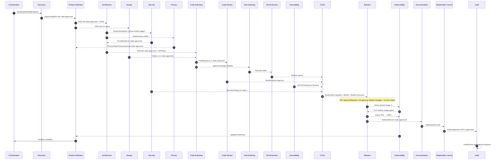
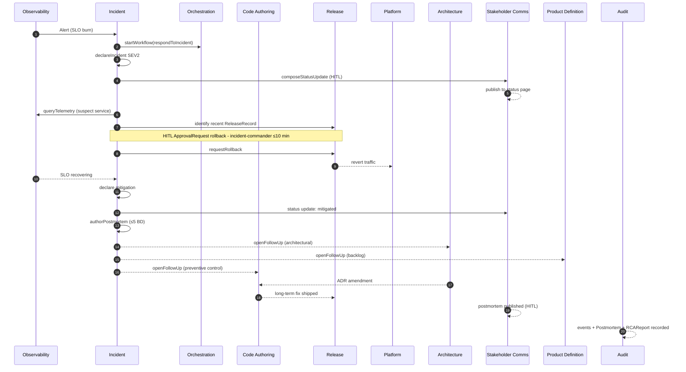
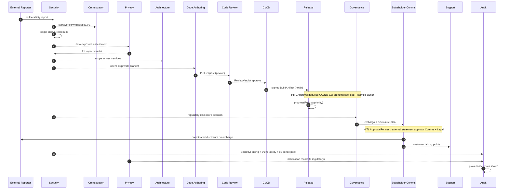
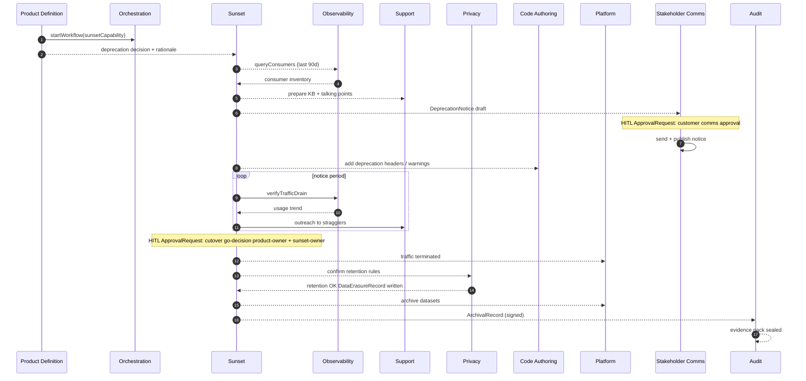
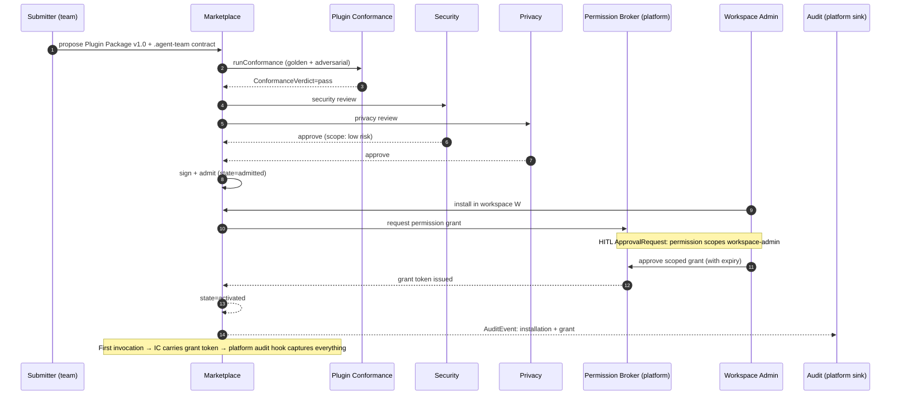
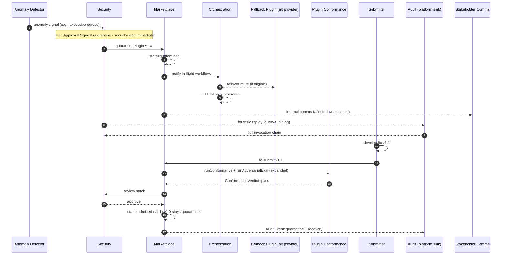
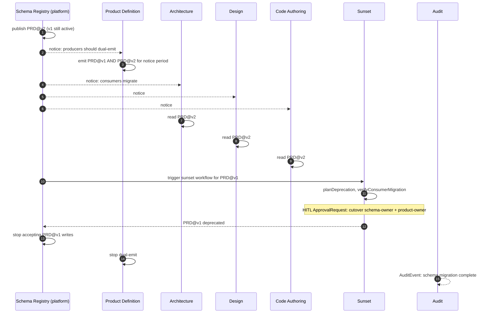
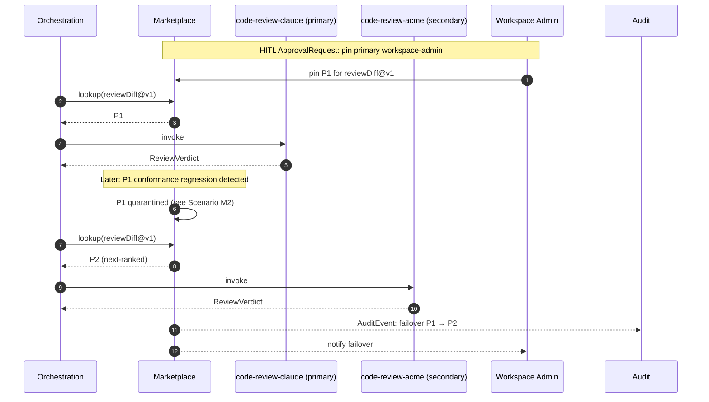
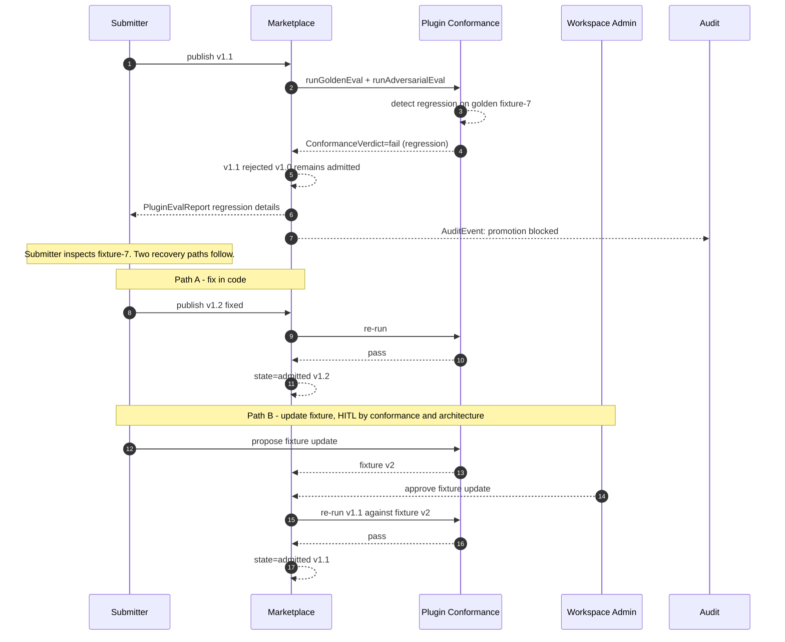

# GOVERNANCE.md

**Status:** Pass C output — operational governance, realism, and extensibility overlay.
**Consumes:** `ARCHITECTURE.md` (Pass A), `PLUGIN-SPECS.md` (Pass B).
**Adds:** RACI (including marketplace-internal tasks), NFR overlays, nine worked scenarios, support/incident loops, HITL checkpoints with approval authority (RBAC + SoD + delegation + break-glass), extension points, open questions with recommended resolutions and owners, and a mandatory cross-pass audit.
**Does NOT:** introduce new Bundle Contracts, change boundaries, or modify any artifact from prior passes.

---

## Bundle Abbreviations

| Abbr | Bundle | Abbr | Bundle |
| --- | --- | --- | --- |
| DISC | Discovery | DR | Resilience and DR |
| PROD | Product Definition | CICD | CI/CD |
| DEL | Delivery | REL | Release |
| ARCH | Architecture | OBS | Observability |
| API | API Lifecycle | INC | Incident |
| DES | Design | FIN | FinOps |
| CODE | Code Authoring | DOC | Documentation |
| REV | Code Review | SUP | Support and Onboarding |
| TA | Test Authoring | LOC | Localization |
| TX | Test Execution | A11Y | Accessibility |
| PERF | Performance | DX | Developer Experience |
| SEC | Security | GOV | Governance |
| PRIV | Privacy and Compliance | COMM | Stakeholder Comms |
| IAM | Identity and Access | SUN | Sunset |
| DATA | Data Engineering | CONF | Plugin Conformance and Eval |
| ML | ML/AI | ORCH | Orchestration (thin) |
| EXP | Experimentation | AUD | Audit (thin) |
| PLAT | Platform | MKT | Marketplace Control Plane (platform) |

---

## Section 1 — RACI Matrix

Canonical SDLC tasks × Bundle Contracts (and the Marketplace Control Plane for marketplace-internal tasks). Each task has **exactly one A**. Platform services may appear as Accountable for marketplace-internal tasks; they are not Bundle Contracts but they have ownership. Implicit always-on participants (`ORCH` for workflow control, `AUD` for evidence capture, `CONF` for plugin admission, platform services) are listed only where they materially own outcomes.

### 1.1 Application SDLC

| # | Task | A | R | C | I |
| --- | --- | --- | --- | --- | --- |
| 1 | Capture a customer insight | DISC | DISC | SUP, PROD, OBS | GOV, AUD |
| 2 | Define a feature | PROD | PROD | ARCH, DES, SEC, PRIV, IAM, FIN, GOV | DEL, COMM, AUD |
| 3 | Estimate it | DEL | DEL, CODE | ARCH, TA, PERF | PROD, FIN |
| 4 | Design it (UX/UI) | DES | DES | ARCH, A11Y, LOC, CODE | PROD, DOC |
| 5 | Review the design | ARCH | ARCH | DES, SEC, PRIV, PERF, A11Y | PROD, GOV |
| 6 | Threat-model it | SEC | SEC | ARCH, PRIV, PLAT | GOV, AUD |
| 7 | Define API contract | API | API | ARCH, CODE, DOC | PROD, COMM |
| 8 | Implement it | CODE | CODE | REV, TA, ARCH, DES, PRIV, LOC | DEL, DOC |
| 9 | Review the code | REV | REV | CODE | DEL, AUD |
| 10 | Unit-test it | TA | TA | CODE | TX |
| 11 | Integration-test it | TA | TA, TX | CODE, PLAT | DEL, AUD |
| 12 | Load-test / perf-test it | PERF | PERF | OBS, PLAT, ARCH, CODE | REL, INC, FIN |
| 13 | Accessibility-test it | A11Y | A11Y | DES, CODE | PROD, GOV |
| 14 | Localization-test it | LOC | LOC | DES, DOC, CODE | TX, PROD |
| 15 | Security-audit it | SEC | SEC | CODE, ARCH, PLAT | GOV, PRIV, AUD |
| 16 | Privacy / compliance check | PRIV | PRIV | DATA, CODE, ARCH | GOV, AUD |
| 17 | Document it (internal) | DOC | DOC | CODE, ARCH, INC | DX, AUD |
| 18 | Document it (external) | DOC | DOC | PROD, COMM, LOC, API | SUP, AUD |
| 19 | Build and package | CICD | CICD | CODE, SEC | REL, AUD |
| 20 | Release it (staged) | REL | REL | CICD, OBS, PERF, INC, EXP | DOC, COMM, AUD |
| 21 | Release it (GA) | REL | REL | CICD, OBS, COMM, SEC, PRIV | DOC, INC, FIN, AUD |
| 22 | Run an experiment | EXP | EXP | REL, PROD, OBS | AUD |
| 23 | Monitor it (production) | OBS | OBS | PLAT, FIN, CODE | INC, REL |
| 24 | On-call alert handling | INC | INC | OBS, PLAT | COMM, SUP |
| 25 | Triage incident | INC | INC | OBS, CODE, SEC, PLAT, DATA | COMM, SUP, AUD |
| 26 | Mitigate incident | INC | INC | CODE, PLAT, REL, SEC | COMM, GOV, AUD |
| 27 | Postmortem | INC | INC | ARCH, CODE, OBS, SEC | GOV, AUD, PROD |
| 28 | File architectural follow-up | ARCH | ARCH | INC, CODE | DEL, PROD, AUD |
| 29 | Iterate on it | PROD | PROD | DEL, CODE, DES | ARCH, COMM |
| 30 | Measure adoption | PROD | PROD | OBS, FIN, DX, EXP | COMM, AUD |
| 31 | Deprecate it (capability) | PROD | PROD | SUN, COMM, GOV | DEL, AUD |
| 32 | Sunset it (capability) | SUN | SUN | PROD, CODE, PLAT, COMM | OBS, FIN, AUD |
| 33 | Archive artifacts | SUN | SUN | AUD, PRIV | GOV, DOC |
| 34 | Vendor / license review | GOV | GOV | SEC, PRIV, PROD | AUD, FIN |
| 35 | Manage cost and budget | FIN | FIN | PLAT, ARCH, PROD | DEL, GOV |
| 36 | Customer support resolution | SUP | SUP | CODE, INC, DOC | PROD, COMM |
| 37 | Customer onboarding / activation | SUP | SUP | PROD, DOC, COMM | OBS |
| 38 | Publish customer / public comms | COMM | COMM | GOV, INC, REL, SEC | SUP, AUD |
| 39 | Board update authoring | GOV | GOV | COMM, FIN, SEC, PRIV | AUD |
| 40 | Board update distribution | COMM | COMM | GOV | AUD |
| 41 | Define backup policy / DR | DR | DR | PLAT, ARCH, FIN | INC, AUD |
| 42 | Run DR drill | DR | DR | PLAT, INC, OBS | DEL, AUD |
| 43 | Define RBAC and run access review | IAM | IAM | SEC, PLAT, GOV | DEL, AUD |
| 44 | Promote an ML/AI model | ML | ML | DATA, PRIV, GOV | OBS, INC, AUD |
| 45 | Run a workflow / coordinate agents | ORCH | ORCH | (all participants) | AUD |
| 46 | Capture audit evidence | AUD | AUD | (all event emitters) | GOV, PRIV |

### 1.2 Marketplace-internal SDLC

| # | Task | A | R | C | I |
| --- | --- | --- | --- | --- | --- |
| M1 | Propose a Plugin Package | MKT | MKT | (submitter), SEC, PRIV, CONF | GOV, AUD |
| M2 | Admit a Plugin Package | MKT | MKT, CONF | SEC, PRIV, ARCH, GOV | AUD |
| M3 | Grant permissions to an Installation | MKT | MKT | SEC, IAM, workspace admin | AUD |
| M4 | Update a Plugin Package | MKT | MKT | CONF, SEC | submitter, AUD |
| M5 | Migrate to a new schema version | MKT | MKT | DATA (when applicable), affected bundles | AUD |
| M6 | Quarantine a compromised Plugin Package | SEC | SEC, MKT | INC, CONF, GOV | COMM, AUD |
| M7 | Recover from quarantine | MKT | MKT | SEC, CONF | submitter, AUD |
| M8 | Select between competing providers | MKT | MKT | workspace admin | (consumers), AUD |
| M9 | Deprecate a Plugin Package | MKT | MKT | submitter, COMM | (consumers), AUD |
| M10 | Run conformance tests | CONF | CONF | submitter | MKT, SEC, AUD |
| M11 | Handle a conformance regression | CONF | CONF, MKT | submitter, SEC | (consumers), AUD |

**Validation.** Every task has exactly one A. Cross-checks:

- "Document it (internal)" and "Document it (external)" both A=DOC — same bundle, different artifacts.
- "Triage incident" and "Customer support resolution" are different tasks: A=INC for incidents, A=SUP for tickets.
- "Postmortem" is A=INC (authorship); architectural follow-ups become A=ARCH downstream (task 28).
- "Vendor / license review" A=GOV; "Quarantine a compromised Plugin Package" A=SEC — different blast radius and decider.
- "Board update authoring" A=GOV; "Board update distribution" A=COMM — content vs distribution split.
- "Define backup policy" A=DR (not PLAT) — disjoint authoritative artifact.
- "Define RBAC" A=IAM (not PLAT) — end-user identity vs workload identity.

---

## Section 2 — Cross-Cutting NFR Overlays

### 2.1 Security and Privacy

| Concern | Owning Bundle / Platform | Minimum Bar | Standards |
| --- | --- | --- | --- |
| Application security (SAST/DAST/SCA) | SEC | OWASP ASVS L2 for all services; L3 for high-trust | OWASP ASVS, OWASP Top 10 |
| Threat modelling | SEC + ARCH | STRIDE per major feature; updated on trust-boundary change | STRIDE, MITRE ATT&CK |
| SBOM | SEC + CICD | Per build, signed, attached as attestation | SPDX or CycloneDX, SLSA L3 target |
| Secrets handling | PLAT + SEC + Platform Secret Broker (MVP0 P7) | Vault-only; ephemeral via OIDC; CI denies plain-text | NIST SP 800-57 |
| PII identification | PRIV | Every data column classified; CI block on untagged | GDPR Art. 30, CCPA |
| PII redaction between agents | PRIV + Platform Schema Registry | Schema-level redaction at bundle boundaries for `pii_restricted` | GDPR Art. 5 |
| Data residency | PLAT + PRIV | Region pin per data class; enforced at IaC | GDPR Ch. V |
| Encryption | PLAT + SEC | TLS 1.3 in transit; AES-256 at rest | NIST FIPS 140-3 |
| Dependency vulnerabilities | SEC | High/critical block release | NIST NVD, CISA KEV |
| Identity and access | IAM + GOV | Least privilege; quarterly access review; MFA mandatory | NIST SP 800-63, SOC 2 CC6 |
| AI-agent threats | SEC + CONF | OWASP LLM Top 10 controls enforced; adversarial eval per Plugin Package | OWASP LLM Top 10 |
| Prompt-injection defense | SEC + Platform (`trust_label`) | trust-label propagation; HITL for untrusted→irreversible | OWASP LLM01 |

### 2.2 Compliance

| Regime | Owning Bundle / Platform | Evidence Emitted | Control Mapping |
| --- | --- | --- | --- |
| SOC 2 (Type II) | PRIV + AUD + GOV | Access logs, change logs, deploy provenance, incident records | CC1–CC9 |
| ISO 27001 | PRIV + AUD + GOV | Statement of Applicability + control evidence packs | Annex A |
| GDPR | PRIV | PIA, DPA registry, DSAR records, lawful-basis tagging, `DataErasureRecord` | Arts. 5, 6, 25, 30, 32, 33, 35 |
| HIPAA (if applicable) | PRIV + SEC | BAA registry, PHI inventory, access logs | 45 CFR Part 164 |
| PCI-DSS (if applicable) | SEC + PRIV | Scope segmentation, key rotation evidence | PCI-DSS v4 |
| EU AI Act / NIST AI RMF | GOV + ML + CONF | Risk classification, eval reports, model cards, conformance verdicts | EU AI Act Title III, NIST AI RMF |
| Marketplace supply chain | SEC + CONF + MKT | Admission signatures on `.agent-team/contract.json`, SBOMs, `ConformanceVerdict`, provenance attestations | SLSA L3 target, in-toto |

### 2.3 Accessibility

| Concern | Owning Bundle | Minimum Bar | Standard |
| --- | --- | --- | --- |
| WCAG conformance | A11Y | 2.2 AA customer-facing; AAA safety-critical | WCAG 2.2 |
| Assistive-tech matrix | A11Y | NVDA + JAWS (Windows), VoiceOver (macOS/iOS), TalkBack (Android) | Vendor specs |
| Accessibility by design | DES | Every `UISpec` carries a11y annotations + contrast checks | WCAG, ARIA APG |
| Accessible documentation | DOC | All docs satisfy WCAG AA (alt text, headings, color) | WCAG 2.2 |

### 2.4 Observability

| Pillar | Owning Bundle | Bar |
| --- | --- | --- |
| Logs | OBS (defs), each bundle (emission), Platform Audit Sink (immutable) | Structured JSON; ownership tag; no PII; OTel log schema |
| Metrics | OBS | Four golden signals per service (RED + USE) |
| Traces | OBS | OTel-instrumented; sampling policy declared; W3C Trace Context |
| SLOs | OBS | ≥1 SLO per user-facing service; weekly error-budget review |
| Dashboards | OBS | One service overview per service; on-call dashboard per SEV |
| Alerts | OBS + INC | SLI-based; runbook link required; noise ratio < threshold |
| Plugin telemetry | MKT + CONF | Per-plugin health + quality + cost emitted to platform; informs ranking + quarantine |

### 2.5 Reliability and SRE

| Concern | Owning Bundle | Bar |
| --- | --- | --- |
| Error budgets | OBS + INC | Per service; freezes on burn |
| Blameless postmortem | INC | Mandatory for SEV1/2; ≤5 BD |
| On-call rotation | INC + DEL | 24x7 for SEV1; humane rotation |
| Incident severity | INC | SEV0–4 with quantified definitions |
| Runbooks | DOC + INC | Linked from every alert; tested quarterly |
| Chaos engineering | PERF + PLAT | Game days quarterly for tier-1 |
| DR / BCP | DR | RTO/RPO per tier; quarterly restore drills |
| Marketplace SLOs | MKT (platform) | Admission < N BD; quarantine response < 1h; audit append < 100ms p99 |

### 2.6 Cost / FinOps

| Concern | Owning Bundle / Platform | Bar |
| --- | --- | --- |
| Cost attribution | FIN | 100% of spend tagged to product/team |
| Budget alerts | FIN | Per product, with owner |
| Cost-aware design | FIN + ARCH | Cost estimate in every `IaCPlan` |
| Optimization actions | FIN | Recommendations open `CodeChange` tickets |
| Per-invocation budget | Platform Budget Service (MVP0 P12) | Every `InvocationContext` carries envelope; fail-closed on breach |

### 2.7 Sustainability

| Concern | Owning Bundle | Bar |
| --- | --- | --- |
| Workload placement | PLAT + FIN | Prefer low-carbon regions where SLA permits |
| Efficiency telemetry | OBS + FIN | Carbon-aware metrics on tier-1 |
| Idle resource detection | FIN | Idle / oversized flagged weekly |

### 2.8 Localization and i18n

| Concern | Owning Bundle | Bar |
| --- | --- | --- |
| Source-text i18n | LOC + CODE | ICU MessageFormat; no string concat |
| Locale completeness | LOC | ≥98% for tier-1 locales at release |
| Cultural review | LOC + GOV | Human linguist for sensitive content |
| Locale QA | LOC + TX | Pseudo-loc + manual spot checks per release |

---

## Section 3 — Worked Lifecycle Scenarios

Four application scenarios (A1–A4) and five marketplace-internal scenarios (M1–M5). For each: a one-paragraph narrative, a Mermaid sequence diagram, and key handoffs.

### Scenario A1 — New Feature: customer insight → GA → adoption

**Narrative.** A signal from support tickets and analytics points to a recurring pain: users abandon a multi-step form. Discovery synthesizes the insight; Product Definition writes a PRD; Architecture proposes an ADR; Design produces a `UISpec`; Code Authoring implements; Review/Test/Security/A11y gate the change; CI/CD builds and signs; Release runs a staged rollout behind a flag; Observability watches SLOs; Documentation publishes notes; Product Definition measures adoption.

**Key handoffs.** `OpportunityBrief → PRD → (ADR + UISpec) → PullRequest → BuildArtifact → ReleaseRecord → telemetry`. Every cross-bundle edge is an `ArtifactEnvelope` with explicit state transition and provenance.

### Scenario A2 — Production Incident: alert → mitigation → postmortem → architectural follow-up

**Narrative.** An alert fires on error-rate burn. Incident declares SEV2, runs the bridge, identifies the recent release as a likely cause, coordinates a rollback via Release, restores service, leads a blameless postmortem. The RCA points to architectural weakness; Architecture files a follow-up ADR; Code Authoring delivers the long-term fix; Stakeholder Comms publishes a status update.

**Key handoffs.** `Alert → IncidentRecord → RollbackRecord → Postmortem → (ADR amendment + backlog items + code fix)`.

### Scenario A3 — Security Vulnerability Disclosure: external CVE → patch → coordinated comms → audit

**Narrative.** A researcher submits a CVE via the disclosure inbox. Security triages, confirms exploitability, runs impact across services, coordinates with Privacy on data exposure, drives a fix in Code Authoring, gates a hotfix release, and works with Comms on coordinated disclosure on the embargo date. Audit collects evidence for compliance.

**Key handoffs.** `Vulnerability → SecurityFinding → hotfix CodeChange → ReleaseRecord (priority) → PublicStatement + customer comms + Audit evidence`. HITL at hotfix go/no-go AND external disclosure.

### Scenario A4 — Sunset of a Legacy Capability

**Narrative.** A legacy capability has low usage and high maintenance cost. Product Definition decides to deprecate. Sunset plans EOL: enumerate consumers (Observability), draft migration plan, set notice period, coordinate customer comms, run traffic-drain measurement, execute archival in coordination with Privacy retention rules, and seal the archival record in Audit.

**Key handoffs.** `Deprecation decision → DeprecationNotice → traffic-drain → ArchivalRecord + DataErasureRecord`. Cutover requires HITL even when usage is zero.

### Scenario M1 — Plugin Installation and Permission Grant

**Narrative.** A team submits a Plugin Package with native Claude Code metadata plus `.agent-team/contract.json` and `.agent-team/conformance.yaml`. Marketplace queues conformance, security, and privacy reviews. On admission, workspace admin installs; Permission Broker presents required scopes as an `ApprovalRequest`. On approval the plugin activates and its first invocation is audited.

**Key handoffs.** `Submission + sidecar contract → ConformanceVerdict → admission signature → permission grant → activation`. HITL on permission grant; no plugin runs without one.

### Scenario M2 — Compromised Plugin Quarantine and Recovery

**Narrative.** Anomalous behavior is detected (rate of HITL declines, exfiltration attempts in audit, or external report). Security triggers quarantine. In-flight workflows route to a fallback provider or HITL. A forensic audit replay establishes scope. The submitter ships a fix; conformance re-runs; the plugin is re-admitted.

**Key handoffs.** `Anomaly → quarantine → failover OR HITL → forensic replay → patched re-admission`. Quarantine fails closed; only patched versions admitted.

### Scenario M3 — Schema Migration with Parallel Providers

**Narrative.** `PRD` schema needs a new required field for compliance. Schema Registry publishes v2 alongside v1. Producers (PROD plugins) dual-emit for the notice period; consumers (ARCH, DES, CODE, etc.) migrate. After consumer migration, v1 deprecates and sunsets via Sunset workflow.

**Key handoffs.** `v2 published → dual-emit → consumer migration → v1 sunset`. The Sunset Bundle handles the v1 EOL exactly like a capability sunset.

### Scenario M4 — Competing Provider Selection and Failover

**Narrative.** Two Plugin Packages implement `reviewDiff@v1`. Workspace admin pins the primary. Primary's conformance score regresses (or it's quarantined). Marketplace fails over to the secondary; workflow continues without intervention. Audit captures the failover.

**Key handoffs.** `Pin → invoke primary → primary quarantine → failover to secondary → continue`. Failover is admin-aware but not admin-blocking.

### Scenario M5 — Agent Output Regression Caught by Eval Gate

**Narrative.** Plugin author publishes v1.1 of `code-review-claude`. Conformance harness runs golden + adversarial eval. v1.1 regresses on a golden fixture (misses a known defect). Marketplace blocks promotion; v1.0 remains active. Submitter investigates; either fixes or fixture is updated.

**Key handoffs.** `Publish → conformance → regression → block → fix OR fixture update → re-run → admission`. The eval gate is non-bypassable; fixture updates require HITL to prevent gaming.

---

## Section 4 — Support and Incident Loops (Steady-State Operations)

### 4.1 Application support escalation

| Tier | Owning Bundle | Scope | Escalation Criterion |
| --- | --- | --- | --- |
| L1 | SUP | First-touch; scripted answers; KB-driven | Unsolved at SLA or needs investigation |
| L2 | SUP | Diagnose; reproduce; reference DOC/INC | Code change needed or product change suspected |
| L3 | SUP + CODE | Engineering-deep; may patch via Code Authoring | Architectural or systemic — escalate to INC or PROD |

- Bug → SUP opens `CodeChange` request → CODE.
- Reproduces production fault → SUP escalates to INC, which absorbs the case.
- Product gap → SUP files signal to PROD.

### 4.2 On-call rotation and handoff

- INC + DEL co-own the rotation; 24x7 for tier-1.
- Shift handoff: outstanding alerts, pending postmortems, follow-up status, captured as a structured `HandoffNote` (a `StakeholderUpdate` subtype produced by INC; *not* a new artifact).
- Pages route via the platform Workflow Engine + HITL Router to honor escalation policies and back-off.

### 4.3 Marketplace operational loops

- **Plugin health monitoring.** MKT + OBS produce per-plugin telemetry (latency, HITL decline rate, conformance regressions). Monthly review.
- **Conformance re-runs on platform upgrades.** CONF runs all admitted plugins' conformance suites quarterly and on major Claude Code releases.
- **Quarantine review cadence.** Quarantined plugins reviewed weekly until recovered or permanently deprecated.
- **Certification renewal.** Plugins with `risk_tier=high` re-attested annually.

### 4.4 Recurring rituals

| Ritual | Owning Bundle / Platform | Cadence | Output |
| --- | --- | --- | --- |
| Daily standup | DEL | Daily | Sprint state, impediment list |
| Iteration retrospective | DEL | Per sprint | RetroNotes + actions |
| Postmortem review | INC + DEL | Weekly | Closure status of action items |
| Architecture review | ARCH | Weekly or per ADR | Decisions + dissent recorded |
| Security review | SEC + ARCH | Per major change | ThreatModel updates |
| Privacy review | PRIV | Per data-touching change | PIA / inventory updates |
| Capacity and cost review | FIN + PLAT | Monthly | CostReport + CapacityPlan |
| SLO review | OBS + INC | Monthly | Error-budget posture |
| DR drill | DR | Quarterly | RestoreRecord |
| Board update | GOV + COMM | Quarterly | BoardUpdate |
| Compliance attestation | PRIV + GOV + AUD | Per audit cycle | EvidencePack |
| DX survey | DX | Quarterly | DXMetric + actions |
| Plugin admission review | MKT + CONF + SEC + PRIV | Per submission + monthly batch | Admission verdicts |
| Conformance regression review | CONF + MKT | Weekly | Regression triage |
| Quarantine review | SEC + MKT | Weekly | Recovery or permanent deprecation decisions |

### 4.5 Telemetry → backlog feedback loop

- OBS detects emergent patterns (latency drift, error-class clustering).
- INC observes correlated incidents and signals patterns to ARCH for design follow-up.
- FIN signals cost anomalies to PROD for prioritization or ARCH for design review.
- SUP signals ticket clusters to PROD as candidate `OpportunityBrief` source.
- EXP signals guardrail breaches to REL and PROD.
- This is the closed loop that prevents the system from being a one-way pipeline.

### 4.6 Plugin Feedback Loop (marketplace self-improvement)

The marketplace runs its own feedback loop. Passive feedback is captured during normal agent runs (the platform's `PostToolUse` hook detects symptoms like rerouted invocations, HITL overrides on the same `ApprovalRequest` template, repeated re-engagement triggers, prompt-injection trust-label downgrades) and writes to the workspace tier at `.agents/state/feedback/`, owned by **Plugin Conformance & Eval** (`marketplace`).

| Phase | Owner | Cadence | Output |
| --- | --- | --- | --- |
| Passive capture | Platform `PostToolUse` hook + CONF | Continuous | Per-event JSON lines in `.agents/state/feedback/<plugin>/<date>.ndjson` |
| Weekly aggregation | CONF | Weekly | Typed `PluginFeedback@v1` artifact in durable CAS, one per plugin |
| Author review | Plugin author teams | Weekly | Triage notes appended to the artifact |
| Conformance regression review | CONF + MKT | Monthly | New adversarial fixtures opened from recurring themes; quarantine proposals for repeat offenders |
| User-facing digest | CONF | On demand via `/plugin-feedback` | Aggregate view across workspaces |

The `PluginFeedback@v1` schema includes: `plugin_id`, `period`, `event_count_by_type`, `top_themes[]`, `linked_invocation_context_ids[]`, `recommended_actions[]`. No PII; principals pseudonymized at write per §2.1 redaction rules.

### 4.7 Ship-and-Observe Cadence

Tier-to-tier promotion is gated by an explicit ship-and-observe cycle. The marketplace platform and each Plugin Package have independent semvers; do NOT bundle unrelated capabilities into a single version bump.

| Tier | Marketplace version | Observation window | Exit criteria to next tier |
| --- | --- | --- | --- |
| MVP0 (platform foundation) | platform v0.1 | ≥ 30 days post-deploy, zero SEV1 attributable to platform | All 13 platform services operating; first MVP1 plugin admitted; audit append non-bypassable verified; conformance harness producing signed verdicts |
| MVP1 (three plugins) | marketplace v1.0 | ≥ 60 days; each plugin runs ≥ 1 end-to-end workflow weekly; conformance verdicts baselined | No quarantine in window; conformance regression rate ≤ 5%; weekly `/plugin-feedback` digest reviewed; PluginFeedback artifacts contain no unresolved SEV2+ themes |
| P1 (remaining ~7 plugins) | rolling per-plugin v1.x | ≥ 30 days per plugin after admission | Plugin-level conformance baseline maintained; no SEV1 attributed to plugin; admission-review queue drained |
| P2 (full-fidelity) | rolling per-plugin v2.x | Ongoing | Bundle Contract coverage complete; cross-plugin glue commands green; multi-regime compliance evidence produced |

Versioning rules:

- Each Plugin Package owns its own semver. Bundle Contracts inside a plugin advance via that plugin's minor versions.
- The marketplace platform has a meta-version (`marketplace v1.0`, `v1.1`, …) that pins the set of admitted plugins and the platform-foundation version range.
- "Pillar versions" that bundle unrelated capabilities into a single semver are forbidden — they obscure which behavioral changes shipped together.

---

## Section 5 — Human-in-the-Loop Checkpoints and Approval Authority

### 5.1 Role overlays vs Approval authority

- **Role overlay** = human-facing label projecting Bundle Contracts (no decision rights).
- **Approval authority** = RBAC group with explicit decision rights, separation-of-duties rules, delegation paths, and break-glass.

A single human MAY hold multiple role overlays AND be a member of multiple approval-authority groups, but separation-of-duties rules MUST prevent self-approval (e.g., the author of a `CodeChange` cannot be the approver of its production GA release).

### 5.2 Checkpoint matrix

For each: Decider (RBAC group), SLA, Fallback (fail-closed by default), Separation-of-Duties, Delegation, Break-glass. The **Tier** column indicates whether a checkpoint is mandatory in MVP1 (`M` — wired into code and config) or configurable for P1+ (`C` — mechanism shipped in MVP1 but the checkpoint itself is off by default until the owning bundle lands). 31 checkpoints in a single shipped product is ceremony; MVP1 wires **eight** (the M-tier rows below) and leaves the remaining configurable so they can be turned on as their owning bundles ship.

MVP1 M-tier checkpoints: **1, 2, 3, 8, 10, 21, 22, 26**. The mechanism (RBAC + SoD + delegation + break-glass + HITL Router) is the same for all 31; only the *defaults* differ.

| # | Tier | Checkpoint | Decider (RBAC) | SLA | Fallback | SoD | Delegation | Break-glass |
| --- | --- | --- | --- | --- | --- | --- | --- | --- |
| 1 | M | Production GA release | `rbac/release-managers` ∩ service owner | ≤24h | Hold release; auto-page secondary | approver ≠ author of any included `CodeChange` | secondary approver in same group | yes (executive on-call; post-hoc audit ≤24h) |
| 2 | M | Production rollback | `rbac/incident-commanders` | ≤10 min during incident | Auto-rollback if SLO burn ≥ threshold | approver ≠ author of suspect change | another incident commander | yes (executive on-call) |
| 3 | M | Hotfix go/no-go (security) | `rbac/security-leads` ∩ service owner | ≤2h SEV0/1; ≤24h SEV2 | Escalate to executive on-call | approver ≠ vuln reporter | another security lead | yes (CISO) |
| 4 | C | External public statement | `rbac/comms-leads` ∩ `rbac/legal` | Per playbook | Hold publication | content author ≠ approver | secondary in each group | no |
| 5 | C | Customer comms (mass) | `rbac/tam-leads` OR `rbac/comms-leads` | ≤24h | Hold; default to status page only | content author ≠ approver | yes | no |
| 6 | C | New Connector Plugin / external integration | `rbac/governance-leads` ∩ `rbac/security-leads` | ≤5 BD | Block install; mark blocked | submitter ≠ approver | yes | no |
| 7 | C | New permission scope granted | `rbac/platform-admins` | ≤2 BD | Deny request | requester ≠ approver | yes | no |
| 8 | M | Irreversible data operation | `rbac/data-governance` ∩ service owner | ≤1 BD | Deny; require migration plan | author ≠ approver | yes (two_person required) | yes (executive + audit) |
| 9 | C | Budget overage > threshold | `rbac/finops-leads` ∩ `rbac/engineering-managers` | ≤2 BD | Auto-freeze non-critical workloads | requester ≠ approver | yes | yes (CFO + post-hoc) |
| 10 | M | Cutover on deprecation | `rbac/product-owners` ∩ `rbac/sunset-owners` | ≤2 BD | Extend notice; keep capability live | yes | yes | no |
| 11 | C | AI/ML model promotion to prod | `rbac/ml-leads` ∩ `rbac/ai-ethics-reviewers` | ≤2 BD | Keep prior model in serving | model author ≠ approver | yes | no |
| 12 | C | Compliance attestation | `rbac/compliance-auditors` ∩ `rbac/governance-leads` | Per audit calendar | Mark control deficient; remediation plan | auditor ≠ control owner | yes | no |
| 13 | C | Chaos experiment in prod | `rbac/sre` ∩ service owner | ≤1 BD | Run in staging only | experiment author ≠ approver | yes | no |
| 14 | C | Data classification change | `rbac/privacy-leads` ∩ `rbac/data-governance` | ≤2 BD | Keep prior classification | yes | yes | no |
| 15 | C | Override SLO error-budget freeze | `rbac/engineering-managers` ∩ `rbac/sre` | ≤1 BD | Freeze stays in effect | yes | yes | no |
| 16 | C | Cross-workspace artifact share | `rbac/governance-leads` | ≤2 BD | Deny | yes | yes | no |
| 17 | C | Copyleft OSS dependency | `rbac/legal` | ≤5 BD | Block adoption | requester ≠ approver | yes | no |
| 18 | C | Embargoed CVE disclosure | `rbac/security-leads` ∩ `rbac/legal` ∩ `rbac/comms-leads` | Per embargo | Maintain embargo | yes | yes | no |
| 19 | C | Architectural exception (out-of-policy ADR) | `rbac/enterprise-architects` | ≤5 BD | Reject ADR | author ≠ approver | yes | no |
| 20 | C | Sunsetting an actively used capability | `rbac/product-owners` ∩ `rbac/engineering-managers` ∩ `rbac/comms-leads` | ≤5 BD | Defer cutover | yes | yes | no |
| 21 | M | **Plugin Package admission** | `rbac/marketplace-admins` ∩ `rbac/security-leads` ∩ `rbac/privacy-leads` | ≤5 BD | Reject admission | submitter ≠ approver | yes | no |
| 22 | M | **Plugin Package quarantine** | `rbac/security-leads` | Immediate (≤1h) | Auto-quarantine on critical signal | n/a (emergency) | yes (CISO) | yes (CISO; post-hoc review) |
| 23 | C | **Plugin Package permission cap exception** | `rbac/marketplace-admins` ∩ `rbac/security-leads` | ≤5 BD | Deny | submitter ≠ approver | yes | no |
| 24 | C | **Competing-provider pin change** | workspace admin | ≤1 BD | Keep prior pin | yes | yes | no |
| 25 | C | **Conformance fixture update** | `rbac/conformance-leads` ∩ `rbac/enterprise-architects` | ≤5 BD | Keep prior fixture | submitter ≠ approver | yes | no |
| 26 | M | Break-glass identity invocation (IAM) | `rbac/platform-admins` ∩ `rbac/security-leads` | Immediate | n/a | n/a (this IS break-glass) | n/a | yes (mandatory post-hoc audit ≤24h) |
| 27 | C | **`/implement` dispatch** (PROD → ARCH → CODE) | originator (PROD owner) automatically; HITL only if `risk_tier ≥ medium` PRD | ≤1 BD | Hold dispatch | dispatcher ≠ approver of resulting GA release (checkpoint 1) | yes | no |
| 28 | C | **`/release` dispatch** | release-manager (auto on green gates) | inherits checkpoint 1 SLA | Hold release | inherits checkpoint 1 SoD | yes | yes (inherits) |
| 29 | C | **`/deprecate` dispatch** | product-owner + sunset-owner | inherits checkpoint 10 | Defer cutover | yes | yes | no |
| 30 | C | **`/incident-from-alert` dispatch** | on-call (auto on SEV2+) | ≤10 min | Page secondary | n/a (emergency) | yes | yes (inherits incident break-glass) |
| 31 | C | **`/install-plugin` dispatch** | inherits checkpoint 21 + 7 | ≤5 BD | Deny | submitter ≠ approver | yes | no |

**SLA enforcement.** The platform HITL Router (MVP0 P10) holds the timer; on breach it follows the fallback path AND records an `EscalationRequest`. Fallbacks are fail-closed (deny / hold / keep prior state) — never silent approval.

**Break-glass invariants.**

- Break-glass invocation is itself an `ApprovalRequest` with `break_glass_token`.
- All break-glass uses produce a `BreakGlassRecord` (owned by IAM).
- Mandatory post-hoc review within 24h.
- Break-glass cannot bypass admission of a new Plugin Package or grant of a permission scope above the plugin's admitted risk tier.

---

## Section 6 — Extension Points

### 6.1 Admitting a new Plugin Package

Per Scenario M1 and RACI tasks M1–M3:

1. Submitter publishes native Claude Code plugin metadata plus `.agent-team/contract.json` and `.agent-team/conformance.yaml`.
2. Marketplace runs `runConformance` + `runAdversarialEval`.
3. Security + Privacy + (for `risk_tier=high`) Architecture review.
4. Marketplace signs and admits (`state=admitted`).
5. Workspace admin installs; permission grant via HITL.
6. First invocation captured by platform audit hook.

### 6.2 Proposing a new Bundle Contract

Rare. Reserved for fundamental SDLC capability gaps:

1. Submit `RFC` (Documentation Bundle) describing the gap, authoritative artifacts, capability interfaces, and disjointness rationale vs existing bundles.
2. Architecture review verifies artifact-write-and-decision-authority disjointness.
3. Security + Privacy review for permission scopes and data classes.
4. Governance review for licensing, ethics, vendor exposure.
5. Marketplace admission updates the Capability Registry.
6. Probation period (limited blast radius) before GA.

Adding a new Capability Interface to an existing bundle is the much-more-common case; that follows the normal Plugin Package admission flow (Scenario M1).

### 6.3 Registering a new Role Overlay

- Declare the label, the Bundle Contracts it projects, and the mandate.
- **No new capabilities may be introduced** — overlay must map to existing Bundle Contract capabilities. If an overlay needs an undeclared capability, that is a Pass A defect.
- ARCH validates the role-overlay table addition; GOV records it.

### 6.4 Evolving an artifact schema

Per Scenario M3:

1. Schema Registry publishes new version alongside old.
2. Producers dual-emit for the notice period.
3. Consumers migrate.
4. Old version deprecates and sunsets via the Sunset Bundle workflow.

Additive (non-breaking) changes ship as minor version bumps without dual-emit.

### 6.5 Vetting a new Connector Plugin

- Permission scopes declared in `plugin.json`.
- Security review of vendor + integration (TLS, auth, blast radius, secret management).
- Privacy review for data egress.
- Governance review for contractual posture (DPA, SLA, liability).
- MCP conformance review.
- Platform admin grants scoped permission.

### 6.6 Competing-provider arbitration

Per Scenario M4. Capability Registry ranks by: admin pin → conformance score → reported quality eval → recency. Per-workflow override via `WorkflowTemplate`. On primary failure, auto-failover to next-ranked.

### 6.7 Author-initiated Plugin Package deprecation

Distinct from domain Sunset:

1. Author publishes deprecation notice in registry (`state=deprecated`).
2. Marketplace notifies installed workspaces.
3. Sunset Bundle's workflow drives migration if a successor exists.
4. After notice period, `state=uninstalled`.

### 6.8 Compromised Plugin Package recovery

Per Scenario M2. Quarantine fails closed; forensic audit replay; patched re-admission.

---

## Section 7 — Open Design Questions

Each: decision needed, options, tradeoff axes, recommended resolution, owner. Pass A's resolved-in-this-pass decisions are NOT duplicated here.

### Q1. Conflict arbitration default policy

- **Decision:** how Orchestration arbitrates when multiple agents produce conflicting outputs for the same capability call.
- **Options:** (a) consensus vote weighted by confidence; (b) designated tie-breaker per capability; (c) ML-judge meta-evaluator; (d) mandatory HITL.
- **Tradeoffs:** latency vs quality, transparency vs throughput, cost of judges, deadlock risk.
- **Recommended resolution:** (a) consensus weighted by confidence as default; (d) HITL for irreversible side-effects or confidence < 0.7. Per-capability override allowed in `WorkflowTemplate`.
- **Owner:** ORCH (with policy registered in `ArbitrationPolicy`).

### Q2. Memory / context substrate beyond CAS

- **Decision:** whether to add a vector index, knowledge graph, or both on top of CAS.
- **Options:** (a) CAS + relational index only; (b) + vector index; (c) + graph; (d) hybrid.
- **Tradeoffs:** recall quality vs operational complexity vs embedding model lock-in vs cost.
- **Recommended resolution:** start with (a); add (b) vector index for skill / subagent retrieval in P1; defer (c) graph until lineage-query needs exceed CAS provenance DAG.
- **Owner:** Platform Artifact and Context Plane (MVP0 P3).

### Q3. Cross-workspace artifact sharing within the org

- **Decision:** whether artifacts may be referenced across workspaces under one tenant.
- **Options:** (a) never; (b) opt-in per workspace pair; (c) default with redaction.
- **Tradeoffs:** org-wide network effects vs blast-radius isolation vs confidentiality.
- **Recommended resolution:** (b) opt-in per workspace pair, audit-logged, with HITL on share. Required for Marketplace admission templates and shared connector configs; otherwise disabled.
- **Owner:** GOV + MKT.

### Q4. Event-bus implementation

- **Decision:** which event-bus technology backs the artifact event substrate.
- **Options:** (a) Kafka; (b) in-process pub/sub; (c) git-backed (commits as events); (d) Redis Streams.
- **Tradeoffs:** operational complexity vs cost vs throughput vs durability.
- **Recommended resolution:** start (b) in-process for MVP0; migrate to (a) Kafka when fanout or retention require.
- **Owner:** Platform Event Bus (MVP0 P5).

### Q5. Determinism guarantees

- **Decision:** what level of determinism the platform promises across primitive invocations.
- **Options:** (a) best-effort; (b) seedable runs for evals; (c) replayable workflows; (d) full provenance replay.
- **Tradeoffs:** debug / audit value vs cost vs LLM nondeterminism limits.
- **Recommended resolution:** (b) seedable for `runConformance` and `runEval`; (c) replayable workflows via durable Workflow Engine; (d) full provenance replay is a P2 goal.
- **Owner:** Platform Workflow Engine + CONF.

### Q6. Plugin telemetry retention

- **Decision:** how long per-plugin health / quality telemetry is retained.
- **Options:** (a) 30 days; (b) 90 days; (c) 1 year.
- **Tradeoffs:** ranking accuracy vs storage cost vs forensic value.
- **Recommended resolution:** (b) 90 days hot, then aggregate to monthly summary retained 2 years.
- **Owner:** MKT + OBS.

### Q7. Two-person approval automation

- **Decision:** whether two-person `ApprovalRequest` can be served by two distinct subagents acting on behalf of two distinct humans, or must always involve two human keystrokes.
- **Options:** (a) always two human keystrokes; (b) subagent-mediated with cryptographic proof of human consent; (c) hybrid by risk tier.
- **Tradeoffs:** throughput vs auditable real-person consent.
- **Recommended resolution:** (a) for irreversible / restricted; (c) for medium-risk with cryptographic proof (e.g., signed FIDO assertion).
- **Owner:** HITL Router (MVP0 P10) + IAM.

### Q8. DR / BCP for the artifact substrate

- **Decision:** RTO/RPO for the CAS itself and how to back it up.
- **Options:** (a) cross-region replication with eventual consistency; (b) synchronous replication; (c) periodic snapshot + WAL.
- **Tradeoffs:** RTO vs storage cost vs operational complexity.
- **Recommended resolution:** (a) cross-region async replication; quarterly restore drill via DR bundle.
- **Owner:** DR + Platform Artifact CAS.

### Q9. External LLM provider allowlist

- **Decision:** which third-party providers (Anthropic, OpenAI, others) may be bound by the `Model` primitive.
- **Options:** (a) Anthropic only; (b) Anthropic + OpenAI; (c) any reviewed.
- **Tradeoffs:** provider diversity vs data-residency review burden vs vendor lock-in.
- **Recommended resolution:** (a) Anthropic-only for MVP (data-residency / contract clarity); (b) add OpenAI in P1 if business need; require GOV vendor assessment per provider; restricted data classes force `data_retention_class=zero` (presently Anthropic-only).
- **Owner:** GOV + ML.

### Q10. Long-term provenance retention

- **Decision:** how long the full provenance DAG is retained vs collapsed to summary.
- **Options:** (a) full retention indefinitely; (b) full 2 years, collapse-to-summary after; (c) full 1 year.
- **Tradeoffs:** forensic completeness vs storage cost vs GDPR right-to-erasure.
- **Recommended resolution:** (b) full 2 years, hash-only summary after. PII fields pseudonymized at write so erasure can collapse to summary without breaking integrity.
- **Owner:** AUD + PRIV.

### Q11. Conformance fixture secrecy

- **Decision:** whether conformance golden + adversarial fixtures are visible to plugin authors or kept secret.
- **Options:** (a) public to authors; (b) sample public + secret holdout; (c) all secret.
- **Tradeoffs:** debuggability vs gaming risk.
- **Recommended resolution:** (b) sample public for development, secret holdout for admission verdicts.
- **Owner:** CONF.

### Q12. Plugin permission cap policy

- **Decision:** how risk-tier caps map to allowed permissions.
- **Options:** (a) static map; (b) per-bundle policy; (c) per-workspace policy.
- **Tradeoffs:** uniformity vs flexibility.
- **Recommended resolution:** (a) static map with (b) per-bundle exception process gated on HITL (Checkpoint 23).
- **Owner:** MKT + SEC.

### Q13. Audit log redaction policy specifics

- **Decision:** what exactly is redacted at audit-write time vs retained.
- **Options:** (a) all PII pseudonymized; (b) PII redacted entirely; (c) configurable per data class.
- **Tradeoffs:** forensic value vs erasure compliance vs storage.
- **Recommended resolution:** (c) configurable per data class — `pii_restricted` pseudonymized at write (reversible only with legal hold); `restricted` redacted; `confidential` and lower retained verbatim.
- **Owner:** PRIV + AUD.

### Q14. Marketplace admission probation length

- **Decision:** how long a newly admitted plugin runs in limited blast radius before full GA.
- **Options:** (a) 7 days; (b) 30 days; (c) tiered by risk_tier.
- **Tradeoffs:** speed-to-value vs safety.
- **Recommended resolution:** (c) tiered — low: 7d, medium: 30d, high: 90d. During probation, blast radius capped at one workspace and HITL on all `irreversible` calls.
- **Owner:** MKT.

### Q15. Subagent persona evolution

- **Decision:** how an Agent (subagent) persona evolves over time (instruction template improvements, model class changes).
- **Options:** (a) every change is a new Agent version; (b) minor edits in place; (c) hybrid (instructions in place, model binding versioned).
- **Tradeoffs:** reproducibility vs operational agility.
- **Recommended resolution:** (a) every persona change is a new Agent version with fresh conformance run; model binding changes also force a new version.
- **Owner:** ML/AI Bundle + CONF.

### Q16. Per-plugin methodology overrides

- **Decision:** when a domain plugin ships a specialized methodology skill variant (e.g., `security.threat-model-walkthrough` as a security-tuned `brainstorm`), how is admission and routing handled?
- **Options:** (a) always allowed via the competing-providers rule (`PLUGIN-SPECS.md` §Plugin Boundary Heuristics §9.4); (b) requires per-Capability-Interface registration in `methodology` first; (c) forbidden — only generic methodology exists; domain plugins must invoke generic methodology and contextualize themselves.
- **Tradeoffs:** specialization quality vs routing complexity vs duplicated maintenance.
- **Recommended resolution:** (a) competing-providers rule applies. Domain plugins MAY ship specialized variants at P1+. Admission requires the variant to declare it `extends` a generic methodology skill in its frontmatter; the conformance harness validates the extension is a strict superset of the generic skill's intent (i.e., the domain variant must `Use when` the same intents plus its own — not a different set).
- **Owner:** Plugin Conformance & Eval (CONF) + Architecture (ARCH).

### Q17. Methodology skill output retention

- **Decision:** when should a workspace promote a methodology skill's ephemeral output to a durable artifact?
- **Options:** (a) never automatically — only a capability skill may promote; (b) workspace policy opt-in (e.g., "always save my brainstorms"); (c) automatic for `mentor`/`self-learn`/`research` outputs because they're personal-knowledge value, ephemeral for `brainstorm`/`debug`/`verify`.
- **Tradeoffs:** durability + searchability vs noise + storage + drift.
- **Recommended resolution:** (a) by default. Capability skills that want to keep methodology output write their own artifact citing the methodology session in `parent_artifact_ids[]`. P1+: per-workspace opt-in for personal-knowledge skills.
- **Owner:** `methodology` + Workspace Admin.

---

## Section 8 — Cross-Pass Issues Discovered (Mandatory Audit)

Audit of Pass A and Pass B for invariant leaks.

### 8.1 Findings

| # | Finding | Location | Severity | Proposed Fix | Owner |
| --- | --- | --- | --- | --- | --- |
| 1 | None: Code Authoring no longer claims test co-location | `PLUGIN-SPECS.md` §7 Mandate Boundary | n/a | — | — |
| 2 | `MigrationPlan` artifact name reused (Data Engineering schema migration vs Sunset capability migration) was resolved by renaming Data Engineering's to `SchemaMigrationPlan` and Sunset's to `CapabilityMigrationPlan` | `ARCHITECTURE.md` §8 Bundle Contracts | n/a | — | — |
| 3 | `EvalReport` artifact name reused (ML/AI model eval vs Plugin Conformance plugin eval) was resolved by renaming ML/AI's to `ModelEvalReport` and Plugin Conformance's to `PluginEvalReport` | `ARCHITECTURE.md` §8 Bundle Contracts | n/a | — | — |
| 4 | Workspace-scope vs cross-workspace artifact sharing remains an open question; Pass A correctly deferred (Open Q3 here) | `ARCHITECTURE.md` §17 | Info | Tracked under Q3 | GOV + MKT |
| 5 | Role overlay "AI Safety / Eval Engineer" maps to ML/AI + Governance + Plugin Conformance — three bundles. Verified that no new capability is introduced; the overlay projects existing capabilities of all three. | `ARCHITECTURE.md` §15 Phase 5 | Info | Confirmed compliant | — |
| 6 | Role overlay "Marketplace Admin" deliberately maps to platform, not a bundle. The architecture treats this correctly. | `ARCHITECTURE.md` §15 Phase 12 | Info | Confirmed compliant | — |
| 7 | MVP1 dependency check: every MVP1 bundle in `PLUGIN-SPECS.md` Roadmap has ≤ 2 MVP1 dependencies. Verified explicitly: Product Definition (0; manual `OpportunityBrief` fixture); Architecture (1: PROD); Code Authoring (2: PROD, ARCH); Code Review (1: CODE); Test Authoring (1: CODE); Test Execution (2: TA, CICD); CI/CD (2: CODE, REV); Orchestration thin (0); Audit thin (0); Plugin Conformance (0). | `PLUGIN-SPECS.md` Roadmap | Info | Confirmed compliant | — |
| 8 | Audit append clearly marked as platform service (MVP0 P8); the Audit *bundle* owns only query/export/evidence. No platform-as-bundle leak. | `PLUGIN-SPECS.md` §35 | Info | Confirmed compliant | — |
| 9 | Orchestration durability clearly marked as platform service (MVP0 P9); the Orchestration *bundle* owns templates and policies. No leak. | `PLUGIN-SPECS.md` §34 | Info | Confirmed compliant | — |
| 10 | Capability Interface signatures (`schema_in`, `schema_out`) in `.agent-team/contract.json` sidecar sketch use artifact schemas declared in Pass A §8. No undeclared schemas referenced. | `ARCHITECTURE.md` §5.3 + §8 | Info | Confirmed compliant | — |
| 11 | All Pass A §17 open questions are deferrable — none are critical-path. Pass C does not re-list them; Pass C's Q1–Q15 are distinct from Pass A's. | Pass A §17 + Pass C §7 | Info | Confirmed compliant | — |
| 12 | Threat-model accountability split clearly: SEC owns `ThreatModel`, ARCH owns `SystemDesignDoc`. No co-ownership. | `ARCHITECTURE.md` §8.2 | Info | Confirmed compliant | — |
| 13 | DOC vs COMM rule "1:1 reactive (SUP) vs 1:many proactive (COMM)" carried from Pass A boundary heuristics to Pass B mandate boundaries to Pass C RACI (tasks 36 vs 38). | All three docs | Info | Confirmed consistent | — |
| 14 | Chat-text `[Plugin:Component]` marker conventions are rejected platform-wide; structured `TelemetryEvent` channel (Pass A §11.7) is the contract. No bundle spec, scenario, or recurring ritual reintroduces text markers. | All three docs | Info | Confirmed compliant | — |
| 15 | Per-bundle "Reference Plugin Package" stubs in `PLUGIN-SPECS.md` are illustrative only; the canonical packaging is §Plugin Packaging Strategy. Every bundle "Packaged in" line resolves to a plugin in the packaging table. No 1-bundle-1-plugin assumption leaks into any RACI or scenario. | `PLUGIN-SPECS.md` §Plugin Packaging Strategy | Info | Confirmed compliant | — |
| 16 | Workspace-state subdirectory ownership (`ARCHITECTURE.md` §7.0 + §8.1) is enforced by the platform PreToolUse hook. Each `.agents/state/<subdir>/` has exactly one owning bundle; cross-writes are conformance violations. No scenario in §3 contains cross-writes. | `ARCHITECTURE.md` §7.0 + §8.1 | Info | Confirmed compliant | — |
| 17 | MVP1 plugin count = **3** (`engineering`, `platform`, `marketplace`) per `PLUGIN-SPECS.md` Roadmap. Cross-checked against the §Plugin Packaging Strategy table. | `PLUGIN-SPECS.md` Roadmap | Info | Confirmed compliant | — |
| 18 | Skill Frontmatter Contract (`ARCHITECTURE.md` §6.11) is referenced by Plugin Conformance & Eval as an admission gate. Bad descriptions are admission blockers, not UX nits. | `ARCHITECTURE.md` §6.11 + Scenario M1/M5 | Info | Confirmed compliant | — |
| 19 | Glue commands (`PLUGIN-SPECS.md` §Glue Commands) appear in the Section 5 HITL matrix as checkpoints 27–31. Workflow templates are owned by the thin Orchestration bundle, not by the originating bundle. | `PLUGIN-SPECS.md` §Glue + Pass C §5 | Info | Confirmed compliant | — |
| 20 | Ship-and-Observe Cadence (Pass C §4.7) enforces per-plugin semver. No "pillar versioning" that bundles unrelated capabilities into a single bump. | Pass C §4.7 | Info | Confirmed compliant | — |
| 21 | Plugin Feedback Loop (Pass C §4.6) produces a typed `PluginFeedback@v1` artifact in durable CAS — not just markdown files. Pseudonymization rules from §2.1 apply. | Pass C §4.6 | Info | Confirmed compliant | — |
| 22 | Methodology Skills (Pass A §6.12, resolved decision 23) form a distinct category from capability skills. They declare `type: methodology` + `produces_authoritative_artifacts: false`, do NOT claim a Bundle Contract, and are composed **inline** in capability-skill bodies (subagents do not nest — Pass A §6.13). Verified: no methodology skill in `methodology` writes to an authoritative-artifact subdir; the platform PreToolUse PEP hook enforces this. | Pass A §6.12, §6.13 + Pass B §Plugin Packaging Strategy | Info | Confirmed compliant | — |
| 23 | `methodology` is the 11th Plugin Package and implements **zero Bundle Contracts** — an intentional exception to the "one plugin = one or more Bundle Contracts" pattern. Justified by methodology being cross-cutting (force-multiplies every capability). MVP1 plugin count = **5** (four capability plugins + methodology); `quality` joins MVP1 to give the end-to-end demo a credible plugin-authored test loop. | Pass B §Plugin Packaging Strategy + Pass C §4.5 | Info | Confirmed compliant — packaging exception is explicit | — |
| 24 | Cross-skill references live **inline in the skill body** (e.g., the procedure references `methodology.plan-work` by name); the conformance harness greps each admitted SKILL.md for `methodology.<name>` tokens and fails admission when a reference is unadmitted. The earlier `references_skills:` YAML frontmatter field has been retired — it was non-standard and would have been silently ignored by Codex and Copilot. | Pass A §6.11, §6.12 + Pass B `engineering` spec | Info | Confirmed compliant | — |
| 25 | Methodology skills do not appear in the §1 RACI as task Accountables — they produce no authoritative artifacts so they do not own SDLC tasks. Their use is captured in capability-skill telemetry. | Pass C §1 + Pass A §6.12 | Info | Confirmed compliant | — |

### 8.2 Summary

All invariant checks passed. No co-location escape clauses. No role overlay introduces a capability not declared by a Bundle Contract. No platform service is modeled as a Bundle Contract. No Bundle Contracts overlap on authoritative artifact write authority. All MVP1 slices respect the ≤ 2 MVP1 dependencies rule. All Capability Interface signatures reference artifact schemas declared in Pass A. The two minor observations from Pass B Architecture Issues Discovered (`APIReference` regeneration RACI; `BoardUpdate` author/distributor split) are explicitly encoded in Section 1 RACI tasks 7+18 and 39+40 respectively. **The architecture additions for Skill Frontmatter Contract, three-tier state substrate, structured telemetry, session lifecycle, plugin packaging strategy, glue commands, ship-and-observe cadence, plugin feedback loop, and the Methodology Skills category are coherent across all four documents (ARCHITECTURE / PLUGIN-SPECS / GOVERNANCE / PLAN).**

No blocking issues. Implementation may proceed with MVP0 platform foundation, then `marketplace v1.0` shipping the four MVP1 plugins (`engineering`, `platform`, `marketplace`, `methodology`).
