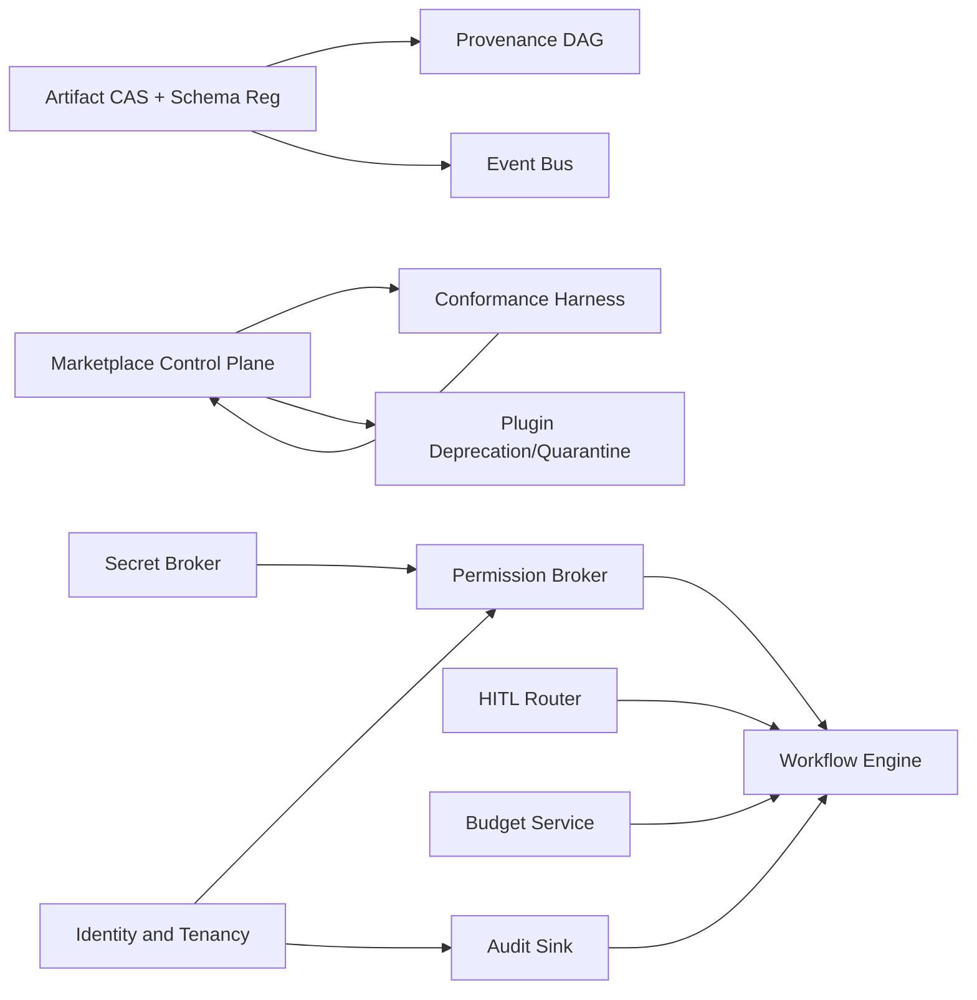
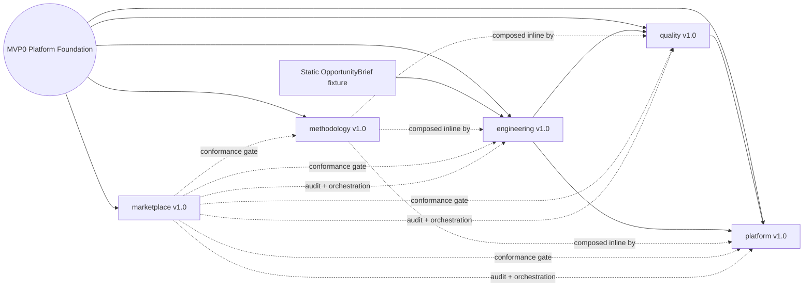
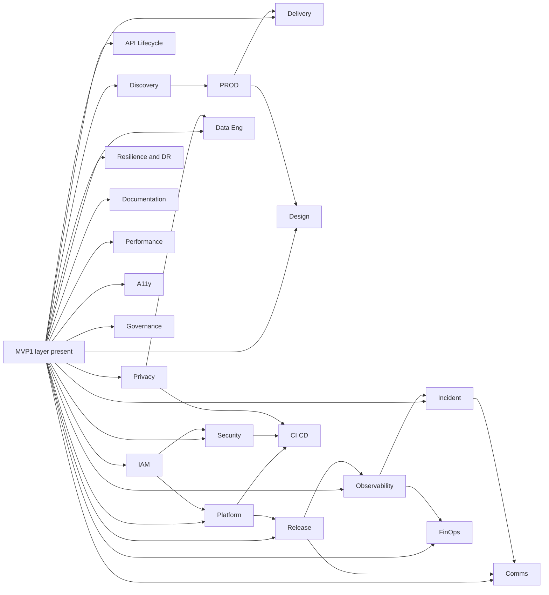
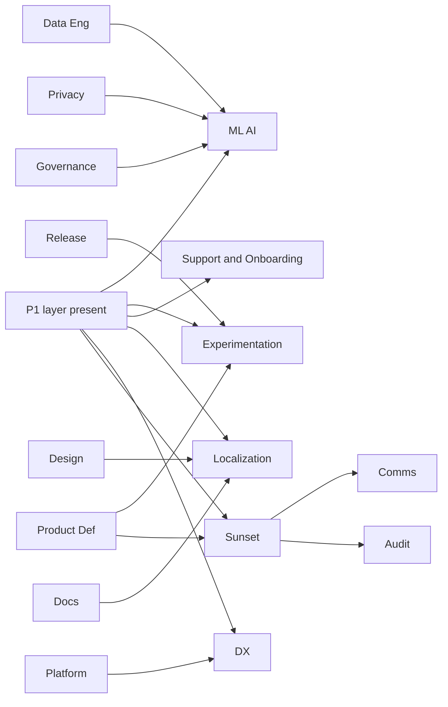

# PLUGIN-SPECS.md

**Status:** Pass B output — implementation-ready Bundle Contract specifications for every contract declared in `ARCHITECTURE.md`.
**Consumes:** `ARCHITECTURE.md` (Pass A).
**Downstream consumer:** `GOVERNANCE.md` (Pass C).

---

## Conventions

- One Bundle Contract = one spec block, in the order defined by Pass A.
- A Bundle Contract is provider-neutral. **Reference Plugin Packages are illustrative** — they show one concrete realization on Claude Code; the contract does not require that exact package.
- Claude Code-native metadata stays in `.claude-plugin/plugin.json`; Bundle Contract / admission / conformance metadata stays in `.agent-team/contract.json` and `.agent-team/conformance.yaml`.
- Mandate Boundaries name *neighboring bundles by name* and use the form: "Bundle X owns artifact A; this bundle consumes A and produces B."
- Quality Gates and Conformance Tests are objective and machine-checkable.
- No co-location escape clauses.
- Connector Dependencies reference Connector Plugins by name (not vendor lists).
- Plugin-owned permission deltas are forbidden. Permission grants are Installation state enforced by the Marketplace Permission Broker through managed/project settings and platform PEP hooks.
- Every bundle declares at least one AI-specific failure mode (prompt injection / hallucination / model regression / poisoned context / excessive agency).

---

## MVP0 — Platform Foundation

MVP0 is the platform foundation. None of these are Bundle Contracts; all are non-pluggable services in Layers 1–3 of the architecture. Every Bundle Contract depends on MVP0.

| # | Platform Service | Owns | Why MVP0 |
| --- | --- | --- | --- |
| P1 | Marketplace Control Plane | Registry, manifest index, capability index, admission, lifecycle, deprecation, quarantine | No plugin can be installed or invoked without it |
| P2 | Plugin Conformance Harness | Conformance suite runner, eval fixture executor, admission verdict producer | Admission gate; required for every Plugin Package |
| P3 | Artifact CAS + Schema Registry | Content-addressable artifact storage, mutable-reference index, schema registration and evolution | Every artifact handoff requires it |
| P4 | Provenance & Lineage DAG | Cross-bundle queryable lineage; SLSA-style attestations | Required for audit and compliance |
| P5 | Event Bus | At-least-once delivery; tenant partitioning; cycle / fanout enforcement; DLQ | Bundles communicate via `ArtifactEvent` |
| P6 | Permission Broker (PEP/PDP) | Grant / refresh / revoke; risk-tier caps; resource-scoped tokens; fail-closed enforcement | Every `ToolInvocation` requires it |
| P7 | Secret Broker | Short-lived references; OIDC-based access; no plain-text secrets | Required by every external `Connector` |
| P8 | Audit Sink | Append-only, signed, non-bypassable hook-injected capture | Foundational trust |
| P9 | Workflow Engine | Durable named workflows; retries; compensations; HITL checkpoints | Cross-bundle orchestration |
| P10 | HITL Router | `ApprovalRequest` routing; SLA timers; fallback to fail-closed; break-glass | Required for irreversible operations |
| P11 | Identity & Tenancy | Principal, workspace, on-behalf-of delegation; carried in `InvocationContext` | Required for every primitive call |
| P12 | Budget Service | Per-`InvocationContext` token / dollar / wall-clock enforcement | Required to prevent runaway agents |
| P13 | Plugin Deprecation & Quarantine | Notice periods; quarantine state transitions; fallback provider routing | Marketplace lifecycle; MVP0 explicitly per Pass A |

**MVP0 dependency graph:**



---

## Plugin Packaging Strategy

Bundle Contracts are NOT installed individually. The 35 Bundle Contracts are grouped into **10 domain-coherent Plugin Packages**, each owned by one internal team and shipped on its own semver. Per-bundle specs below name the Plugin Package they ship in (see "Packaged in" line); the per-bundle Reference Plugin Package stubs from earlier drafts are superseded by this section.

### Packaging table

| # | Plugin Package | Bundle Contracts shipped | Owning team | Primary connectors | Risk tier |
| --- | --- | --- | --- | --- | --- |
| 1 | `product` | Discovery, Product Definition, Delivery | Product Circle | Jira, Linear, Productboard, Zendesk, Dovetail, Snowflake | medium |
| 2 | `architecture` | Architecture, API Lifecycle, Design | Architecture Guild | Confluence, Backstage, Figma, API registry | medium |
| 3 | `engineering` | Code Authoring, Code Review | Dev Tools | GitHub | medium |
| 4 | `quality` | Test Authoring, Test Execution, Performance, Accessibility | Quality Engineering | CI, k6, Chaos Mesh, axe-core | medium |
| 5 | `security` | Security, Privacy & Compliance, Identity & Access | Security Team | Snyk, Semgrep, CodeQL, OneTrust, Vault, IdP | high |
| 6 | `data` | Data Engineering, ML/AI, Experimentation | Data Platform | dbt, Airflow, Snowflake, MLflow, LaunchDarkly | high |
| 7 | `platform` | Platform, Resilience & DR, CI/CD | Platform Engineering | Terraform, Kubernetes, cloud, GitHub Actions | high |
| 8 | `release-operate` | Release, Observability, Incident, FinOps | SRE | LaunchDarkly, Datadog, PagerDuty, AWS CUR | high |
| 9 | `content` | Documentation, Stakeholder Comms, Support & Onboarding, Localization, DX, Sunset | Content & DevRel | Docusaurus, Statuspage, Zendesk, Crowdin, Backstage | medium |
| 10 | `marketplace` | Plugin Conformance & Eval, Orchestration (thin), Audit (thin), Governance | Marketplace Platform | platform conformance harness, audit sink, Ironclad | irreversible |
| 11 | `methodology` | **None** — cross-cutting methodology skills only (zero Bundle Contracts) | Internal DevTools / DX | none (no external connectors) | low |

### Methodology plugin scope

`methodology` is a **special-case Plugin Package**: it implements zero Bundle Contracts. It exists to host cross-cutting **methodology skills** (per `ARCHITECTURE.md` §6.12) that compose inside capability skills.

Starter set (MVP1: 6 skills; P1 adds the rest):

| Skill | MVP1 | Use when (frontmatter abbreviated) |
| --- | --- | --- |
| `brainstorm` | ✓ | open-ended ideation on any topic |
| `plan-work` | ✓ | decompose a goal into verifiable steps |
| `mentor` | ✓ | explain a concept tailored to the asker's level |
| `clarify` | ✓ | ask structured clarifying questions when intent is ambiguous |
| `verify` | ✓ | confirm a change actually solves the stated problem before completion |
| `tdd` | ✓ | enforce test-first discipline during implementation |
| `research` | P1 | gather and cite information from authoritative sources |
| `self-learn` | P1 | self-directed learning + synthesis notes |
| `debug` | P1 | systematic debugging methodology |
| `decompose` | P1 | problem decomposition |
| `estimate` | P1 | sizing/estimation with confidence bands |
| `risk-assess` | P1 | risk assessment for a decision |
| `read-code` | P1 | orienting in an unfamiliar codebase |
| `pair-program` | P2 | pair programming patterns |
| `retro` (technique) | P2 | retrospective methodology — distinct from `Delivery.runRetro` artifact producer |
| `hypothesis-test` | P2 | hypothesis-driven investigation |

All skills declare `type: methodology` and `produces_authoritative_artifacts: false`. They may appear as both slash commands (`/brainstorm`, `/plan`, `/mentor`, `/research`, `/verify`) and auto-routable skills.

### Per-plugin filesystem sketch (example: `engineering`)

```text
engineering/
├── .claude-plugin/
│   └── plugin.json                                # native, strict-valid
├── .agent-team/
│   ├── contract.json                              # sidecar (bundle_contracts_touched, ci_implemented)
│   ├── conformance.yaml                           # golden + adversarial fixtures
│   └── capability-contracts/
│       ├── implementChange.md                     # one file per Capability Interface
│       ├── refactor.md
│       ├── reviewDiff.md
│       └── suggestRefactor.md
├── skills/
│   ├── propose-pr/SKILL.md                        # frontmatter routes intent → skill
│   └── review-diff/SKILL.md
├── agents/
│   ├── code-author.md                             # subagent persona + tool allowlist
│   └── code-reviewer.md
├── commands/
│   ├── implement.md                               # slash command bodies
│   └── review.md
├── hooks/
│   ├── hooks.json                                 # event → command map
│   └── scripts/
│       ├── route-to-implement.sh                  # POSIX shell; stdin=JSON, stdout=JSON
│       └── gate-pr-open.sh
├── mcp/
│   └── github.json                                # reference to connector plugin
├── lsp/
│   └── (none for this plugin)
├── monitors/
│   └── (none for this plugin)
├── settings/
│   └── plugin-settings.json                       # settings overlay
└── README.md
```

Other plugins follow the same layout; only the surfaces differ:

- `quality` adds `monitors/test-runner-watcher.json` and `lsp/jest.json` for test diagnostics.
- `release-operate` adds `monitors/alert-watcher.json` for incident response.
- `marketplace` is unique: it ships the platform's conformance suite harness invocation skills; its `.agent-team/contract.json` declares the highest risk tier and is signed by the trust authority directly.

### Workspace-state subdirectory ownership

Each subdirectory under `.agents/state/` is owned by exactly one Plugin Package (which contains the owning Bundle Contract). Cross-bundle writes are conformance violations enforced by the platform's PreToolUse hook.

| Workspace path | Owning bundle | Owning plugin |
| --- | --- | --- |
| `.agents/state/intakes/` | Product Definition | `product` |
| `.agents/state/blueprints/` | Architecture | `architecture` |
| `.agents/state/prs/` | Code Authoring | `engineering` |
| `.agents/state/reviews/` | Code Review | `engineering` |
| `.agents/state/runs/` | Test Execution | `quality` |
| `.agents/state/findings/security/` | Security | `security` |
| `.agents/state/findings/privacy/` | Privacy & Compliance | `security` |
| `.agents/state/findings/a11y/` | Accessibility | `quality` |
| `.agents/state/incidents/` | Incident | `release-operate` |
| `.agents/state/releases/` | Release | `release-operate` |
| `.agents/state/deprecations/` | Sunset | `content` |
| `.agents/state/feedback/` | Plugin Conformance & Eval | `marketplace` |
| `.agents/state/methodology/` | (none — methodology skills produce no authoritative artifacts) | `methodology` (ephemeral notes only; swept on SessionEnd) |
| `.agents/state/telemetry/` | (platform) | (platform) |
| `.agents/state/markers/` | (platform) | (platform) |

---

## Glue Commands

User-facing slash commands that bridge bundles. Each is a workflow trigger; the thin Orchestration bundle dispatches via the durable Workflow Engine.

**All glue commands live in the `marketplace` plugin.** Workflow templates are shipped as YAML inside `plugins/marketplace/workflows/<workflow-id>.yaml`. Glue commands MUST reference workflows by id with `workflow: workflows/<id>.yaml` (path resolved relative to the marketplace plugin root, available post-install via `${CLAUDE_PLUGIN_ROOT}`). Templates at the repo root are not portable across `claude /plugin install` — the install copies the plugin directory and nothing else, so any template outside `plugins/marketplace/` won't be reachable at runtime.

| Command | Workflow id | Consuming plugins (in order) | HITL surfaces |
| --- | --- | --- | --- |
| `/implement [capability-id]` | `shipFeature` | `architecture` (P1) → `engineering` → `quality` → `platform` → `release-operate` (P1) | Architecture exception; GA release |
| `/review [pr-id\|paste]` | `reviewPR` | `engineering`(Code Review); fan-out adds `security` + `quality` when those plugins present | none for read; SoD on approve-own |
| `/release [capability-id]` | `releaseCapability` | `platform`(CI/CD) → `release-operate`(Release) (P1) | GA approval; rollback |
| `/incident-from-alert [alert-id]` | `respondToIncident` | `release-operate`(Incident) → `content`(Comms) (both P1) | SEV0/1 declaration; rollback |
| `/deprecate [capability-id]` | `sunsetCapability` | `content`(Sunset) → `content`(Comms) → `security`(Privacy retention) (all P1) | Cutover decision |
| `/audit [evidence-pack-id]` | `exportEvidence` | `marketplace`(Audit thin) | Large-export approval |
| `/install-plugin [name]` | `installPlugin` | Permission Broker | Permission grant; risk-tier exception |
| `/plugin-feedback` | `aggregateFeedback` | `marketplace`(Conformance) | none read; fixture-update if proposed |
| `/brainstorm [topic]` | n/a (direct skill) | `methodology` only | none |
| `/plan [goal]` | n/a (direct skill) | `methodology` only | none |
| `/verify [artifact]` | n/a (direct skill) | `methodology` only | none |
| `/refactor [target]` | `refactorWithSafety` (P1) | `engineering` → `quality` → `release-operate` (P1) | Architecture exception if cross-boundary |

Each glue command MUST declare in its frontmatter: workflow id, expected `ApprovalRequest` ids, and the failure-recovery path. The thin Orchestration bundle owns the `WorkflowTemplate` artifacts that back each command; in MVP1, those templates live as YAML inside the `marketplace` plugin and are loaded by the `workflow-router` subagent at command time.

---

## Bundle Contract Specifications

> **Note on Reference Plugin Packages.** The per-bundle "Packaged in" line below points to the Plugin Package that ships each bundle (see §Plugin Packaging Strategy). The per-bundle "Reference Plugin Package" stubs are illustrative only and may lag the canonical packaging table — when in doubt, the Plugin Packaging Strategy wins.

### 1. Discovery

- **Primary Objective:** Surface market and user signals into ranked, sized opportunities.
- **Role Overlays Served:** Market Researcher, Product Strategist, Business Analyst, UX Researcher, Competitive Intelligence.
- **Capability Interfaces Implemented:** `synthesizeInterviews@v1` (`InterviewTranscript[]` → `InterviewSynthesis`), `clusterFeedback@v1` (`SupportTicket[]` → `MarketSignalCluster`), `sizeOpportunity@v1` (`InterviewSynthesis` → `OpportunityBrief`), `prioritizeOpportunities@v1` (`OpportunityBrief[]` → `OpportunityBrief[]`).
- **Authoritative Artifacts Owned:** `OpportunityBrief`, `MarketSignalCluster`, `InterviewSynthesis`.
- **Artifact States Written:** draft → proposed → approved.
- **Data Classes Touched:** internal, confidential, pii_restricted (interview transcripts).
- **Mandate Boundary:** Product Definition owns `PRD`; this bundle consumes raw interview/support data and produces `OpportunityBrief`. This bundle does NOT write `PRD` (Product Definition), `UISpec` (Design), or run usability tests on shipped UI (Test Execution).
- **Owned Capabilities:**
  - Prompts: `synthesizeUserInterviews`, `competitiveScan`, `sizeOpportunity`, `clusterFeedback`, `prioritizeOpportunities`.
  - Resources: `MarketResearchKB`, `CompetitorProfileDB`, `InterviewTranscriptStore`.
  - Tools: `searchMarketSignals`, `clusterFeedback`, `runSurvey`, `exportOpportunityBrief`.
  - Permissions: `crm:read` (low), `surveyTool:read` (low), `analyticsWarehouse:read` (medium, aggregate only).
  - Agents: `market-researcher` subagent (model_class: sonnet/opus; tool allowlist: search + cluster).
  - Connectors used: `connector-zendesk` (read), `connector-snowflake` (aggregate read), `connector-dovetail`.
  - Hooks contributed: none.
  - Monitors contributed: none.
- **Required Inputs:** raw `InterviewTranscript`, `SupportTicket` aggregates, market data feeds, analytics summaries.
- **Expected Outputs:** `OpportunityBrief` (CAS, signed, state=proposed/approved), `MarketSignalCluster`, `InterviewSynthesis`.
- **Connector Dependencies:** `connector-zendesk`, `connector-snowflake`, `connector-dovetail`.
- **Runtime Constraints:** synthesis prompt timeout 60s; max 5 child invocations (cluster + summarize); budget envelope ≤ $5 per brief.
- **Quality Gates:** brief includes problem, evidence (≥3 sources), affected segment, sizing range, confidence; signed by ≥1 human (HITL); lineage attached; PII-redacted at boundary.
- **Conformance Tests / Eval Fixtures:** golden 10-transcript synthesis → expected `InterviewSynthesis` shape; adversarial: injected "ignore prior context" string in transcript MUST be quarantined.
- **Upstream Collaborators:** Support & Onboarding (`SupportTicket` aggregates), Observability (usage trends), FinOps (cost-of-pain).
- **Downstream Collaborators:** Product Definition (consumes `OpportunityBrief`), Stakeholder Comms (executive opportunity updates).
- **HITL Surfaces:** brief approval before transition to approved (RBAC: product-research-lead; SLA 5 BD; fallback: hold).
- **Escalation Triggers:** insufficient evidence (<3 sources), conflicting signal directions, regulated-industry segment.
- **Key Metrics:** opportunity-to-bet conversion, signal-to-noise (briefs accepted / produced), time-to-first-evidence.
- **Failure Modes & Mitigations:**
  1. **(AI)** Hallucinated market sizing → require source citations + range + confidence; conformance test for source-grounding.
  2. **(AI)** Prompt injection from transcript content → trust_label=untrusted_user_content; instruction-pattern detector at boundary.
  3. Echo-chamber bias from limited interview pool → enforce ≥3 source diversity rule.
- **Update / Rollback / Quarantine Behavior:** in-flight syntheses checkpoint per transcript; on quarantine, in-flight briefs revert to draft; admin re-runs against fallback provider.
- **Priority:** P1.
- **MVP1/P1/P2 Slices:** P1 MVP slice = `synthesizeUserInterviews` + `exportOpportunityBrief` via manual transcript uploads. P1 expansion: `clusterFeedback` over support tickets; CRM integration. P2: automated signal scanning, `prioritizeOpportunities` ranking model.
- **Reference Plugin Package:** `discovery-claude/`. Skills: `synthesize-interviews.md`. Subagents: `market-researcher`. MCP: relies on `connector-zendesk` + `connector-snowflake`. Slash: `/discover`.

---

### 2. Product Definition

- **Primary Objective:** Convert opportunities into PRDs, OKRs, epics, and a groomed backlog.
- **Role Overlays Served:** Product Manager, Product Owner, Business Analyst, Product Strategist.
- **Capability Interfaces Implemented:** `draftPRD@v1` (`OpportunityBrief` → `PRD`), `decomposeEpic@v1` (`PRD` → `EpicSpec[] + UserStory[]`), `writeAC@v1` (`UserStory` → `UserStory` (enriched)), `linkEpicToOKR@v1`.
- **Authoritative Artifacts Owned:** `PRD`, `EpicSpec`, `UserStory`, `Roadmap`, `OKR`.
- **Artifact States Written:** draft → proposed → approved → superseded.
- **Data Classes Touched:** internal, confidential.
- **Mandate Boundary:** Discovery owns `OpportunityBrief`; this bundle consumes it and produces `PRD`/`EpicSpec`/`UserStory`. This bundle does NOT do market research (Discovery), design system architecture (Architecture), plan sprints (Delivery), or design UI (Design).
- **Owned Capabilities:**
  - Prompts: `draftPRD`, `decomposeEpic`, `writeAcceptanceCriteria`, `defineOKR`, `groomBacklog`.
  - Resources: `PRDTemplates`, `OKRTaxonomy`, `BacklogTaxonomy`.
  - Tools: `writePRD`, `linkEpicToOKR`, `createUserStory`, `updateRoadmap`.
  - Permissions: `productMgmt:write` (medium, workspace blast radius, approval=auto).
  - Agents: `product-manager` subagent.
  - Connectors used: `connector-jira` or `connector-linear`, `connector-confluence`.
  - Hooks contributed: PreToolUse on `updateRoadmap` → require PRD link.
  - Monitors contributed: none.
- **Required Inputs:** `OpportunityBrief` (Discovery), `NFRSpec` (Architecture), `PrivacyImpactAssessment` flag (Privacy), `BudgetEnvelope` (FinOps), `LegalReview` (Governance).
- **Expected Outputs:** `PRD`, `EpicSpec`, `UserStory`, `Roadmap`, `OKR`.
- **Connector Dependencies:** `connector-jira`/`connector-linear`, `connector-confluence`.
- **Runtime Constraints:** PRD drafting timeout 120s; budget ≤ $10 per PRD.
- **Quality Gates:** PRD includes problem, users, goals, non-goals, success metrics, AC, NFR references, risks; OKRs have measurable KRs; backlog items satisfy INVEST; PRD references `PrivacyImpactAssessment` if data classes touched.
- **Conformance Tests / Eval Fixtures:** golden brief → expected PRD shape and required-fields check; adversarial: PRD producer must reject PRD missing NFR or AC fields.
- **Upstream Collaborators:** Discovery (`OpportunityBrief`), Governance (`LegalReview`), Support & Onboarding (top pain points), Architecture (NFRs).
- **Downstream Collaborators:** Delivery (sprint planning), Architecture (drives ADRs), Design, Test Authoring (consumes AC).
- **HITL Surfaces:** PRD approval (product-owner; SLA 3 BD; fallback hold), OKR sign-off (executive; SLA 5 BD).
- **Escalation Triggers:** unresolved compliance flag, conflicting OKR, missing success metric.
- **Key Metrics:** lead time opportunity→PRD, % PRDs shipped without scope-change > X%, backlog age.
- **Failure Modes & Mitigations:**
  1. **(AI)** Vague acceptance criteria → enforce schema validation requiring testable AC.
  2. Goal/non-goal collision across PRDs → cross-PRD lint via Governance.
  3. Missing privacy flag → require PIA flag check before publish.
- **Update / Rollback / Quarantine Behavior:** PRDs in draft remain editable; approved PRDs go to superseded on update; quarantine routes new drafts to fallback provider.
- **Priority:** **MVP1**.
- **MVP1/P1/P2 Slices:** MVP1 slice = `draftPRD` + `createUserStory` from a manually supplied `OpportunityBrief` fixture; Jira integration optional. P1 expansion: OKR linkage, automated grooming, live Jira integration. P2: cross-product portfolio prioritization.
- **Reference Plugin Package:** `product-definition-claude/`. Subagents: `product-manager`. Skills: `draft-prd.md`, `decompose-epic.md`. Slash: `/prd`. MCP: `connector-jira`.

---

### 3. Delivery

- **Primary Objective:** Plan and run cadence of work (sprints, ceremonies, capacity, estimates).
- **Role Overlays Served:** Engineering Manager, Scrum Master, Project/Program Manager, Release Train Engineer.
- **Capability Interfaces Implemented:** `planSprint@v1`, `estimateStory@v1`, `runRetro@v1`, `forecastVelocity@v1`.
- **Authoritative Artifacts Owned:** `SprintPlan`, `EstimateSet`, `RetroNotes`, `ImpedimentLog`, `VelocityReport`.
- **Artifact States Written:** draft → approved.
- **Data Classes Touched:** internal.
- **Mandate Boundary:** Product Definition owns `UserStory`; this bundle consumes the backlog and produces `SprintPlan`/`EstimateSet`. This bundle does NOT decide what to build (Product Definition), how (Architecture), or when to release (Release).
- **Owned Capabilities:**
  - Prompts: `planSprint`, `estimateStory`, `runStandup`, `runRetro`, `forecastVelocity`.
  - Resources: `CapacityModels`, `CeremonyTemplates`, `VelocityHistory`.
  - Tools: `createSprintPlan`, `recordEstimate`, `assignToSprint`, `produceRetroNotes`.
  - Permissions: `pm:write` (low, workspace), `calendar:read` (low).
  - Agents: `scrum-master` subagent.
  - Connectors used: `connector-jira`, `connector-calendar`, `connector-slack`.
  - Hooks contributed: none.
  - Monitors contributed: none.
- **Required Inputs:** groomed backlog (Product Definition), team availability, prior `VelocityReport`, Incident carve-out.
- **Expected Outputs:** `SprintPlan`, `EstimateSet`, `RetroNotes`, `ImpedimentLog`, `VelocityReport`.
- **Connector Dependencies:** `connector-jira`, `connector-calendar`, `connector-slack`.
- **Runtime Constraints:** plan generation timeout 60s; budget ≤ $3 per sprint.
- **Quality Gates:** sprint has goal, capacity-fit, balanced risk; estimates have confidence bands; retro yields ≥1 action with owner + date.
- **Conformance Tests / Eval Fixtures:** golden backlog → sprint must respect capacity ± 10%; retro fixture must produce ≥1 owned action.
- **Upstream Collaborators:** Product Definition (backlog), Incident (carve-out), Engineering team (capacity).
- **Downstream Collaborators:** Code Authoring (tasks), Release (windows).
- **HITL Surfaces:** sprint commit (EM; SLA 1 BD).
- **Escalation Triggers:** velocity collapse > 30%, repeated impediments.
- **Key Metrics:** velocity stability, sprint-goal-met %, lead time, cycle time, % capacity for unplanned work.
- **Failure Modes & Mitigations:**
  1. **(AI)** Hallucinated estimates → reference-class forecasting against `VelocityHistory`; eval fixture for estimate sanity.
  2. Ceremony fatigue → enforce time-boxes; async alternatives.
  3. Impediment debt → impediments older than N days auto-escalate to EM.
- **Update / Rollback / Quarantine Behavior:** in-flight sprints retain plan on plugin update; quarantine routes future plans to fallback.
- **Priority:** P1.
- **Slices:** P1 MVP slice = `planSprint` + Jira sync. P1 expansion: retro automation, capacity modelling. P2: program-increment planning.
- **Reference Plugin Package:** `delivery-claude/`. Subagent: `scrum-master`. Slash: `/plan-sprint`, `/retro`.

---

### 4. Architecture

- **Primary Objective:** Produce ADRs, system designs, NFR specs, technology selections.
- **Role Overlays Served:** Enterprise Architect, System/Solution Architect, Security Architect, Data Architect, Tech-Debt Tracker.
- **Capability Interfaces Implemented:** `proposeADR@v1`, `defineNFRs@v1`, `selectTechnology@v1`, `reviewArchitecture@v1`.
- **Authoritative Artifacts Owned:** `ADR`, `SystemDesignDoc`, `NFRSpec`, `TechDebtEntry`, `TechRadar`.
- **Artifact States Written:** draft → proposed → approved → superseded.
- **Data Classes Touched:** internal.
- **Mandate Boundary:** Security owns `ThreatModel`; this bundle owns `SystemDesignDoc` and may flag trust-boundary risks but does NOT write `ThreatModel`. Code Authoring owns `CodeChange`; this bundle does NOT write code. API Lifecycle owns `APIContract`.
- **Owned Capabilities:**
  - Prompts: `proposeADR`, `selectTechnology`, `defineNFRs`, `reviewArchitecture`, `inventoryTechDebt`.
  - Resources: `ADRRegistry`, `RefArchCatalog`, `NFRTaxonomy`, `TechRadar`.
  - Tools: `publishADR`, `runArchReview`, `linkADRToPRD`, `recordTechDebt`.
  - Permissions: `architecture:write` (medium, workspace, approval=auto).
  - Agents: `system-architect` subagent.
  - Connectors used: `connector-confluence`, `connector-github` (ADR repo), `connector-backstage`.
  - Hooks contributed: PostToolUse on `publishADR` → emit `ArtifactEvent`.
  - Monitors contributed: none.
- **Required Inputs:** `PRD`/`EpicSpec` (Product Definition), `ThreatModel` (Security), `PrivacyImpactAssessment` (Privacy), `BudgetEnvelope` (FinOps).
- **Expected Outputs:** `ADR`, `SystemDesignDoc`, `NFRSpec`, `TechDebtEntry`.
- **Connector Dependencies:** `connector-confluence`, `connector-github`, `connector-backstage`.
- **Runtime Constraints:** ADR drafting timeout 120s; budget ≤ $10 per ADR.
- **Quality Gates:** ADR has context/decision/consequences/alternatives; NFRs measurable; design review signed by ≥1 senior engineer; tradeoffs documented.
- **Conformance Tests / Eval Fixtures:** golden PRD → ADR must reference NFR taxonomy and at least one alternative; adversarial: ADR cannot decide without context section.
- **Upstream Collaborators:** Product Definition, Security, Privacy, FinOps, Identity & Access.
- **Downstream Collaborators:** Code Authoring, Platform, Data Engineering, Test Authoring, API Lifecycle.
- **HITL Surfaces:** ADR approval (architecture-board; SLA 5 BD; SoD: author ≠ approver), architectural exception (Enterprise Architect; SLA 5 BD).
- **Escalation Triggers:** ADR contradicts standard, NFR unmet within budget, missing threat-model dependency.
- **Key Metrics:** ADRs accepted/rejected, NFR met-on-first-pass %, time-to-decision.
- **Failure Modes & Mitigations:**
  1. **(AI)** ADR drift (decisions not implemented) → bidirectional link from `CodeChange` to ADR.
  2. **(AI)** Over-architecting → MVP-now-vs-later section required.
  3. Forgotten NFRs → `NFRSpec` required as Test Authoring input.
- **Update / Rollback / Quarantine Behavior:** ADRs are immutable post-approval (superseded by new version); quarantine routes new proposals to fallback.
- **Priority:** **MVP1**.
- **Slices:** MVP1 slice = `proposeADR` + `publishADR` to Markdown ADR repo. P1: `defineNFRs` schema + cross-ADR lint. P2: TechRadar integration; design-review automation.
- **Reference Plugin Package:** `architecture-claude/`. Subagent: `system-architect`. Slash: `/adr`. MCP: `connector-github`.

---

### 5. API Lifecycle

- **Primary Objective:** Govern the full lifecycle of API contracts: design, versioning, deprecation, archive.
- **Role Overlays Served:** API Designer.
- **Capability Interfaces Implemented:** `defineAPIContract@v1`, `evolveAPIVersion@v1`, `planAPIDeprecation@v1`.
- **Authoritative Artifacts Owned:** `APIContract`, `APIVersionPlan`, `APIDeprecationNotice`.
- **Artifact States Written:** draft → proposed → approved → superseded → archived.
- **Data Classes Touched:** public, internal.
- **Mandate Boundary:** Architecture owns `SystemDesignDoc`; this bundle consumes design and produces `APIContract`. Sunset owns capability EOL; this bundle owns API-specific deprecation. Documentation owns `APIReference` (generated from `APIContract`).
- **Owned Capabilities:**
  - Prompts: `defineOpenAPISpec`, `evolveAPI`, `planAPIDeprecation`, `reviewPublicAPI`.
  - Resources: `APIStyleGuide`, `VersioningPolicy`.
  - Tools: `publishAPIContract`, `bumpAPIVersion`, `emitDeprecationHeader`, `runContractDiff`.
  - Permissions: `apiRegistry:write` (medium), `apiGateway:configure` (medium, approval=human_required for prod).
  - Agents: `api-designer` subagent.
  - Connectors used: `connector-api-registry`, `connector-github` (OpenAPI specs).
  - Hooks contributed: PreToolUse on `bumpAPIVersion` → require diff impact analysis.
  - Monitors contributed: none.
- **Required Inputs:** `SystemDesignDoc`, `ADR`, prior `APIContract` versions.
- **Expected Outputs:** `APIContract`, `APIVersionPlan`, `APIDeprecationNotice`.
- **Connector Dependencies:** `connector-api-registry`, `connector-github`.
- **Runtime Constraints:** contract diff timeout 30s.
- **Quality Gates:** contract has OpenAPI/gRPC validation, versioning policy compliance, backward-compat assessment, deprecation notice references migration plan.
- **Conformance Tests / Eval Fixtures:** golden contract diff → breaking change must trigger version bump or block; adversarial: removal of public field without deprecation must fail.
- **Upstream Collaborators:** Architecture, Code Authoring (impl signal), Product Definition.
- **Downstream Collaborators:** Documentation (`APIReference`), Code Authoring (clients), Sunset (full EOL), Stakeholder Comms (external announcements).
- **HITL Surfaces:** breaking-change approval (API-board; SLA 5 BD), public-API deprecation notice approval (legal + product; SLA 10 BD).
- **Escalation Triggers:** undeclared breaking change, missing migration plan.
- **Key Metrics:** public-API stability rate, time-to-deprecate, consumer migration completion %.
- **Failure Modes & Mitigations:**
  1. **(AI)** Silent breaking change → automated contract diff conformance test.
  2. Orphan public field → contract lint requires owner.
  3. Stale version proliferation → version inventory + max-active-versions policy.
- **Update / Rollback / Quarantine Behavior:** published contracts immutable; new versions supersede; quarantine routes new contract proposals to fallback.
- **Priority:** P1.
- **Slices:** P1 MVP slice = `defineOpenAPISpec` + `publishAPIContract`. P1 expansion: deprecation flow. P2: gRPC + GraphQL; client SDK auto-gen.
- **Reference Plugin Package:** `api-lifecycle-claude/`. Subagent: `api-designer`. Slash: `/api-define`.

---

### 6. Design

- **Primary Objective:** Produce UX flows, UI specs, design tokens, microcopy.
- **Role Overlays Served:** UX Designer, UI Designer, Design Systems Engineer, UX/Content Writer.
- **Capability Interfaces Implemented:** `produceWireframe@v1`, `designComponent@v1`, `proposeDesignToken@v1`, `writeMicrocopy@v1`.
- **Authoritative Artifacts Owned:** `UISpec`, `Wireframe`, `DesignTokenSet`, `MicrocopyBundle`.
- **Artifact States Written:** draft → proposed → approved.
- **Data Classes Touched:** internal.
- **Mandate Boundary:** Accessibility owns `WCAGFinding`; this bundle ensures a11y-by-design but does NOT audit (Accessibility). Code Authoring owns `CodeChange`; this bundle does NOT implement UI. Localization owns `LocaleBundle`; this bundle does NOT translate microcopy.
- **Owned Capabilities:**
  - Prompts: `produceWireframe`, `designComponent`, `reviewUX`, `writeMicrocopy`, `proposeDesignToken`.
  - Resources: `DesignSystem`, `UsabilityHeuristics`, `BrandGuidelines`, `IconLibrary`.
  - Tools: `exportDesignTokens`, `publishUISpec`, `syncFigma`, `commitToken`.
  - Permissions: `figma:write` (medium, workspace), `designTokenStore:write` (medium).
  - Agents: `ux-designer`, `ui-designer` subagents.
  - Connectors used: `connector-figma`, `connector-storybook`.
  - Hooks contributed: none.
  - Monitors contributed: none.
- **Required Inputs:** `PRD`, `OpportunityBrief`, `NFRSpec` (perf budget), accessibility targets.
- **Expected Outputs:** `Wireframe`, `UISpec`, `DesignTokenSet`, `MicrocopyBundle`.
- **Connector Dependencies:** `connector-figma`, `connector-storybook`.
- **Runtime Constraints:** spec generation timeout 90s.
- **Quality Gates:** `UISpec` references design tokens (no hardcoded colors), includes a11y annotations, microcopy passes content lint, components covered by Storybook.
- **Conformance Tests / Eval Fixtures:** golden PRD → wireframe must include all CTAs from PRD; adversarial: a11y-blocker contrast must be flagged.
- **Upstream Collaborators:** Discovery, Product Definition, Architecture.
- **Downstream Collaborators:** Code Authoring, Accessibility, Localization, Documentation.
- **HITL Surfaces:** UISpec sign-off (design-lead; SLA 3 BD), brand exception (brand-lead; SLA 5 BD).
- **Escalation Triggers:** brand violation, a11y-blocker requiring design override, contrast failure.
- **Key Metrics:** design-handoff defect rate, token-coverage %, time PRD→handoff.
- **Failure Modes & Mitigations:**
  1. **(AI)** Designs without a11y annotations → schema requires them; conformance test.
  2. Token drift → design token store source of truth; CI fails on drift.
  3. Untranslatable microcopy → content lint flags concat strings, locale-bound formatting.
- **Update / Rollback / Quarantine Behavior:** UISpecs in draft editable; quarantine routes new design tasks to fallback.
- **Priority:** P1.
- **Slices:** P1 MVP slice = `publishUISpec` + Figma sync. P1: token pipeline, content lint. P2: generative wireframe authoring.
- **Reference Plugin Package:** `design-claude/`. Subagents: `ux-designer`, `ui-designer`. MCP: `connector-figma`.

---

### 7. Code Authoring

- **Primary Objective:** Produce, modify, and refactor source code to satisfy specs and ADRs.
- **Role Overlays Served:** Frontend, Backend, Mobile, Full-Stack, Embedded, Integrations Engineer, Refactoring Specialist, Dependency Bot, Customer Support L3.
- **Capability Interfaces Implemented:** `implementChange@v1` (`UserStory + ADR + UISpec` → `PullRequest`), `refactor@v1`, `scaffoldComponent@v1`, `applyDependencyUpgrade@v1`.
- **Authoritative Artifacts Owned:** `CodeChange`, `PullRequest`, `RefactoringPlan`.
- **Artifact States Written:** draft → proposed.
- **Data Classes Touched:** internal, confidential (source).
- **Mandate Boundary:** Code Review owns `ReviewVerdict`; this bundle never approves its own diff. Test Authoring owns `TestSuite`; this bundle does NOT write test logic — test edits in support of refactor must be delegated. Security owns `ThreatModel`/`SecurityFinding`. Platform owns IaC.
- **Owned Capabilities:**
  - Prompts: `implementChange`, `refactor`, `scaffoldComponent`, `applyDependencyUpgrade`, `fixBugFromTicket`.
  - Resources: `RepoLayout`, `StyleGuides`, `LanguageIdioms`.
  - Tools: `applyEdit`, `openPullRequest`, `runLocalBuild`, `bumpDependency`.
  - Permissions: `git:write` (medium, branch-only, never main; approval=auto), `ci:trigger` (medium).
  - Agents: `code-author` subagent (per-language variants).
  - Connectors used: `connector-github` / `connector-gitlab` / `connector-azuredevops`, language toolchains.
  - Hooks contributed: PostToolUse on `openPullRequest` → run local build; PreToolUse on `applyEdit` → secret-scan.
  - Monitors contributed: none.
- **Required Inputs:** `UserStory`/`EpicSpec`, `UISpec` (UI work), `ADR`, `NFRSpec`, related `SecurityFinding`, `WCAGFinding`.
- **Expected Outputs:** `CodeChange`, `PullRequest` (state=proposed), branch + commits with structured messages.
- **Connector Dependencies:** `connector-github` (or equivalent).
- **Runtime Constraints:** edit timeout 180s; max diff 1000 LOC without HITL; budget ≤ $20 per PR.
- **Quality Gates:** PR has linked artifact IDs (story / ADR / finding); local build green; small focused diff; conventional-commit message; no secrets in diff (pre-commit scan).
- **Conformance Tests / Eval Fixtures:** golden story → PR must reference story ID; adversarial: hallucinated API call must be caught by build.
- **Upstream Collaborators:** Product Definition, Design, Architecture, Security (findings), Privacy (PII tagging), Accessibility (findings), Localization (string handling).
- **Downstream Collaborators:** Code Review, Test Authoring (coverage signal), CI/CD (build trigger), Documentation (doc updates).
- **HITL Surfaces:** large-diff approval (EM; SLA 1 BD), unfamiliar-pattern approval (architect; SLA 2 BD).
- **Escalation Triggers:** scope explosion (> N files/LOC), unfamiliar pattern, missing ADR.
- **Key Metrics:** PR cycle time, change-failure rate, defect-escape rate, diff size distribution.
- **Failure Modes & Mitigations:**
  1. **(AI)** Hallucinated API → require build-green pre-PR; conformance test.
  2. **(AI)** Secret leak → mandatory pre-commit secret scan (Security Bundle hook).
  3. **(AI)** Prompt injection from issue/comment context → trust_label=untrusted_user_content; HITL before irreversible actions.
- **Update / Rollback / Quarantine Behavior:** in-flight PRs preserved on update; quarantine routes new authoring tasks to fallback; existing PRs remain open for human review.
- **Priority:** **MVP1**.
- **Slices:** MVP1 slice = `applyEdit` + `openPullRequest` on a single repo. P1: `refactor`, dependency bumps with SBOM, multi-repo. P2: scaffold from `UISpec`/`ADR`, cross-repo refactor.
- **Reference Plugin Package:** `code-author-claude/`. Subagents: `code-author`. Slash: `/implement`. MCP: `connector-github`.

---

### 8. Code Review

- **Primary Objective:** Assess pull requests for correctness, maintainability, readability, standards conformance.
- **Role Overlays Served:** Code Reviewer.
- **Capability Interfaces Implemented:** `reviewDiff@v1` (`PullRequest + UserStory + ADR` → `ReviewComment[] + ReviewVerdict`), `suggestRefactor@v1`, `assessMaintainability@v1`.
- **Authoritative Artifacts Owned:** `ReviewComment`, `ReviewVerdict`.
- **Artifact States Written:** draft → approved.
- **Data Classes Touched:** internal.
- **Mandate Boundary:** Code Authoring owns `CodeChange`; this bundle never edits code. Security owns `SecurityFinding`; this bundle does not raise security findings. Performance / Accessibility / Privacy have their own audits. SoD: reviewer ≠ author.
- **Owned Capabilities:**
  - Prompts: `reviewDiff`, `suggestRefactor`, `assessMaintainability`, `checkStandardsConformance`.
  - Resources: `ReviewRubric`, `StyleProfiles`, `ReviewHistoryDB`.
  - Tools: `postReviewComment`, `requestChanges`, `approveDiff`, `requestSpecificReviewer`.
  - Permissions: `git:review` (low; workspace; approval=auto).
  - Agents: `code-reviewer` subagent.
  - Connectors used: `connector-github` PR API.
  - Hooks contributed: PostToolUse on `openPullRequest` → auto-trigger review.
  - Monitors contributed: none.
- **Required Inputs:** `PullRequest`, linked `UserStory`/`ADR`, applicable style guides.
- **Expected Outputs:** `ReviewComment[]`, `ReviewVerdict` (approve / request-changes), refactor suggestions.
- **Connector Dependencies:** `connector-github`.
- **Runtime Constraints:** review timeout 90s; budget ≤ $5 per review.
- **Quality Gates:** every change-request comment cites a rubric item; no duplicate findings; non-blocking comments labelled; verdict required; SoD enforced (`reviewer.principal != author.principal`).
- **Conformance Tests / Eval Fixtures:** golden PR with known defects → reviewer must catch ≥ 80% of seeded issues; adversarial: rubber-stamp suppression — reviewer cannot approve with zero file-level reads.
- **Upstream Collaborators:** Code Authoring (PR), Architecture (rubric, ADR conformance), Documentation (doc lint signals).
- **Downstream Collaborators:** Code Authoring (revision), CI/CD (gate).
- **HITL Surfaces:** disagreement after N rounds (senior engineer; SLA 1 BD); SoD violation attempt (admin; SLA immediate, fail-closed).
- **Escalation Triggers:** novel pattern not in rubric, disagreement after N rounds.
- **Key Metrics:** review turnaround, defects caught pre-merge, comment acceptance rate.
- **Failure Modes & Mitigations:**
  1. **(AI)** Nitpicky comment storms → enforce "must cite rubric" + non-blocking label.
  2. **(AI)** Rubber-stamp approvals → evidence-of-reading check ≥80% of changed files.
  3. **(AI)** Prompt injection in PR description → trust_label=untrusted_user_content on PR body.
- **Update / Rollback / Quarantine Behavior:** in-flight reviews finished by current version; quarantine routes new reviews to fallback.
- **Priority:** **MVP1**.
- **Slices:** MVP1 slice = `reviewDiff` + `postReviewComment` on GitHub. P1: standards-conformance check, refactor suggestions. P2: cross-PR knowledge synthesis.
- **Reference Plugin Package:** `code-review-claude/`. Subagent: `code-reviewer`. Hook: PostToolUse on git push. MCP: `connector-github`.

---

### 9. Test Authoring

- **Primary Objective:** Author and maintain unit, integration, contract, and E2E tests.
- **Role Overlays Served:** Test Automation Engineer, Contract Test Owner.
- **Capability Interfaces Implemented:** `writeUnitTest@v1`, `writeIntegrationTest@v1`, `writeContractTest@v1`, `writeE2ETest@v1`.
- **Authoritative Artifacts Owned:** `TestSuite`, `ContractRegistration`, `FixtureSet`.
- **Artifact States Written:** draft → approved.
- **Data Classes Touched:** internal.
- **Mandate Boundary:** Test Execution owns `TestRun`; this bundle does not run tests. Performance owns load tests. Security owns sec scans. Accessibility owns a11y tests. **Code Authoring may NOT write test logic** — this bundle owns it exclusively.
- **Owned Capabilities:**
  - Prompts: `writeUnitTest`, `writeIntegrationTest`, `writeContractTest`, `writeE2ETest`, `proposeFixture`.
  - Resources: `TestPatternLibrary`, `FixtureCatalog`, `ContractRegistry`.
  - Tools: `generateTest`, `commitTest`, `registerContract`.
  - Permissions: `git:write` (low, test paths only; approval=auto).
  - Agents: `test-author` subagent.
  - Connectors used: `connector-github`.
  - Hooks contributed: PostToolUse on `applyEdit` (Code Authoring) → suggest tests.
  - Monitors contributed: none.
- **Required Inputs:** `CodeChange`/`PullRequest`, `NFRSpec`, `UISpec` (E2E flows), service contracts.
- **Expected Outputs:** `TestSuite` (additions), `ContractRegistration`, coverage deltas.
- **Connector Dependencies:** `connector-github`.
- **Runtime Constraints:** test gen timeout 120s.
- **Quality Gates:** tests deterministic; behavior-first naming; isolated (no shared state); contract changes notify counterparts.
- **Conformance Tests / Eval Fixtures:** golden CodeChange → generated tests must achieve specified coverage on diff; adversarial: implementation-coupled test pattern must be rejected.
- **Upstream Collaborators:** Code Authoring (PR), Architecture (NFRs), Design (UI flows).
- **Downstream Collaborators:** Test Execution (runs), CI/CD (gates).
- **HITL Surfaces:** contract-change approval (counterpart team; SLA 2 BD).
- **Escalation Triggers:** flaky test pattern, unstable contract.
- **Key Metrics:** coverage delta, contract conformance, mutation-test score.
- **Failure Modes & Mitigations:**
  1. **(AI)** Implementation-coupled tests → enforce behavior-first naming rubric.
  2. **(AI)** Flaky generation → run new tests N times pre-commit.
  3. Contract drift unannounced → contract changes emit `ArtifactEvent`.
- **Update / Rollback / Quarantine Behavior:** in-flight test gen completes; quarantine routes new gen to fallback.
- **Priority:** **MVP1**.
- **Slices:** MVP1 slice = `writeUnitTest` + `commitTest` for one language. P1: integration + contract tests. P2: E2E gen from `UISpec`, mutation testing.
- **Reference Plugin Package:** `test-author-claude/`. Subagent: `test-author`. Slash: `/write-tests`.

---

### 10. Test Execution

- **Primary Objective:** Run tests, triage failures, manage flakes, report quality signals.
- **Role Overlays Served:** Manual/Exploratory Tester, QA Strategy Lead.
- **Capability Interfaces Implemented:** `runTestSuite@v1`, `triageFailure@v1`, `detectFlake@v1`, `summarizeRun@v1`.
- **Authoritative Artifacts Owned:** `TestRun`, `CoverageReport`, `FlakeReport`.
- **Artifact States Written:** approved.
- **Data Classes Touched:** internal.
- **Mandate Boundary:** Test Authoring owns `TestSuite`; this bundle does not write tests. Performance owns load. Security owns sec scans.
- **Owned Capabilities:**
  - Prompts: `triageFailure`, `detectFlake`, `prioritizeReruns`, `summarizeRun`.
  - Resources: `TestHistoryDB`, `FlakeRegistry`, `QuarantineList`.
  - Tools: `runTestSuite`, `quarantineFlake`, `rerunFailures`, `produceTestRunReport`.
  - Permissions: `ci:run` (low), `testStore:write` (low).
  - Agents: `test-runner` subagent.
  - Connectors used: `connector-ci`, `connector-browserstack` (for E2E).
  - Hooks contributed: PostToolUse on CI build → run tests.
  - Monitors contributed: none.
- **Required Inputs:** `TestSuite`, `CodeChange` under test.
- **Expected Outputs:** `TestRun`, `CoverageReport`, `FlakeReport`.
- **Connector Dependencies:** `connector-ci`.
- **Runtime Constraints:** suite timeout per project policy.
- **Quality Gates:** flake rate < threshold; quarantined tests have owner + expiry; triage produces labeled bucket.
- **Conformance Tests / Eval Fixtures:** golden suite + seeded failures → triage must label correctly ≥90%.
- **Upstream Collaborators:** Test Authoring, CI/CD, Code Authoring (signal).
- **Downstream Collaborators:** CI/CD (gate verdict), Incident (production-impacting), Product Definition (quality signal).
- **HITL Surfaces:** quarantine extension (QA-lead; SLA 1 BD).
- **Escalation Triggers:** flake breach, regression bucket > N, env outage.
- **Key Metrics:** pass rate, flake rate, MTTR failing builds, coverage trend.
- **Failure Modes & Mitigations:**
  1. **(AI)** Triage error → tags require evidence link.
  2. Quarantine creep → expiry mandatory; weekly stale-quarantine report.
  3. False-green from skipped tests → skips visible in report; blocked if newly introduced.
- **Update / Rollback / Quarantine Behavior:** in-flight runs complete on current version; quarantine routes new runs to fallback (rare — usually platform CI).
- **Priority:** **MVP1**.
- **Slices:** MVP1 slice = `runTestSuite` + `produceTestRunReport` on CI. P1: flake detection. P2: ML-driven failure clustering.
- **Reference Plugin Package:** `test-execution-claude/`. Subagent: `test-runner`. MCP: `connector-ci`.

---

### 11. Performance

- **Primary Objective:** Define performance budgets, run load/profile/chaos work, recommend optimizations.
- **Role Overlays Served:** Performance Engineer, Chaos Engineer, Query Optimizer.
- **Capability Interfaces Implemented:** `defineLoadProfile@v1`, `runLoadTest@v1`, `analyzeProfile@v1`, `runChaosExperiment@v1`.
- **Authoritative Artifacts Owned:** `PerfBenchmark`, `LoadTestReport`, `ProfileTrace`, `ChaosExperimentRecord`.
- **Artifact States Written:** approved.
- **Data Classes Touched:** internal.
- **Mandate Boundary:** Test Execution owns functional `TestRun`; this bundle owns perf and chaos. Observability owns `SLO`; this bundle defines load profiles aligned to SLOs.
- **Owned Capabilities:**
  - Prompts: `defineLoadProfile`, `analyzeProfile`, `recommendOptimization`, `designChaosExperiment`.
  - Resources: `BenchmarkBaselines`, `ProfileArchive`, `ChaosScenarioLibrary`.
  - Tools: `runLoadTest`, `captureProfile`, `runChaosExperiment`.
  - Permissions: `perfLab:use` (medium), `chaosTooling:execute` (high, approval=human_required in prod).
  - Agents: `perf-engineer` subagent.
  - Connectors used: `connector-k6`, `connector-chaos-mesh`, `connector-profiler`.
  - Hooks contributed: PreToolUse on `runChaosExperiment` → check env tag.
  - Monitors contributed: none.
- **Required Inputs:** `NFRSpec` (perf budgets), production traffic profile (anonymized), `SLO`.
- **Expected Outputs:** `PerfBenchmark`, `LoadTestReport`, `ProfileTrace`, optimization recommendations (open `CodeChange` requests).
- **Connector Dependencies:** `connector-k6`, `connector-chaos-mesh`.
- **Runtime Constraints:** load test duration per profile; chaos blast-radius declared.
- **Quality Gates:** benchmarks vs baseline; report includes p50/p95/p99 + tail; chaos has rollback + blast-radius declared.
- **Conformance Tests / Eval Fixtures:** baseline regression test; chaos-in-prod must require HITL.
- **Upstream Collaborators:** Architecture (NFRs), Observability (SLO), Platform (envs).
- **Downstream Collaborators:** Code Authoring (optimization), Architecture (when fixes exceed local scope), Release (perf gate).
- **HITL Surfaces:** chaos-in-prod (SRE + service owner; SLA 1 BD; fallback: run in staging).
- **Escalation Triggers:** regression > X% vs baseline, chaos blast wider than expected.
- **Key Metrics:** p95 vs budget, throughput vs capacity, % NFRs met at release, chaos coverage.
- **Failure Modes & Mitigations:**
  1. **(AI)** Unrealistic load profile → require derivation from Observability traffic.
  2. Chaos in prod without approval → policy block; explicit HITL.
  3. **(AI)** Profile noise → require N runs + statistical comparison.
- **Update / Rollback / Quarantine Behavior:** in-flight tests complete; chaos in-flight emergency-stops on quarantine.
- **Priority:** P1.
- **Slices:** P1 MVP slice = `runLoadTest` + `LoadTestReport`. P1: profiling. P2: chaos engineering.
- **Reference Plugin Package:** `performance-claude/`. Subagent: `perf-engineer`. MCP: `connector-k6`.

---

### 12. Security

- **Primary Objective:** Identify, triage, and drive remediation of security risk across the SDLC.
- **Role Overlays Served:** AppSec, SecOps, Threat Modeller, Pentester, Supply-Chain Sec Engineer, Security Architect.
- **Capability Interfaces Implemented:** `runSAST@v1`, `runDAST@v1`, `runSCA@v1`, `threatModel@v1`, `generateSBOM@v1`, `triageFinding@v1`.
- **Authoritative Artifacts Owned:** `SecurityFinding`, `Vulnerability`, `SBOM`, `ThreatModel`, `PenTestReport`.
- **Artifact States Written:** proposed → approved → revoked.
- **Data Classes Touched:** internal, confidential, restricted.
- **Mandate Boundary:** Privacy & Compliance owns data-use lawfulness; this bundle owns exploitability. Architecture owns `SystemDesignDoc`; this bundle owns `ThreatModel` (cross-references trust boundaries).
- **Owned Capabilities:**
  - Prompts: `threatModel`, `triageFinding`, `proposeMitigation`, `runPentestPlan`.
  - Resources: `ThreatLibrary` (STRIDE/MITRE ATT&CK), `VulnDB` (CVE feed), `SecurityPlaybooks`.
  - Tools: `runSAST`, `runDAST`, `runSCA`, `generateSBOM`, `recordFinding`.
  - Permissions: `secScanner:run` (medium), `secrets:read` (high, limited audit), `pentest:execute` (high, scoped).
  - Agents: `appsec-engineer`, `threat-modeller` subagents.
  - Connectors used: `connector-snyk`, `connector-semgrep`, `connector-codeql`, `connector-zap`.
  - Hooks contributed: PreToolUse on `openPullRequest` → secret scan; PostToolUse on CI build → SBOM emit.
  - Monitors contributed: none.
- **Required Inputs:** `CodeChange`, `SBOM`, `SystemDesignDoc`, threat-model inputs.
- **Expected Outputs:** `SecurityFinding`, `Vulnerability`, `SBOM`, `ThreatModel`, `PenTestReport`.
- **Connector Dependencies:** `connector-snyk`, `connector-semgrep`, `connector-codeql`, `connector-zap`.
- **Runtime Constraints:** scan timeout per tool; budget per build ≤ $5.
- **Quality Gates:** findings have severity (CVSS) + exploitability + remediation; SBOM per build; high/critical block release.
- **Conformance Tests / Eval Fixtures:** seeded vulnerable code → SAST must catch ≥ 90%; adversarial: alert-fatigue suppression (dedup by component).
- **Upstream Collaborators:** Code Authoring, Platform, Privacy (data classification).
- **Downstream Collaborators:** Code Authoring (fixes), Release (gate), Stakeholder Comms (CVE disclosure), Audit.
- **HITL Surfaces:** suppression with expiry (security-lead; SLA 1 BD), pentest scope approval (security-lead + service owner; SLA 5 BD).
- **Escalation Triggers:** critical CVE in prod, active exploit, supply-chain compromise.
- **Key Metrics:** MTTR remediation, open-finding aging, % builds with SBOM, supply-chain risk score.
- **Failure Modes & Mitigations:**
  1. **(AI)** Alert fatigue from low-fidelity tools → tiered triage; suppression with expiry; dedupe by component.
  2. SBOM drift → CI emits SBOM per build; mismatch fails gate.
  3. **(AI)** Threat-model rot → re-trigger on `ADR` trust-boundary changes.
- **Update / Rollback / Quarantine Behavior:** in-flight scans complete; quarantine routes new scans to fallback.
- **Priority:** P1.
- **Slices:** P1 MVP slice = `runSAST` + `runSCA` + `recordFinding` on every PR. P1 expansion: DAST, SBOM, threat modelling. P2: red-team automation, runtime detection.
- **Reference Plugin Package:** `security-claude/`. Subagents: `appsec-engineer`. MCP: `connector-snyk`, `connector-semgrep`.

---

### 13. Privacy & Compliance

- **Primary Objective:** Ensure lawful data handling and produce audit-grade compliance evidence.
- **Role Overlays Served:** Privacy Engineer, Compliance Auditor, Data Governance Lead.
- **Capability Interfaces Implemented:** `runPIA@v1`, `tagPII@v1`, `mapDataFlows@v1`, `assertControlEvidence@v1`, `runDSARWorkflow@v1`.
- **Authoritative Artifacts Owned:** `PrivacyImpactAssessment`, `DataInventory`, `DataFlowMap`, `ComplianceEvidence`, `DSARRecord`, `DataErasureRecord`.
- **Artifact States Written:** proposed → approved.
- **Data Classes Touched:** all (including pii_restricted, restricted).
- **Mandate Boundary:** Security owns exploitability; this bundle owns lawfulness. Governance owns policy; this bundle implements data law specifically. Sunset owns archival; this bundle owns retention/erasure.
- **Owned Capabilities:**
  - Prompts: `runPIA`, `mapDataFlows`, `assertControlEvidence`, `respondToDSAR`.
  - Resources: `DataInventory`, `ControlCatalog` (SOC 2 / ISO 27001 / GDPR / HIPAA / CCPA), `RetentionPolicies`.
  - Tools: `tagPII`, `recordEvidence`, `runDSARWorkflow`, `mapLineageForPersonalData`.
  - Permissions: `dataInventory:write` (medium), `legalHold:write` (high, approval=human_required).
  - Agents: `privacy-engineer` subagent.
  - Connectors used: `connector-onetrust`, `connector-bigid`, `connector-data-catalog`.
  - Hooks contributed: PreToolUse on data-op tools → require PII tagging.
  - Monitors contributed: none.
- **Required Inputs:** `ADR`, `SystemDesignDoc`, `DataInventory` deltas, regulatory scope (Governance).
- **Expected Outputs:** `PrivacyImpactAssessment`, `DataFlowMap`, `ComplianceEvidence`, `DSARRecord`, `DataErasureRecord`, retention configs.
- **Connector Dependencies:** `connector-onetrust`, `connector-bigid`.
- **Runtime Constraints:** PIA timeout 180s.
- **Quality Gates:** PIA before launch of any feature touching personal data; data flows match inventory; evidence emitted per control crossed.
- **Conformance Tests / Eval Fixtures:** seeded schema with PII column → must auto-tag; adversarial: untagged PII column must block deploy.
- **Upstream Collaborators:** Architecture, Code Authoring, Data Engineering, Governance.
- **Downstream Collaborators:** Audit (evidence), Code Authoring (block deploy on missing tags), Release (gate), Sunset (retention).
- **HITL Surfaces:** PIA approval (privacy-officer; SLA 5 BD), DSAR completion (privacy-officer; SLA 30 days regulatory).
- **Escalation Triggers:** new data category, cross-border transfer, vendor processing without DPA.
- **Key Metrics:** % features with PIA on launch, DSAR SLA, control evidence coverage %.
- **Failure Modes & Mitigations:**
  1. **(AI)** Untagged PII → CI block on data ops touching untagged columns.
  2. Stale inventory → continuous scan reconciliation.
  3. **(AI)** PIA hallucination → evidence-grounding conformance test.
- **Update / Rollback / Quarantine Behavior:** PIAs immutable post-approval; quarantine routes new PIAs to fallback.
- **Priority:** P1.
- **Slices:** P1 MVP slice = `tagPII` + `DataInventory` + `recordEvidence`. P1: PIA workflow, SOC 2 mapping. P2: DSAR automation, multi-regime mapping.
- **Reference Plugin Package:** `privacy-claude/`. Subagent: `privacy-engineer`. MCP: `connector-bigid`.

---

### 14. Identity & Access

- **Primary Objective:** Define RBAC, run access reviews, manage break-glass identities.
- **Role Overlays Served:** IAM Engineer.
- **Capability Interfaces Implemented:** `defineRBAC@v1`, `runAccessReview@v1`, `provisionIdentity@v1`, `recordBreakGlass@v1`.
- **Authoritative Artifacts Owned:** `IdentityPolicy`, `RoleDefinition`, `AccessReview`, `BreakGlassRecord`.
- **Artifact States Written:** draft → approved → revoked.
- **Data Classes Touched:** restricted (identity data).
- **Mandate Boundary:** Platform owns infrastructure identity (workload IAM); this bundle owns end-user authn/authz and RBAC. Security owns scanning; this bundle owns identity policy.
- **Owned Capabilities:**
  - Prompts: `proposeRBAC`, `runAccessReview`, `analyzeBreakGlass`.
  - Resources: `RoleRegistry`, `IdentityProviderCatalog`, `BreakGlassPolicy`.
  - Tools: `defineRBAC`, `provisionIdentity`, `runAccessReview`, `revokeAccess`.
  - Permissions: `identity:admin` (high, approval=human_required + two_person), `accessReview:run` (medium).
  - Agents: `iam-engineer` subagent.
  - Connectors used: `connector-vault`, `connector-idp` (Okta / Entra).
  - Hooks contributed: PostToolUse on `recordBreakGlass` → page security.
  - Monitors contributed: none.
- **Required Inputs:** `ADR` (identity-impacting), org structure, service inventory.
- **Expected Outputs:** `IdentityPolicy`, `RoleDefinition`, `AccessReview`, `BreakGlassRecord`.
- **Connector Dependencies:** `connector-vault`, `connector-idp`.
- **Runtime Constraints:** access review window per regulatory cadence.
- **Quality Gates:** MFA mandatory; least privilege enforced; quarterly access review; break-glass audited and time-bound.
- **Conformance Tests / Eval Fixtures:** seeded role with excess privilege → access review must flag; adversarial: break-glass without justification must fail.
- **Upstream Collaborators:** Architecture, Platform, Security, Governance.
- **Downstream Collaborators:** Platform (workload IAM mapping), Security, Audit.
- **HITL Surfaces:** new role with elevated privilege (security + manager; SLA 2 BD; two_person), break-glass invocation (admin + security; SLA immediate; post-hoc review within 24h).
- **Escalation Triggers:** failed access review, break-glass used > N times / month.
- **Key Metrics:** % users with stale access, quarterly review completion, break-glass usage rate.
- **Failure Modes & Mitigations:**
  1. Stale access → quarterly review with hard deadline.
  2. **(AI)** Over-permissive role suggestion → conformance test against least-privilege rubric.
  3. Break-glass abuse → mandatory post-hoc audit + review.
- **Update / Rollback / Quarantine Behavior:** identity policies persist on update; quarantine never affects already-issued credentials (revoke via separate workflow).
- **Priority:** P1.
- **Slices:** P1 MVP slice = `defineRBAC` + `runAccessReview` (manual). P1 expansion: IdP integration. P2: automated least-privilege analysis.
- **Reference Plugin Package:** `iam-claude/`. Subagent: `iam-engineer`. MCP: `connector-vault`, `connector-idp`.

---

### 15. Data Engineering

- **Primary Objective:** Build and operate data schemas, pipelines, warehouses, analytics layers.
- **Role Overlays Served:** Data Engineer, Analytics Engineer, Data Analyst, BI Developer, DBA, Query Optimizer, Data Architect.
- **Capability Interfaces Implemented:** `designSchema@v1`, `buildPipeline@v1`, `applyMigration@v1`, `defineDataContract@v1`.
- **Authoritative Artifacts Owned:** `DataSchema`, `DataPipeline`, `DataContract`, `SchemaMigrationPlan`, `DataQualitySLO`.
- **Artifact States Written:** draft → approved → superseded.
- **Data Classes Touched:** internal, confidential, pii_restricted.
- **Mandate Boundary:** ML/AI owns models; this bundle owns features and pipelines. Privacy owns classification; this bundle enforces it. Platform owns infra; this bundle owns data-layer specifics.
- **Owned Capabilities:**
  - Prompts: `designSchema`, `buildPipeline`, `optimizeQuery`, `modelAnalytics`, `produceDataReport`.
  - Resources: `DataCatalog`, `LineageGraph`, `SchemaRegistry`.
  - Tools: `applyMigration`, `deployPipeline`, `optimizeQueryPlan`, `publishDashboard`.
  - Permissions: `dwh:write` (high), `pipeline:deploy` (medium).
  - Agents: `data-engineer`, `analytics-engineer` subagents.
  - Connectors used: `connector-dbt`, `connector-airflow`, `connector-snowflake`.
  - Hooks contributed: PreToolUse on `applyMigration` → require reversibility.
  - Monitors contributed: none.
- **Required Inputs:** `ADR`, `PrivacyImpactAssessment`, `NFRSpec`, source-system schemas.
- **Expected Outputs:** `DataSchema`, `DataPipeline`, `DataContract`, `SchemaMigrationPlan`, dashboards.
- **Connector Dependencies:** `connector-dbt`, `connector-airflow`, `connector-snowflake`.
- **Runtime Constraints:** migration timeout per project; cost ceiling per query.
- **Quality Gates:** migration reversible (with documented exceptions); pipeline has SLOs, tests, lineage; PII columns tagged; query plan reviewed if cost > threshold.
- **Conformance Tests / Eval Fixtures:** golden schema migration → must produce reversible plan; adversarial: PII column added to public dataset must block.
- **Upstream Collaborators:** Architecture, Privacy, Product Definition, FinOps.
- **Downstream Collaborators:** ML/AI (features), Observability (pipeline telemetry), Stakeholder Comms.
- **HITL Surfaces:** irreversible migration (DBA + privacy; SLA 1 BD), PII column to public dataset (privacy; SLA 2 BD).
- **Escalation Triggers:** irreversible migration without backup, PII bleed.
- **Key Metrics:** pipeline freshness, DQ SLO, query p95, cost per query/pipeline run.
- **Failure Modes & Mitigations:**
  1. Schema-breaking migration → forward-compat or shadow tables required.
  2. **(AI)** PII bleed → Privacy blocks deploy if columns untagged.
  3. Runaway query cost → FinOps budget alert + auto-kill above ceiling.
- **Update / Rollback / Quarantine Behavior:** running pipelines persist; new pipeline deploys require re-admission.
- **Priority:** P1.
- **Slices:** P1 MVP slice = `applyMigration` + lineage emission for one warehouse. P1: pipeline orchestration. P2: query optimization, cross-warehouse lineage.
- **Reference Plugin Package:** `data-eng-claude/`. Subagents: `data-engineer`. MCP: `connector-dbt`.

---

### 16. ML/AI

- **Primary Objective:** Train, evaluate, deploy, and monitor ML/AI models including LLM prompts.
- **Role Overlays Served:** Data Scientist, ML Engineer, MLOps Engineer, AI Safety/Eval Engineer, Prompt Engineer.
- **Capability Interfaces Implemented:** `trainModel@v1`, `evaluateModel@v1`, `promoteModel@v1`, `rollbackModel@v1`, `versionPrompt@v1`, `runSafetyEval@v1`.
- **Authoritative Artifacts Owned:** `ModelArtifact`, `ModelEvalReport`, `PromptVersion`, `ModelCard`.
- **Artifact States Written:** draft → approved → superseded → revoked.
- **Data Classes Touched:** internal, confidential, pii_restricted.
- **Mandate Boundary:** Data Engineering owns features and pipelines; this bundle owns models and prompts. Governance owns ethics review; this bundle owns safety eval. Code Authoring owns model consumer code.
- **Owned Capabilities:**
  - Prompts: `trainModel`, `evaluateModel`, `deployModel`, `runSafetyEval`, `designPromptTemplate`.
  - Resources: `FeatureStore`, `ModelRegistry`, `PromptLibrary`, `EvalDatasets`.
  - Tools: `runTraining`, `promoteModel`, `rollbackModel`, `runEval`, `versionPrompt`.
  - Permissions: `gpu:use` (medium), `modelRegistry:write` (high), `eval:run` (medium).
  - Agents: `ml-engineer`, `prompt-engineer` subagents.
  - Connectors used: `connector-mlflow`, `connector-wandb`, `connector-huggingface`.
  - Hooks contributed: PreToolUse on `promoteModel` → require eval pass + ethics review.
  - Monitors contributed: none.
- **Required Inputs:** training data (Data Engineering), `PrivacyImpactAssessment`, safety thresholds (Governance), `EthicsReview`.
- **Expected Outputs:** `ModelArtifact`, `ModelEvalReport`, `PromptVersion`, `ModelCard`.
- **Connector Dependencies:** `connector-mlflow`, `connector-wandb`.
- **Runtime Constraints:** training time-boxed; eval suite mandatory.
- **Quality Gates:** training data lineage captured; eval covers quality + safety; rollback plan present; PII-exposure check passed.
- **Conformance Tests / Eval Fixtures:** seeded eval regression → must block promotion; adversarial: prompt-injection eval on prompt versions.
- **Upstream Collaborators:** Data Engineering, Privacy, Governance.
- **Downstream Collaborators:** Code Authoring (consumers), Observability (model telemetry), Incident (drift response).
- **HITL Surfaces:** model promotion (ML lead + AI Ethics; SLA 2 BD), safety eval regression (Governance; SLA 1 BD).
- **Escalation Triggers:** safety eval regression, bias-metric breach.
- **Key Metrics:** offline eval scores, online metrics (precision / recall / latency), drift detection rate, time-to-rollback.
- **Failure Modes & Mitigations:**
  1. **(AI)** Train/test leakage → enforce dataset lineage + split provenance.
  2. **(AI)** Silent model regression → shadow + canary required for promotion.
  3. **(AI)** Prompt drift → versioning + rollback by `PromptVersion`.
- **Update / Rollback / Quarantine Behavior:** prior model remains serving on quarantine; new model deploys require re-admission.
- **Priority:** P2.
- **Slices:** P2 MVP slice = `versionPrompt` + `runEval` for LLM prompts. P2 expansion: full training + registry.
- **Reference Plugin Package:** `ml-ai-claude/`. Subagents: `ml-engineer`, `prompt-engineer`. MCP: `connector-mlflow`.

---

### 17. Experimentation

- **Primary Objective:** Design and analyze A/B and other online experiments with guardrails.
- **Role Overlays Served:** Experiment Analyst.
- **Capability Interfaces Implemented:** `designExperiment@v1`, `analyzeExperiment@v1`, `defineGuardrail@v1`.
- **Authoritative Artifacts Owned:** `ExperimentPlan`, `ExperimentResult`, `ExposureLog`, `Guardrail`.
- **Artifact States Written:** draft → approved → archived.
- **Data Classes Touched:** internal, confidential.
- **Mandate Boundary:** Release owns `FlagChange`; this bundle owns experiment design and analysis. Product Definition owns intent.
- **Owned Capabilities:**
  - Prompts: `designExperiment`, `analyzeExperiment`, `defineGuardrail`.
  - Resources: `ExperimentTemplates`, `GuardrailCatalog`, `ExperimentHistoryDB`.
  - Tools: `registerExperiment`, `recordExposure`, `analyzeResults`, `setGuardrail`.
  - Permissions: `experimentPlatform:write` (medium), `analyticsWarehouse:read` (medium).
  - Agents: `experiment-analyst` subagent.
  - Connectors used: `connector-launchdarkly` or `connector-statsig`, `connector-snowflake`.
  - Hooks contributed: PreToolUse on `enableFeatureFlag` (Release) → require `ExperimentPlan` if experiment-tagged.
  - Monitors contributed: none.
- **Required Inputs:** `PRD`, `FlagChange` plan, traffic profile.
- **Expected Outputs:** `ExperimentPlan`, `ExperimentResult`, `ExposureLog`, `Guardrail`.
- **Connector Dependencies:** `connector-launchdarkly` (or equivalent), `connector-snowflake`.
- **Runtime Constraints:** experiment duration per plan.
- **Quality Gates:** experiment has hypothesis, primary metric, guardrails, sample-size calc, rollout %; results have CIs.
- **Conformance Tests / Eval Fixtures:** golden plan → must include all required fields; adversarial: peeking (early conclusion) must be flagged.
- **Upstream Collaborators:** Product Definition, Release.
- **Downstream Collaborators:** Release (gate), Product Definition (decision input).
- **HITL Surfaces:** guardrail breach (product owner; SLA 1 BD; fallback auto-pause).
- **Escalation Triggers:** guardrail breach, anomalous exposure.
- **Key Metrics:** experiments shipped, guardrail breach rate, decisions informed by experiment.
- **Failure Modes & Mitigations:**
  1. **(AI)** Peeking → mandatory pre-registration; conformance test.
  2. Sample-ratio mismatch → automated detector.
  3. Guardrail miss → mandatory pre-launch guardrail definition.
- **Update / Rollback / Quarantine Behavior:** running experiments continue; new experiments require re-admission.
- **Priority:** P2.
- **Slices:** P2 MVP slice = `designExperiment` + `analyzeExperiment` on one platform.
- **Reference Plugin Package:** `experiment-claude/`. Subagent: `experiment-analyst`. MCP: `connector-launchdarkly`.

---

### 18. Platform

- **Primary Objective:** Operate internal developer platform and infra primitives (compute, network, storage, identity, IaC).
- **Role Overlays Served:** Platform Engineer, DevOps Engineer, IaC Author, DBA (infra side), Capacity Planner.
- **Capability Interfaces Implemented:** `provisionEnvironment@v1`, `applyIaC@v1`, `defineNetworkPolicy@v1`, `manageQuota@v1`.
- **Authoritative Artifacts Owned:** `IaCPlan`, `K8sManifest`, `EnvDefinition`, `NetworkPolicy`, `QuotaPolicy`.
- **Artifact States Written:** draft → approved → superseded.
- **Data Classes Touched:** internal, restricted.
- **Mandate Boundary:** CI/CD owns pipelines; this bundle owns infra primitives. Release owns rollout strategy. Observability owns telemetry definition. Identity & Access owns end-user identity; this bundle owns workload identity.
- **Owned Capabilities:**
  - Prompts: `provisionEnvironment`, `defineNetworkPolicy`, `templateGoldenPath`, `proposeQuota`.
  - Resources: `IaCModuleRegistry`, `EnvCatalog`, `NetworkTopology`, `IdentityCatalog` (workload).
  - Tools: `applyIaC`, `rotateNetworkPolicy`, `manageQuota`, `provisionService`.
  - Permissions: `cloud:admin` (high, scoped, approval=human_required), `iac:apply` (medium).
  - Agents: `platform-engineer` subagent.
  - Connectors used: `connector-terraform`, `connector-kubernetes`, `connector-aws`/`gcp`/`azure`, `connector-vault`.
  - Hooks contributed: PreToolUse on `applyIaC` → require drift check + cost estimate.
  - Monitors contributed: none.
- **Required Inputs:** `ADR`, capacity asks (FinOps), security baseline (Security), `NFRSpec`, `IdentityPolicy` (IAM).
- **Expected Outputs:** `IaCPlan`, `K8sManifest`, `EnvDefinition`, golden-path templates.
- **Connector Dependencies:** `connector-terraform`, `connector-kubernetes`, cloud-provider connectors.
- **Runtime Constraints:** apply timeout 600s; drift detection per env.
- **Quality Gates:** IaC plan reviewed; drift detection in place; cost estimate produced; identity/secret rotation policies present.
- **Conformance Tests / Eval Fixtures:** golden module → must produce signed plan; adversarial: plain-text secret in IaC must fail.
- **Upstream Collaborators:** Architecture, Security, Privacy, FinOps, Identity & Access.
- **Downstream Collaborators:** CI/CD (targets), Code Authoring (golden paths), Observability (env scaffolding).
- **HITL Surfaces:** prod IaC apply (platform-admin + SRE; SLA 1 BD), capacity ceiling breach (SRE + EM; SLA 1 BD).
- **Escalation Triggers:** prod drift, identity escalation request, capacity breach.
- **Key Metrics:** env provisioning lead time, drift incidents, IaC failure rate, env MTTR.
- **Failure Modes & Mitigations:**
  1. Manual drift → drift detector + auto-reconcile-or-page.
  2. Secret sprawl → Vault as single source; CI denies plain-text.
  3. **(AI)** Cost spike from misconfigured infra → plan emits cost estimate; FinOps gate.
- **Update / Rollback / Quarantine Behavior:** in-flight applies complete; quarantine routes new applies to fallback.
- **Priority:** P1.
- **Slices:** P1 MVP slice = `applyIaC` for one cloud + drift detection. P1 expansion: golden paths. P2: multi-cloud abstraction.
- **Reference Plugin Package:** `platform-claude/`. Subagent: `platform-engineer`. MCP: `connector-terraform`.

---

### 19. Resilience & DR

- **Primary Objective:** Define backup policy, run restore drills, document DR and BCP.
- **Role Overlays Served:** DR Engineer.
- **Capability Interfaces Implemented:** `defineBackupPolicy@v1`, `runRestoreDrill@v1`, `defineRTORPO@v1`.
- **Authoritative Artifacts Owned:** `BackupPolicy`, `RestoreRecord`, `DRRunbook`, `RTORPOSpec`, `BCPPlan`.
- **Artifact States Written:** draft → approved → archived.
- **Data Classes Touched:** internal, restricted.
- **Mandate Boundary:** Platform owns infra; this bundle owns BR/DR posture. Incident owns response; this bundle owns recovery plans.
- **Owned Capabilities:**
  - Prompts: `defineBackupPolicy`, `runRestoreDrill`, `defineRTORPO`, `composeBCPPlan`.
  - Resources: `RestoreScenarioLibrary`, `RTORPOCatalog`.
  - Tools: `scheduleBackup`, `executeRestoreDrill`, `recordDRDrill`.
  - Permissions: `backup:admin` (high), `restoreDrill:execute` (high, approval=human_required).
  - Agents: `dr-engineer` subagent.
  - Connectors used: `connector-cloud-backup`, `connector-pagerduty` (for drills).
  - Hooks contributed: scheduled hook → quarterly restore drill.
  - Monitors contributed: none.
- **Required Inputs:** `NFRSpec` (RTO/RPO), service inventory, `BackupPolicy` baseline.
- **Expected Outputs:** `BackupPolicy`, `RestoreRecord`, `DRRunbook`, `RTORPOSpec`, `BCPPlan`.
- **Connector Dependencies:** `connector-cloud-backup`.
- **Runtime Constraints:** drill schedule quarterly per tier.
- **Quality Gates:** RTO/RPO documented per service; restore drill quarterly for tier-1; runbook tested.
- **Conformance Tests / Eval Fixtures:** drill execution → must produce signed `RestoreRecord`; adversarial: stale drill > 90 days flags tier-1.
- **Upstream Collaborators:** Architecture, Platform, FinOps.
- **Downstream Collaborators:** Incident, Audit.
- **HITL Surfaces:** drill in prod (SRE; SLA 1 BD), RTO/RPO change (architecture-board; SLA 5 BD).
- **Escalation Triggers:** failed drill, RTO breach during incident.
- **Key Metrics:** drill success rate, restore time vs RTO, backup integrity rate.
- **Failure Modes & Mitigations:**
  1. Stale backups → integrity check weekly.
  2. Untested runbook → mandatory quarterly drill.
  3. **(AI)** Hallucinated DR step → conformance test for runbook executability.
- **Update / Rollback / Quarantine Behavior:** schedules persist; new drill definitions require re-admission.
- **Priority:** P1.
- **Slices:** P1 MVP slice = `defineBackupPolicy` + `runRestoreDrill` for tier-1. P2: BCP plans.
- **Reference Plugin Package:** `dr-claude/`. Subagent: `dr-engineer`. MCP: `connector-cloud-backup`.

---

### 20. CI/CD

- **Primary Objective:** Run reliable, signed, gated build → test → package → deploy pipelines.
- **Role Overlays Served:** CI/CD Specialist, DevOps Engineer.
- **Capability Interfaces Implemented:** `definePipeline@v1`, `runPipeline@v1`, `signArtifact@v1`, `publishImage@v1`.
- **Authoritative Artifacts Owned:** `PipelineDefinition`, `BuildArtifact`, `BuildProvenance`, `PipelineRun`.
- **Artifact States Written:** approved.
- **Data Classes Touched:** internal.
- **Mandate Boundary:** Release decides when artifacts go live; this bundle owns build/package/publish. Platform owns infrastructure; this bundle uses it. Security invokes scans as pipeline steps; this bundle does not own scans.
- **Owned Capabilities:**
  - Prompts: `definePipeline`, `gateBuild`, `triagePipelineFailure`.
  - Resources: `PipelineTemplates`, `BuildArtifacts`, `SignedArtifactRegistry`.
  - Tools: `runPipeline`, `signArtifact`, `publishImage`, `pinArtifactToEnv`.
  - Permissions: `ci:admin` (medium), `registry:write` (medium).
  - Agents: `cicd-engineer` subagent.
  - Connectors used: `connector-github-actions` (or `connector-gitlab-ci` / `connector-azure-pipelines`), `connector-cosign`.
  - Hooks contributed: PostToolUse on PR merge → trigger pipeline.
  - Monitors contributed: none.
- **Required Inputs:** `CodeChange` (PR/main), `PipelineDefinition`, gate signals (Security, Privacy, Test Execution, Performance).
- **Expected Outputs:** `BuildArtifact` (signed), `BuildProvenance`, `PipelineRun`.
- **Connector Dependencies:** `connector-github-actions`, `connector-cosign`.
- **Runtime Constraints:** pipeline timeout per template.
- **Quality Gates:** all configured gates green; artifact signed; SBOM attached; provenance attestation present.
- **Conformance Tests / Eval Fixtures:** golden pipeline → must produce signed artifact + attestation; adversarial: unsigned artifact must fail downstream verify.
- **Upstream Collaborators:** Code Review, Test Execution, Security, Privacy, Performance.
- **Downstream Collaborators:** Release (consumes), Audit (provenance).
- **HITL Surfaces:** gate bypass (release-manager; SLA immediate; fallback deny).
- **Escalation Triggers:** repeated pipeline failure pattern, gate-bypass request.
- **Key Metrics:** build success rate, mean build time, deployment frequency (DORA), provenance coverage.
- **Failure Modes & Mitigations:**
  1. Unsigned artifact promoted → Release-side verifier refuses.
  2. **(AI)** Flaky pipeline → quarantine workflow with owner + expiry.
  3. Hidden secrets in env → ephemeral OIDC, no long-lived secrets.
- **Update / Rollback / Quarantine Behavior:** in-flight pipelines complete; quarantine routes new triggers to fallback.
- **Priority:** **MVP1**.
- **Slices:** MVP1 slice = `runPipeline` + `signArtifact` + `publishImage`. P1: pinning, gate orchestration. P2: intelligent pipeline composition.
- **Reference Plugin Package:** `cicd-claude/`. Subagent: `cicd-engineer`. MCP: `connector-github-actions`.

---

### 21. Release

- **Primary Objective:** Decide and execute when, where, and how a signed artifact reaches users.
- **Role Overlays Served:** Release Manager, Release Train Engineer, Change Advisory Reviewer.
- **Capability Interfaces Implemented:** `planRollout@v1`, `defineFlagStrategy@v1`, `progressRollout@v1`, `rollback@v1`, `decideGoNoGo@v1`.
- **Authoritative Artifacts Owned:** `ReleaseRecord`, `RolloutPlan`, `FlagChange`, `RollbackRecord`.
- **Artifact States Written:** draft → approved → archived.
- **Data Classes Touched:** internal.
- **Mandate Boundary:** CI/CD builds artifacts; this bundle releases them. Observability watches; this bundle decides. Documentation writes notes; this bundle does not.
- **Owned Capabilities:**
  - Prompts: `planRollout`, `defineFlagStrategy`, `decideGoNoGo`, `composeChangeRequest`.
  - Resources: `ReleaseCalendar`, `FlagInventory`, `RolloutPlaybooks`.
  - Tools: `enableFeatureFlag`, `progressRollout`, `rollback`, `pauseRollout`.
  - Permissions: `release:execute` (high, approval=human_required), `flags:write` (medium).
  - Agents: `release-manager` subagent.
  - Connectors used: `connector-launchdarkly`, `connector-argocd`, `connector-servicenow` (CAB).
  - Hooks contributed: PreToolUse on `progressRollout` → require gate signals.
  - Monitors contributed: none.
- **Required Inputs:** signed `BuildArtifact`, gate signals, `RolloutPlan`, change-window calendar.
- **Expected Outputs:** `ReleaseRecord`, `RolloutPlan`, `FlagChange`, `RollbackRecord`.
- **Connector Dependencies:** `connector-launchdarkly`, `connector-argocd`.
- **Runtime Constraints:** rollout per stage timeout per plan.
- **Quality Gates:** rollout has stages with success criteria; rollback plan exists and tested; HITL for prod GA; comms drafted.
- **Conformance Tests / Eval Fixtures:** golden plan → all stages must have success criteria; adversarial: rollout without rollback plan must fail.
- **Upstream Collaborators:** CI/CD, Security, Privacy, Performance, Stakeholder Comms.
- **Downstream Collaborators:** Observability (watches), Incident (rollback initiation), Documentation (signal).
- **HITL Surfaces:** GA approval (release-manager + service owner; SLA 24h; fallback hold), rollback (incident commander; SLA 10 min; auto-rollback on SLO burn).
- **Escalation Triggers:** SLO regression mid-rollout, alert spike post-stage.
- **Key Metrics:** deployment frequency, change-failure rate, lead time, MTTR (DORA).
- **Failure Modes & Mitigations:**
  1. Stage promotion without metric check → success-criteria gate required.
  2. Flag debt → inventory with owners + TTL.
  3. **(AI)** Untested rollback → dry-runs scheduled per release.
- **Update / Rollback / Quarantine Behavior:** in-flight rollouts complete; quarantine routes new rollouts to fallback; auto-rollback on quarantine if mid-stage.
- **Priority:** P1.
- **Slices:** P1 MVP slice = `progressRollout` + `rollback` for one env with manual gate. P1 expansion: flag strategy, auto-pause. P2: auto-canary.
- **Reference Plugin Package:** `release-claude/`. Subagent: `release-manager`. MCP: `connector-launchdarkly`.

---

### 22. Observability

- **Primary Objective:** Define SLOs, instrument services, build dashboards, configure alerts.
- **Role Overlays Served:** Observability Engineer, SRE (definition side), SLA/SLO Steward.
- **Capability Interfaces Implemented:** `defineSLO@v1`, `instrumentService@v1`, `tuneAlerts@v1`, `composeDashboard@v1`.
- **Authoritative Artifacts Owned:** `SLO`, `Dashboard`, `Alert`, `MetricCatalog`, `LogSchema`, `TraceSchema`.
- **Artifact States Written:** draft → approved.
- **Data Classes Touched:** internal.
- **Mandate Boundary:** Incident owns response; this bundle owns definition. Performance owns load tests; this bundle owns prod telemetry. FinOps consumes signals; this bundle owns instrumentation.
- **Owned Capabilities:**
  - Prompts: `defineSLO`, `instrumentService`, `tuneAlerts`, `composeDashboard`.
  - Resources: `MetricCatalog`, `DashboardLibrary`, `SLOInventory`, `LogSchemas`, `TraceSchemas`.
  - Tools: `createDashboard`, `defineAlert`, `queryTelemetry`, `registerSLO`.
  - Permissions: `observability:write` (medium), `telemetry:read` (medium).
  - Agents: `observability-engineer` subagent.
  - Connectors used: `connector-datadog` (or `connector-grafana`, `connector-newrelic`), `connector-otel`.
  - Hooks contributed: PostToolUse on `provisionEnvironment` (Platform) → require SLO definition.
  - Monitors contributed: none.
- **Required Inputs:** `NFRSpec`, `SystemDesignDoc`, service ownership.
- **Expected Outputs:** `SLO`, `Dashboard`, `Alert`, instrumentation specs.
- **Connector Dependencies:** `connector-datadog`, `connector-otel`.
- **Runtime Constraints:** dashboard build timeout 60s.
- **Quality Gates:** every service has owner, four golden signals, ≥1 SLO; alerts have runbook links + noise budget.
- **Conformance Tests / Eval Fixtures:** golden service → must produce all four golden signals; adversarial: alert without runbook link must fail.
- **Upstream Collaborators:** Architecture (NFRs), Platform (env), Release (rollout watchers).
- **Downstream Collaborators:** Incident (alerts), FinOps (utilization signals), Stakeholder Comms (SLA reporting).
- **HITL Surfaces:** SLO change (service owner + SRE; SLA 2 BD), alert-policy override (SRE; SLA 1 BD).
- **Escalation Triggers:** SLO miss > error budget, alert noise breach.
- **Key Metrics:** SLO coverage %, alert noise ratio, dashboard staleness, instrumentation completeness.
- **Failure Modes & Mitigations:**
  1. Alert noise → SLI-based alerting; burn-rate alerts.
  2. Dashboard drift → dashboards-as-code; CI lint.
  3. **(AI)** Untagged telemetry → ownership tag required; CI block.
- **Update / Rollback / Quarantine Behavior:** definitions persist on update; quarantine routes new definitions to fallback.
- **Priority:** P1.
- **Slices:** P1 MVP slice = `createDashboard` + `defineAlert` for one service. P1: SLO inventory, alert tuning. P2: auto-instrumentation, anomaly detection.
- **Reference Plugin Package:** `observability-claude/`. Subagent: `observability-engineer`. MCP: `connector-datadog`.

---

### 23. Incident

- **Primary Objective:** Triage alerts, run incidents, restore service, produce blameless postmortems.
- **Role Overlays Served:** Incident Commander, On-Call Engineer, SRE (response), Postmortem Owner.
- **Capability Interfaces Implemented:** `triageAlert@v1`, `runIncidentBridge@v1`, `authorPostmortem@v1`, `proposeFollowUps@v1`.
- **Authoritative Artifacts Owned:** `IncidentRecord`, `Postmortem`, `RCAReport`, `IncidentTimeline`.
- **Artifact States Written:** draft → approved.
- **Data Classes Touched:** internal, confidential.
- **Mandate Boundary:** Observability defines alerts; this bundle responds. Code Authoring fixes long-term; this bundle owns mitigation. Stakeholder Comms speaks externally; this bundle does not.
- **Owned Capabilities:**
  - Prompts: `triageAlert`, `runIncidentBridge`, `authorPostmortem`, `proposeFollowUps`.
  - Resources: `RunbookLibrary`, `IncidentHistory`, `SeverityPolicy`.
  - Tools: `declareIncident`, `pageOnCall`, `recordTimeline`, `publishPostmortem`, `openFollowUp`.
  - Permissions: `pager:trigger` (high), `incidentRecord:write` (medium).
  - Agents: `incident-commander` subagent.
  - Connectors used: `connector-pagerduty`, `connector-slack`, `connector-statuspage`, `connector-datadog`.
  - Hooks contributed: PostToolUse on alert fire → `declareIncident`.
  - Monitors contributed: none.
- **Required Inputs:** `Alert` (Observability), telemetry queries, `Runbook`, recent `ReleaseRecord`.
- **Expected Outputs:** `IncidentRecord`, `Postmortem`, `RCAReport`, follow-up items.
- **Connector Dependencies:** `connector-pagerduty`, `connector-slack`, `connector-statuspage`.
- **Runtime Constraints:** SEV1 page < 60s; postmortem within 5 BD.
- **Quality Gates:** postmortem blameless; timeline reconstructed; contributing factors enumerated; ≥1 actionable follow-up.
- **Conformance Tests / Eval Fixtures:** seeded incident → timeline must include all major events; adversarial: postmortem with blame language must be rejected.
- **Upstream Collaborators:** Observability, Security (security incidents), Release (recent changes).
- **Downstream Collaborators:** Product Definition (follow-up backlog), Architecture (debt), Stakeholder Comms (status), Audit.
- **HITL Surfaces:** SEV0/1 declaration (incident-commander; immediate), rollback authorization (incident-commander; SLA 10 min).
- **Escalation Triggers:** SEV1 (data loss, outage, security), regulatory event.
- **Key Metrics:** MTTA, MTTM, MTTR, recurrence rate, follow-up closure rate.
- **Failure Modes & Mitigations:**
  1. Lost timeline → automatic capture from comms channel + tools.
  2. Blame culture → enforce blameless template.
  3. **(AI)** Hallucinated RCA → require evidence-link per cause.
- **Update / Rollback / Quarantine Behavior:** in-flight incidents stay with current version (no swap mid-incident); quarantine routes new incidents to fallback.
- **Priority:** P1.
- **Slices:** P1 MVP slice = `declareIncident` + `recordTimeline` + `publishPostmortem`. P1: runbook-driven triage. P2: incident correlation.
- **Reference Plugin Package:** `incident-claude/`. Subagent: `incident-commander`. MCP: `connector-pagerduty`.

---

### 24. FinOps

- **Primary Objective:** Attribute cost, forecast spend, set budgets, recommend optimizations.
- **Role Overlays Served:** FinOps Engineer, Capacity Planner.
- **Capability Interfaces Implemented:** `attributeCost@v1`, `forecastSpend@v1`, `recommendOptimization@v1`.
- **Authoritative Artifacts Owned:** `CostReport`, `BudgetAlert`, `OptimizationRecommendation`, `CapacityPlan`.
- **Artifact States Written:** approved.
- **Data Classes Touched:** internal, confidential.
- **Mandate Boundary:** Platform operates infra; this bundle reports/optimizes cost. Product Definition sets priorities; this bundle informs.
- **Owned Capabilities:**
  - Prompts: `attributeCost`, `forecastSpend`, `recommendOptimization`.
  - Resources: `CostModel`, `UsageHistory`, `ReservationCatalog`.
  - Tools: `tagResources`, `setBudgetAlert`, `flagWaste`, `produceCostReport`.
  - Permissions: `billing:read` (medium), `costTags:write` (low).
  - Agents: `finops-engineer` subagent.
  - Connectors used: `connector-aws-cur`, `connector-gcp-billing`, `connector-cloudhealth`.
  - Hooks contributed: scheduled hook → weekly cost report.
  - Monitors contributed: none.
- **Required Inputs:** cloud billing exports, resource inventory (Platform), product/team mapping (Governance).
- **Expected Outputs:** `CostReport`, `BudgetAlert`, `OptimizationRecommendation`, `CapacityPlan`.
- **Connector Dependencies:** `connector-aws-cur` (or equivalent).
- **Runtime Constraints:** report generation timeout 120s.
- **Quality Gates:** every resource tagged; forecasts include confidence; budget alerts have owner.
- **Conformance Tests / Eval Fixtures:** seeded billing → must produce attributed `CostReport`; adversarial: untagged spend > X% must alert.
- **Upstream Collaborators:** Platform, Observability, Governance.
- **Downstream Collaborators:** Product Definition, Architecture, Code Authoring (optimization tickets).
- **HITL Surfaces:** budget overage (FinOps + EM; SLA 2 BD; fallback auto-freeze non-critical), reservation commit (FinOps + finance; SLA 5 BD).
- **Escalation Triggers:** budget breach, runaway query, untagged spend > X.
- **Key Metrics:** cost per request/feature/customer, forecast accuracy, % untagged, optimization $ realized.
- **Failure Modes & Mitigations:**
  1. Untagged spend → CI block; daily reconciliation.
  2. **(AI)** Forecast surprise → variance alerts.
  3. **(AI)** Optimization recommendation without action → recommendations open Code Authoring tickets directly.
- **Update / Rollback / Quarantine Behavior:** reports persist; new reports require re-admission.
- **Priority:** P1.
- **Slices:** P1 MVP slice = `produceCostReport` + tagging compliance. P1: budget alerts, forecast. P2: automated rightsizing.
- **Reference Plugin Package:** `finops-claude/`. Subagent: `finops-engineer`. MCP: `connector-aws-cur`.

---

### 25. Documentation

- **Primary Objective:** Author and maintain internal and external technical documentation.
- **Role Overlays Served:** Technical Writer, Documentation Generator, UX/Content Writer (technical overlap), API Designer (docs side).
- **Capability Interfaces Implemented:** `draftRunbook@v1`, `generateAPIDoc@v1`, `writeChangelog@v1`, `authorRFC@v1`.
- **Authoritative Artifacts Owned:** `DocPage`, `APIReference`, `Runbook`, `ChangelogEntry`, `RFC`.
- **Artifact States Written:** draft → approved → superseded.
- **Data Classes Touched:** public, internal.
- **Mandate Boundary:** Stakeholder Comms writes exec/customer/public; this bundle writes builder/user technical. Localization translates; this bundle does not. Design produces UI specs; this bundle does not.
- **Owned Capabilities:**
  - Prompts: `draftRunbook`, `generateAPIDoc`, `writeChangelog`, `authorRFC`, `composeReleaseNotes`.
  - Resources: `DocTemplates`, `StyleGuide`, `DocSiteIndex`, `Glossary`.
  - Tools: `publishDoc`, `regenerateAPIRef`, `lintDocs`.
  - Permissions: `docs:write` (low).
  - Agents: `tech-writer` subagent.
  - Connectors used: `connector-docusaurus` (or `connector-mkdocs`), `connector-confluence`, `connector-backstage`.
  - Hooks contributed: PostToolUse on `ReleaseRecord` → draft release notes.
  - Monitors contributed: none.
- **Required Inputs:** `CodeChange`, `ADR`, `ReleaseRecord`, OpenAPI/gRPC schemas (API Lifecycle), `Runbook` need signals (Incident).
- **Expected Outputs:** `DocPage`, `APIReference`, `Runbook`, `ChangelogEntry`, `RFC`.
- **Connector Dependencies:** `connector-docusaurus` (or equivalent).
- **Runtime Constraints:** doc generation timeout 60s.
- **Quality Gates:** docs match latest API schemas (lint); runbooks have steps + verification; release notes audience-appropriate; glossary consistent.
- **Conformance Tests / Eval Fixtures:** golden API change → regenerated `APIReference` must match; adversarial: orphan page must be flagged.
- **Upstream Collaborators:** Code Authoring, Architecture, Release, Incident, Support & Onboarding.
- **Downstream Collaborators:** Support & Onboarding (KB), Localization, Stakeholder Comms (sources release notes).
- **HITL Surfaces:** doc publishing for public surfaces (writer; SLA 1 BD).
- **Escalation Triggers:** doc/code drift > threshold, ambiguous API change.
- **Key Metrics:** doc freshness (median age vs code), doc coverage %, search success, support deflection via docs.
- **Failure Modes & Mitigations:**
  1. Drift from code → `APIReference` regenerated per release; CI fails on drift.
  2. **(AI)** Wall-of-text → enforce style guide.
  3. Orphan pages → link-graph audit, archive policy.
- **Update / Rollback / Quarantine Behavior:** published docs persist; new drafts to fallback on quarantine.
- **Priority:** P1.
- **Slices:** P1 MVP slice = `generateAPIDoc` + `publishDoc`. P1: runbook authoring, RFCs. P2: AI-assisted doc gap detection.
- **Reference Plugin Package:** `docs-claude/`. Subagent: `tech-writer`. MCP: `connector-docusaurus`.

---

### 26. Support & Customer Onboarding

- **Primary Objective:** Triage and resolve customer tickets across L1/L2/L3 with escalation; run customer onboarding/activation.
- **Role Overlays Served:** Customer Support L1/L2/L3, Technical Account Manager, Customer Success / Activation.
- **Capability Interfaces Implemented:** `triageTicket@v1`, `draftCustomerReply@v1`, `escalateToEngineering@v1`, `composeOnboardingFlow@v1`.
- **Authoritative Artifacts Owned:** `SupportTicket`, `EscalationRecord`, `OnboardingFlow`, `CSAT`.
- **Artifact States Written:** draft → approved.
- **Data Classes Touched:** internal, confidential, pii_restricted (customer data).
- **Mandate Boundary:** Stakeholder Comms originates 1:many proactive comms; this bundle owns 1:1 reactive. Documentation writes product docs; this bundle uses them via KB. Incident owns incidents; this bundle escalates to it.
- **Owned Capabilities:**
  - Prompts: `triageTicket`, `draftCustomerReply`, `escalateToEngineering`, `composeOnboardingFlow`, `summarizeForExec`.
  - Resources: `KnowledgeBase`, `TicketHistory`, `EscalationPlaybook`, `OnboardingTemplates`.
  - Tools: `respondToTicket`, `escalate`, `linkToIncident`, `createBugReport`, `triggerOnboardingFlow`.
  - Permissions: `crm:write` (medium), `support:reply` (medium; approval=human_required for sensitive categories).
  - Agents: `support-engineer` subagent (L1/L2/L3 personas).
  - Connectors used: `connector-zendesk` (or `connector-salesforce-service`), `connector-intercom`, `connector-jira-sm`.
  - Hooks contributed: PostToolUse on `respondToTicket` → CSAT scheduling.
  - Monitors contributed: none.
- **Required Inputs:** `SupportTicket`, KB references, `IncidentRecord`, `ReleaseRecord`.
- **Expected Outputs:** ticket responses, `EscalationRecord`, bug reports (open `CodeChange` requests), `CSAT`, `OnboardingFlow`.
- **Connector Dependencies:** `connector-zendesk`.
- **Runtime Constraints:** reply timeout 60s; SLA per tier.
- **Quality Gates:** response in SLA; reply cites KB or evidence; escalations have repro + impact + severity.
- **Conformance Tests / Eval Fixtures:** seeded ticket → triage to correct tier; adversarial: AI replying off-script for sensitive category must require HITL.
- **Upstream Collaborators:** Incident, Release, Documentation.
- **Downstream Collaborators:** Product Definition (signal), Code Authoring (bugs), Incident (when ticket reveals one).
- **HITL Surfaces:** sensitive-category reply (TAM/lead; SLA 1 BD), regulatory complaint (legal + governance; SLA immediate).
- **Escalation Triggers:** SEV1 from ticket pattern, regulatory complaint, repeated unresolved.
- **Key Metrics:** first-response time, resolution time, CSAT, deflection rate via KB, escalation conversion.
- **Failure Modes & Mitigations:**
  1. **(AI)** AI replying off-script for sensitive categories → HITL gate.
  2. Missed SLA → workflow timer; auto-page.
  3. **(AI)** Repeated unresolved → cluster + auto-create epic.
- **Update / Rollback / Quarantine Behavior:** in-flight tickets retain handler; quarantine routes new tickets to fallback (often human L1).
- **Priority:** P2.
- **Slices:** P2 MVP slice = `triageTicket` + `draftCustomerReply` (human-reviewed). P2: escalation flows, KB integration, onboarding flows.
- **Reference Plugin Package:** `support-claude/`. Subagent: `support-engineer`. MCP: `connector-zendesk`.

---

### 27. Localization

- **Primary Objective:** Manage i18n/l10n workflows, translation memory, locale validation.
- **Role Overlays Served:** Internationalization Engineer, Localization Tester.
- **Capability Interfaces Implemented:** `extractStrings@v1`, `reviewTranslation@v1`, `validateLocale@v1`.
- **Authoritative Artifacts Owned:** `LocaleBundle`, `TranslationMemory`, `LocaleQAReport`.
- **Artifact States Written:** draft → approved.
- **Data Classes Touched:** internal.
- **Mandate Boundary:** Design owns microcopy; Documentation owns docs; this bundle translates both. Accessibility owns a11y. Code Authoring owns extraction call sites; this bundle owns extraction mechanics.
- **Owned Capabilities:**
  - Prompts: `extractStrings`, `reviewTranslation`, `validateLocale`, `composeLocaleQAPlan`.
  - Resources: `TranslationMemory`, `LocaleMatrix`, `GlossaryByLocale`.
  - Tools: `pushToTMS`, `pullTranslations`, `runPseudoLoc`, `lintICUMessages`.
  - Permissions: `tms:write` (low).
  - Agents: `i18n-engineer` subagent.
  - Connectors used: `connector-crowdin` (or `connector-lokalise` / `connector-phrase`).
  - Hooks contributed: PreToolUse on `applyEdit` (Code Authoring) → lint for concat strings.
  - Monitors contributed: none.
- **Required Inputs:** source strings from Design/Documentation/Code Authoring, locale priorities (Product Definition).
- **Expected Outputs:** `LocaleBundle`, translated strings, `TranslationMemory`, `LocaleQAReport`.
- **Connector Dependencies:** `connector-crowdin` (or equivalent).
- **Runtime Constraints:** pseudo-loc timeout 30s.
- **Quality Gates:** ICU messages validated; pseudo-loc renders without overflow; glossary consistency; locale completeness per release.
- **Conformance Tests / Eval Fixtures:** seeded strings → must extract all; adversarial: concat string must be flagged.
- **Upstream Collaborators:** Design, Documentation, Code Authoring.
- **Downstream Collaborators:** Code Authoring (bundles), Test Execution (locale tests), Stakeholder Comms (multilingual).
- **HITL Surfaces:** culturally sensitive content (human linguist; SLA 5 BD).
- **Escalation Triggers:** culturally sensitive content, regional regulation.
- **Key Metrics:** locale completeness %, translation lead time, defect rate per locale, TM reuse %.
- **Failure Modes & Mitigations:**
  1. String concat in source → CI lint blocks.
  2. Missing strings in release → completeness gate.
  3. **(AI)** Cultural mismatch → human linguist for sensitive categories.
- **Update / Rollback / Quarantine Behavior:** translations persist; new extractions to fallback on quarantine.
- **Priority:** P2.
- **Slices:** P2 MVP slice = `extractStrings` + `pushToTMS` + `pullTranslations`. P2 expansion: pseudo-loc, lint pipeline, cultural review.
- **Reference Plugin Package:** `i18n-claude/`. Subagent: `i18n-engineer`. MCP: `connector-crowdin`.

---

### 28. Accessibility

- **Primary Objective:** Audit, find, and drive remediation of accessibility defects to WCAG 2.2 AA.
- **Role Overlays Served:** Accessibility Specialist (audit), Accessibility Tester.
- **Capability Interfaces Implemented:** `auditWCAG@v1`, `proposeRemediation@v1`, `validateAssistiveTech@v1`.
- **Authoritative Artifacts Owned:** `WCAGFinding`, `AccessibilityReport`, `A11yRemediationPlan`.
- **Artifact States Written:** draft → approved.
- **Data Classes Touched:** public, internal.
- **Mandate Boundary:** Design consults; this bundle audits. Code Authoring fixes; this bundle does not implement. Governance sets policy; this bundle enforces conformance.
- **Owned Capabilities:**
  - Prompts: `auditWCAG`, `proposeRemediation`, `validateAssistiveTech`.
  - Resources: `WCAGReference`, `A11yPatterns`, `AssistiveTechMatrix`.
  - Tools: `runAxeScan`, `recordA11yFinding`, `verifyKeyboardPath`.
  - Permissions: `a11yTooling:run` (low).
  - Agents: `a11y-specialist` subagent.
  - Connectors used: `connector-axe`, `connector-pa11y`, `connector-lighthouse`.
  - Hooks contributed: PostToolUse on UI PR → axe scan.
  - Monitors contributed: none.
- **Required Inputs:** `UISpec`, `CodeChange` (UI), staging URLs.
- **Expected Outputs:** `WCAGFinding`, `AccessibilityReport`, `A11yRemediationPlan`.
- **Connector Dependencies:** `connector-axe`, `connector-lighthouse`.
- **Runtime Constraints:** scan timeout 60s.
- **Quality Gates:** scans run per PR touching UI; findings carry WCAG criterion + impact; no AA-blocker on release.
- **Conformance Tests / Eval Fixtures:** seeded a11y defect → must catch; adversarial: false positive must require manual verification.
- **Upstream Collaborators:** Design (specs), Code Authoring (PRs).
- **Downstream Collaborators:** Code Authoring (fixes), Release (gate), Documentation (a11y notes).
- **HITL Surfaces:** AA-blocker exception on release (a11y specialist + product; SLA 1 BD).
- **Escalation Triggers:** AA-blocker on release, AT incompatibility.
- **Key Metrics:** AA conformance %, AA-blocker count, time-to-remediate, AT defect parity.
- **Failure Modes & Mitigations:**
  1. **(AI)** False positives → manual verification for blocker class.
  2. Audit fatigue → severity-based throttling.
  3. AT regression → matrix runs on major releases.
- **Update / Rollback / Quarantine Behavior:** existing findings persist; new scans to fallback on quarantine.
- **Priority:** P1.
- **Slices:** P1 MVP slice = `runAxeScan` + `recordA11yFinding` on PRs. P1: AT validation. P2: ML-driven semantic analysis.
- **Reference Plugin Package:** `a11y-claude/`. Subagent: `a11y-specialist`. MCP: `connector-axe`.

---

### 29. Developer Experience

- **Primary Objective:** Improve internal developer productivity via golden paths, tooling, and measurement.
- **Role Overlays Served:** DX Advocate, Platform Engineer (DX side), Engineering Manager (DX dimension).
- **Capability Interfaces Implemented:** `defineGoldenPath@v1`, `measureDX@v1`, `proposeTooling@v1`.
- **Authoritative Artifacts Owned:** `GoldenPath`, `DXMetric`, `ToolingProposal`.
- **Artifact States Written:** draft → approved.
- **Data Classes Touched:** internal.
- **Mandate Boundary:** Platform builds infra; this bundle builds DX layer. Documentation writes; this bundle authors golden-path templates. Release sets strategy; this bundle does not.
- **Owned Capabilities:**
  - Prompts: `defineGoldenPath`, `measureDX`, `proposeTooling`, `composeDevSurvey`.
  - Resources: `GoldenPathRegistry`, `DXMetricStore`, `InternalToolingCatalog`.
  - Tools: `surveyDevs`, `publishGoldenPath`, `instrumentDevTooling`.
  - Permissions: `devSurvey:run` (low), `goldenPathRegistry:write` (low).
  - Agents: `dx-engineer` subagent.
  - Connectors used: `connector-backstage`, `connector-survey` (internal).
  - Hooks contributed: none.
  - Monitors contributed: none.
- **Required Inputs:** dev surveys, build/test/deploy telemetry, friction reports.
- **Expected Outputs:** `GoldenPath`, `DXMetric`, surveys, `ToolingProposal`.
- **Connector Dependencies:** `connector-backstage`.
- **Runtime Constraints:** survey runs per cadence.
- **Quality Gates:** every golden path has maintainer + telemetry + adoption metric; surveys have baseline + cadence.
- **Conformance Tests / Eval Fixtures:** seeded path → must declare maintainer; adversarial: vanity-only metric must require outcome pairing.
- **Upstream Collaborators:** Platform, Code Authoring (friction), Delivery (cycle data).
- **Downstream Collaborators:** Platform (tooling), Documentation (golden-path docs).
- **HITL Surfaces:** new tooling addition (platform-admin; SLA 5 BD).
- **Escalation Triggers:** DX metric decline > X%.
- **Key Metrics:** golden-path adoption, DORA-derived DX, time-to-first-PR for new hires, friction reports closed.
- **Failure Modes & Mitigations:**
  1. Survey fatigue → cap cadence, sample frames.
  2. **(AI)** Vanity adoption metrics → require outcome pairing.
  3. Tooling proliferation → registry approval gate.
- **Update / Rollback / Quarantine Behavior:** registry persists; new golden paths require admission.
- **Priority:** P2.
- **Slices:** P2 MVP slice = `surveyDevs` + DX baseline. P2 expansion: registry, instrumentation.
- **Reference Plugin Package:** `dx-claude/`. Subagent: `dx-engineer`. MCP: `connector-backstage`.

---

### 30. Governance

- **Primary Objective:** Manage legal/IP, ethics, vendors, and board-level reporting and risk.
- **Role Overlays Served:** Legal/IP Counsel, Procurement, Data Governance Lead, AI Ethics Reviewer, Executive/Board Reporter.
- **Capability Interfaces Implemented:** `reviewLicense@v1`, `assessVendor@v1`, `runEthicsReview@v1`, `composeBoardUpdate@v1`.
- **Authoritative Artifacts Owned:** `LegalReview`, `VendorAssessment`, `EthicsReview`, `BoardUpdate`, `LicenseRecord`.
- **Artifact States Written:** proposed → approved.
- **Data Classes Touched:** internal, confidential.
- **Mandate Boundary:** Security finds vulnerabilities; this bundle assesses vendor posture. Privacy classifies PII; this bundle assesses overall data governance. Stakeholder Comms publishes; this bundle authors `BoardUpdate`.
- **Owned Capabilities:**
  - Prompts: `reviewLicense`, `assessVendor`, `runEthicsReview`, `composeBoardUpdate`.
  - Resources: `LicenseDB`, `VendorRegistry`, `EthicsCaseLog`, `BoardCalendar`.
  - Tools: `recordReview`, `flagRisk`, `requireDPA`, `produceBoardUpdate`.
  - Permissions: `legalCase:write` (high), `vendorRegistry:write` (medium).
  - Agents: `governance-officer` subagent.
  - Connectors used: `connector-ironclad`, `connector-docusign`, `connector-openchain`.
  - Hooks contributed: PreToolUse on `bumpDependency` → license check.
  - Monitors contributed: none.
- **Required Inputs:** new dependency/vendor signal, AI feature signal (ML/AI events), board cadence.
- **Expected Outputs:** `LegalReview`, `VendorAssessment`, `EthicsReview`, `BoardUpdate`, `LicenseRecord`.
- **Connector Dependencies:** `connector-ironclad`, `connector-openchain`.
- **Runtime Constraints:** vendor assessment timeout 5 BD.
- **Quality Gates:** every new third-party dep has license review; vendor has DPA + security review; AI feature has ethics review; board updates traceable to evidence.
- **Conformance Tests / Eval Fixtures:** seeded copyleft license → must block; adversarial: vendor without DPA must require remediation.
- **Upstream Collaborators:** Security, Privacy, Procurement signals, ML/AI.
- **Downstream Collaborators:** All bundles (policy distribution), Audit, Stakeholder Comms (publishes board updates).
- **HITL Surfaces:** license exception (legal counsel; SLA 5 BD), ethics red flag (executive + legal; SLA 5 BD).
- **Escalation Triggers:** copyleft contagion, vendor incident, ethics red flag.
- **Key Metrics:** % deps with reviewed license, % vendors with DPA, ethics-review SLA, board-update on-time rate.
- **Failure Modes & Mitigations:**
  1. **(AI)** License contagion → SBOM scanned for copyleft; CI gate.
  2. Vendor sprawl → registry source of truth; spend reconciled.
  3. Ethics review skipped → ML/AI blocked from prod without it.
- **Update / Rollback / Quarantine Behavior:** approved reviews persist; quarantine routes new reviews to fallback (often human-only).
- **Priority:** P1.
- **Slices:** P1 MVP slice = `recordReview` + license review pipeline. P1: vendor assessments, ethics reviews. P2: continuous risk dashboards.
- **Reference Plugin Package:** `governance-claude/`. Subagent: `governance-officer`. MCP: `connector-ironclad`.

---

### 31. Stakeholder Comms

- **Primary Objective:** Compose internal exec, customer, and public-facing communications.
- **Role Overlays Served:** Executive Reporter, TAM (external comms), Public Comms/PR, DevRel.
- **Capability Interfaces Implemented:** `draftExecUpdate@v1`, `composeCustomerComm@v1`, `preparePublicStatement@v1`, `composeStatusUpdate@v1`.
- **Authoritative Artifacts Owned:** `StakeholderUpdate`, `CustomerComms`, `PublicStatement`, `StatusUpdate`.
- **Artifact States Written:** draft → approved.
- **Data Classes Touched:** public, internal, confidential.
- **Mandate Boundary:** Documentation writes technical docs; this bundle writes for execs/customers/public. Support handles 1:1 reactive; this bundle handles 1:many proactive. Governance authors `BoardUpdate`; this bundle distributes.
- **Owned Capabilities:**
  - Prompts: `draftExecUpdate`, `composeCustomerComm`, `preparePublicStatement`, `composeStatusUpdate`.
  - Resources: `MessagingFrameworks`, `AudienceProfiles`, `BrandVoice`.
  - Tools: `publishUpdate`, `sendCustomerComm`, `coordinatePRRelease`.
  - Permissions: `comms:publish` (high, approval=human_required for public).
  - Agents: `comms-officer` subagent.
  - Connectors used: `connector-statuspage`, `connector-mailchimp` (or `connector-customer-io`), `connector-social`.
  - Hooks contributed: PostToolUse on `IncidentRecord` SEV1 → draft status update.
  - Monitors contributed: none.
- **Required Inputs:** `IncidentRecord`, `ReleaseRecord`, `BoardUpdate` (Governance), CVE disclosures (Security).
- **Expected Outputs:** `StakeholderUpdate`, `CustomerComms`, `PublicStatement`, `StatusUpdate`.
- **Connector Dependencies:** `connector-statuspage`, `connector-mailchimp`.
- **Runtime Constraints:** publish timeout 60s.
- **Quality Gates:** every public message has named human approver; audience-appropriate; legal review for risk classes; consistent voice.
- **Conformance Tests / Eval Fixtures:** golden incident → status update must reference incident ID; adversarial: off-brand voice must fail lint.
- **Upstream Collaborators:** Incident, Release, Security, Governance, Product Definition.
- **Downstream Collaborators:** Support (talking points), Audit.
- **HITL Surfaces:** public statement (Comms lead + Legal; SLA per playbook; fallback hold), mass customer comm (TAM/Comms; SLA 24h).
- **Escalation Triggers:** crisis, regulatory comms, public CVE.
- **Key Metrics:** cycle time, delivered/opened, complaint rate, regulatory compliance.
- **Failure Modes & Mitigations:**
  1. **(AI)** Off-brand voice → brand-voice lint.
  2. **(AI)** Premature publish → HITL gate; staged review.
  3. Stale info → pull from artifacts at send time.
- **Update / Rollback / Quarantine Behavior:** published messages immutable; quarantine routes new drafts to fallback.
- **Priority:** P1.
- **Slices:** P1 MVP slice = `composeStatusUpdate` + status-page publish (HITL). P1: customer comms, exec updates. P2: crisis playbooks.
- **Reference Plugin Package:** `comms-claude/`. Subagent: `comms-officer`. MCP: `connector-statuspage`.

---

### 32. Sunset

- **Primary Objective:** Plan and execute end-of-life for features, services, APIs, and data.
- **Role Overlays Served:** Deprecation/Sunset Owner.
- **Capability Interfaces Implemented:** `planDeprecation@v1`, `composeEOLNotice@v1`, `archiveCapability@v1`, `verifyTrafficDrain@v1`.
- **Authoritative Artifacts Owned:** `DeprecationNotice`, `CapabilityMigrationPlan`, `ArchivalRecord`.
- **Artifact States Written:** draft → approved → archived.
- **Data Classes Touched:** internal.
- **Mandate Boundary:** Product Definition decides what to sunset; this bundle plans and executes. Privacy owns retention/erasure; Sunset invokes Privacy. Stakeholder Comms writes customer notice; this bundle drafts content. **Marketplace plugin deprecation is platform (MVP0), not this bundle.**
- **Owned Capabilities:**
  - Prompts: `planDeprecation`, `composeEOLNotice`, `archiveCapability`, `verifyTrafficDrain`.
  - Resources: `DeprecationRegistry`, `CapabilityMigrationCatalog`, `EOLPlaybooks`.
  - Tools: `markDeprecated`, `executeArchival`, `verifyTrafficDrain`, `notifyConsumers`.
  - Permissions: `capability:retire` (high, approval=human_required).
  - Agents: `sunset-owner` subagent.
  - Connectors used: `connector-api-gateway`, `connector-archival-storage`.
  - Hooks contributed: scheduled hook → verify traffic drain during notice period.
  - Monitors contributed: none.
- **Required Inputs:** deprecation decision (Product Definition), consumer inventory (Observability), retention rules (Privacy).
- **Expected Outputs:** `DeprecationNotice`, `CapabilityMigrationPlan`, `ArchivalRecord`.
- **Connector Dependencies:** `connector-api-gateway`.
- **Runtime Constraints:** notice period per policy.
- **Quality Gates:** notice period meets policy; consumers identified and notified; migration path documented; final archival signed.
- **Conformance Tests / Eval Fixtures:** seeded deprecation → traffic-drain verification must succeed; adversarial: active consumers at cutover must block.
- **Upstream Collaborators:** Product Definition, Observability, Privacy.
- **Downstream Collaborators:** Stakeholder Comms (customer announcement), Audit (archival record).
- **HITL Surfaces:** cutover decision (product owner + sunset owner; SLA 2 BD).
- **Escalation Triggers:** active consumers at cutover, regulatory retention conflict.
- **Key Metrics:** % consumers migrated by cutover, lead time, post-cutover incidents.
- **Failure Modes & Mitigations:**
  1. Stragglers at cutover → measured rollback or extension with HITL.
  2. **(AI)** Premature archival → retention gate via Privacy.
  3. Lost knowledge → archival package includes runbooks + contacts.
- **Update / Rollback / Quarantine Behavior:** in-flight deprecations continue; quarantine routes new plans to fallback.
- **Priority:** P2.
- **Slices:** P2 MVP slice = `markDeprecated` + `DeprecationNotice` publish. P2 expansion: consumer tracking, migration tools, archival audit packs.
- **Reference Plugin Package:** `sunset-claude/`. Subagent: `sunset-owner`. MCP: `connector-api-gateway`.

---

### 33. Plugin Conformance & Eval

- **Primary Objective:** Validate every Plugin Package against its declared Bundle Contract via conformance suites and quality eval.
- **Role Overlays Served:** Plugin Conformance Tester, AI Safety / Eval Engineer.
- **Capability Interfaces Implemented:** `runConformance@v1`, `runGoldenEval@v1`, `runAdversarialEval@v1`, `produceVerdict@v1`.
- **Authoritative Artifacts Owned:** `ConformanceSuite`, `EvalFixture`, `PluginEvalReport`, `ConformanceVerdict`.
- **Artifact States Written:** approved.
- **Data Classes Touched:** internal.
- **Mandate Boundary:** Test Execution owns `TestRun` for application code; this bundle owns `ConformanceVerdict` and `PluginEvalReport` for Plugin Packages. The Marketplace Control Plane owns the final admission/quarantine decision and uses these artifacts as gate evidence. ML/AI owns `ModelEvalReport`.
- **Owned Capabilities:**
  - Prompts: `composeConformanceSuite`, `runGoldenEval`, `runAdversarialEval`, `interpretVerdict`.
  - Resources: `ConformanceTemplateLibrary`, `AdversarialPatternLibrary`, `EvalGoldenDatasets`.
  - Tools: `runConformance`, `runEval`, `produceVerdict`, `attestConformance`.
  - Permissions: `pluginRegistry:read` (medium), `conformanceLog:write` (medium).
  - Agents: `conformance-tester` subagent.
  - Connectors used: platform conformance harness (MVP0 P2).
  - Hooks contributed: marketplace admission hook → block admission on `ConformanceVerdict.fail`.
  - Monitors contributed: none.
- **Required Inputs:** Plugin Package `conformance_suite_ref`, Bundle Contract Capability Interface signatures, golden + adversarial datasets.
- **Expected Outputs:** `ConformanceSuite`, `EvalFixture`, `PluginEvalReport`, `ConformanceVerdict` (admit / reject / re-run).
- **Connector Dependencies:** internal conformance harness.
- **Runtime Constraints:** conformance run budget per plugin; nondeterminism budget for LLM responses (seedable where possible).
- **Quality Gates:** every Plugin Package has `conformance_suite_ref`; verdict signed; eval fixtures versioned; adversarial coverage ≥ baseline.
- **Conformance Tests / Eval Fixtures:** meta — this bundle eats its own dogfood. The harness itself is conformance-tested.
- **Upstream Collaborators:** every Plugin Package author.
- **Downstream Collaborators:** Marketplace Control Plane (admission/quarantine gate), Audit.
- **HITL Surfaces:** conformance exception (security + architecture board; SLA 5 BD).
- **Escalation Triggers:** plugin regresses on prior verdict, adversarial test flagged.
- **Key Metrics:** % plugins with conformance verdict, eval pass rate, adversarial-catch rate, time-to-verdict.
- **Failure Modes & Mitigations:**
  1. **(AI)** Plugin gaming the conformance suite → adversarial fixtures rotated; seeded fixtures kept secret.
  2. **(AI)** LLM nondeterminism inflating false fails → multiple-run sampling, seed pinning where supported.
  3. Stale eval fixtures → mandatory refresh per quarter.
- **Update / Rollback / Quarantine Behavior:** verdict immutable per `(plugin, version)`; new versions trigger fresh run.
- **Priority:** **MVP1**.
- **Slices:** MVP1 slice = `runConformance` + `produceVerdict` for one Capability Interface family. P1: full eval suite. P2: cross-plugin regression detection.
- **Reference Plugin Package:** `conformance-claude/` (often platform-first-party). Subagent: `conformance-tester`. Uses platform harness.

---

### 34. Orchestration (thin)

- **Primary Objective:** Define and operate named workflows; arbitrate conflicts; route HITL escalations. The workflow engine itself is platform.
- **Role Overlays Served:** Orchestrator/Router, Conflict Resolver, HITL Escalator.
- **Capability Interfaces Implemented:** `defineWorkflow@v1`, `arbitrateConflict@v1`, `escalateToHuman@v1`, `composeSLABreachNotice@v1`.
- **Authoritative Artifacts Owned:** `WorkflowTemplate`, `ArbitrationPolicy`, `EscalationDirectory`.
- **Artifact States Written:** approved.
- **Data Classes Touched:** internal.
- **Mandate Boundary:** This bundle does NOT produce any domain artifact (PRD/code/design/etc.). It is purely control plane on top of the platform workflow engine.
- **Owned Capabilities:**
  - Prompts: `routeWorkflow`, `arbitrateConflict`, `escalateToHuman`, `composeSLABreachNotice`.
  - Resources: `WorkflowRegistry`, `ArbitrationPolicies`, `EscalationDirectory`.
  - Tools: `startWorkflow`, `awaitArtifact`, `resolveConflict`, `requestHumanApproval`, `applyCompensation`.
  - Permissions: `workflow:execute` (medium).
  - Agents: `workflow-router` subagent.
  - Connectors used: platform workflow engine; HITL Router.
  - Hooks contributed: PreToolUse on `irreversible` tools → require `ApprovalRequest` or budget envelope.
  - Monitors contributed: none.
- **Required Inputs:** workflow templates registered by bundles, arbitration policy, escalation directory.
- **Expected Outputs:** `WorkflowTemplate`, `ArbitrationPolicy`, `EscalationDirectory`. Workflow execution state itself is platform-owned (`WorkflowState`).
- **Connector Dependencies:** platform workflow engine (MVP0 P9), HITL Router (MVP0 P10).
- **Runtime Constraints:** per-workflow SLA timers; cycle/fanout budgets enforced.
- **Quality Gates:** every workflow named, versioned, durable; every conflict ends with `ConflictDecision` + audit trail; every escalation has SLA + fallback.
- **Conformance Tests / Eval Fixtures:** workflow replay on golden inputs; adversarial: workflow without compensation must fail review.
- **Upstream Collaborators:** every bundle that runs workflows.
- **Downstream Collaborators:** every bundle that participates in workflows; Audit (events).
- **HITL Surfaces:** policy gaps (platform admin), irrecoverable workflow state (SRE + platform admin).
- **Escalation Triggers:** policy gaps, irrecoverable state.
- **Key Metrics:** workflow completion rate, mean steps-to-completion, conflict resolution latency, HITL SLA.
- **Failure Modes & Mitigations:**
  1. Workflow drift → versioned definitions; replay test on change.
  2. Deadlocks → SLA timers; auto-escalation; compensation paths.
  3. Silent HITL stalls → response SLA + auto-fallback.
- **Update / Rollback / Quarantine Behavior:** in-flight workflows continue on prior version; new workflows use new version.
- **Priority:** **MVP1**.
- **Slices:** MVP1 slice = `startWorkflow` + `awaitArtifact` + `requestHumanApproval`. P1: arbitration policies, compensation. P2: predictive scheduling.
- **Reference Plugin Package:** `orchestration-claude/`. Subagent: `workflow-router`. Uses platform workflow engine.

---

### 35. Audit (thin)

- **Primary Objective:** Query, export, and verify audit evidence. The audit append path itself is a platform service.
- **Role Overlays Served:** Audit / Trace Logger.
- **Capability Interfaces Implemented:** `queryAuditLog@v1`, `exportEvidence@v1`, `verifyProvenance@v1`.
- **Authoritative Artifacts Owned:** `EvidencePack`, `ProvenanceQuery`, `ComplianceExport`.
- **Artifact States Written:** approved.
- **Data Classes Touched:** internal, confidential, restricted (audit logs may contain pseudonymized PII).
- **Mandate Boundary:** Privacy classifies data; this bundle queries audit. Governance defines scope; this bundle produces evidence. **The append path is platform (MVP0 P8), not this bundle.**
- **Owned Capabilities:**
  - Prompts: `queryAuditLog`, `exportEvidence`, `verifyProvenance`.
  - Resources: `AuditLog` (read-only view), `EvidencePack`, `ProvenanceIndex`.
  - Tools: `queryAuditLog`, `verifyAttestation`, `exportComplianceBundle`.
  - Permissions: `audit:read` (medium), `audit:append` (HIGH — restricted; only platform-side hooks have it).
  - Agents: `audit-officer` subagent.
  - Connectors used: platform audit sink.
  - Hooks contributed: none (platform owns the audit hooks).
  - Monitors contributed: none.
- **Required Inputs:** `AuditEvent` stream from platform, `ProvenanceAttestation` from CI/CD, regulatory scope (Governance).
- **Expected Outputs:** `EvidencePack`, `ProvenanceQuery` results, `ComplianceExport`.
- **Connector Dependencies:** platform audit sink, transparency log (e.g., Rekor).
- **Runtime Constraints:** query timeout 120s; export timeout 600s.
- **Quality Gates:** log append never lossy (platform SLO); every event has provenance; export signed and reproducible; retention enforced.
- **Conformance Tests / Eval Fixtures:** golden event stream → query must return correct subset; adversarial: tampering attempt must be detected.
- **Upstream Collaborators:** every bundle (event source via platform).
- **Downstream Collaborators:** Governance, Privacy & Compliance, Security, Incident (forensic).
- **HITL Surfaces:** large export request (security; SLA 1 BD).
- **Escalation Triggers:** log tampering attempt, append failure (platform-level), large export request.
- **Key Metrics:** log durability (platform SLO), event lag, evidence-export latency, attestation verify-success rate.
- **Failure Modes & Mitigations:**
  1. Backpressure dropping events → platform-side durable queue; SLO on append latency.
  2. Tampering → append-only + transparency log + signatures.
  3. **(AI)** PII in audit log → events pseudonymized at write per schema; hash retention only.
- **Update / Rollback / Quarantine Behavior:** queries stateless; quarantine of this bundle does not affect append (platform continues).
- **Priority:** **MVP1**.
- **Slices:** MVP1 slice = `queryAuditLog` + basic `exportEvidence`. P1: full `exportComplianceBundle`, provenance verification. P2: continuous compliance posture, cross-org federation.
- **Reference Plugin Package:** `audit-claude/`. Subagent: `audit-officer`. Uses platform audit sink.

---

## Prioritization Roadmap

### MVP0 Recap

Listed in the MVP0 — Platform Foundation section above. All 13 platform services must exist before any Bundle Contract ships.

### MVP1 — Five Plugin Packages

MVP1 ships exactly **five Plugin Packages** on top of MVP0 — four capability plugins plus `methodology`. Each capability plugin ships only its MVP1 slice of its bundles; remaining bundle scope lands in P1/P2 per-plugin minor versions. The methodology plugin is included in MVP1 because methodology skills are cross-cutting force-multipliers composed inline inside capability skills (per `ARCHITECTURE.md` §6.12). End-to-end loop: manually-supplied `OpportunityBrief` fixture → product definition (in `product`, P1 not MVP1 — but **provided as a static fixture for MVP1**) → architecture ADR → implementation (composes `methodology.plan-work` + `methodology.tdd` inline) → `quality` writes the test suite + runs it → review → CI/CD → audit, with `methodology.verify` composed before each artifact promotion. `quality` is in MVP1 because a marketplace without a credible, plugin-authored test loop is not a credible MVP1 — the MVP1 demo needs an explicit "code is tested before release" beat that does not depend on a hand-crafted fixture for everything except the test suite itself.

| MVP1 Plugin | Bundle Contracts shipped at MVP1 | MVP1 slice scope | Capability Interfaces at MVP1 |
| --- | --- | --- | --- |
| `engineering` (v1.0) | Code Authoring, Code Review, **+ minimal Architecture** (ADRs only — full Architecture lives in `architecture` from P1) | `implementChange`, `reviewDiff`, `proposeADR` | `implementChange@v1`, `reviewDiff@v1`, `proposeADR@v1` |
| `quality` (v1.0) | Test Authoring (minimal — unit tests only), Test Execution (read pipeline runs) | `writeUnitTest`, `runUnitTests` | `writeUnitTest@v1`, `runUnitTests@v1` |
| `platform` (v1.0) | CI/CD, Test Execution (pipeline-side), **+ minimal Platform** (one-env IaC apply only) | `runPipeline`, `runTestSuite`, `applyIaC` | `runPipeline@v1`, `signArtifact@v1`, `runTestSuite@v1`, `applyIaC@v1` |
| `marketplace` (v1.0) | Plugin Conformance & Eval, Orchestration (thin), Audit (thin) | `runConformance`, `defineWorkflow`, `queryAuditLog` | `runConformance@v1`, `defineWorkflow@v1`, `queryAuditLog@v1` |
| `methodology` (v1.0) | **None** (zero Bundle Contracts — cross-cutting methodology only) | `brainstorm`, `plan-work`, `mentor`, `clarify`, `verify`, `tdd` | (none — methodology skills are not capability interfaces) |

Per-bundle MVP1 slices still respect the **≤ 2 MVP1 bundle dependencies** rule. Cross-plugin dependencies in MVP1:

- `Code Review` (in `engineering`) ← `Code Authoring` (same plugin)
- `Test Authoring` (in `quality`) ← `Code Authoring` (in `engineering`)
- `Test Execution` (pipeline runner in `platform`) ← `Test Authoring` (in `quality`) + `CI/CD` (same plugin as platform)
- `CI/CD` (in `platform`) ← `Code Authoring` + `Code Review` (in `engineering`)
- `methodology` has **zero MVP1 dependencies** (no Bundle Contracts to depend on). Capability skills in the other four MVP1 plugins reference methodology skills inline in their bodies (validated by conformance — see `ARCHITECTURE.md` §6.12).

`Test Authoring`'s full scope (integration, contract, mutation testing) and `Performance` + `Accessibility` bundles are **P1**, not MVP1. MVP1's `quality v1.0` ships only the unit-test slice; `quality v1.x` in P1 fills out the remaining scope.

**MVP1 dependency graph (plugins):**



### P1 — Remaining Plugin Packages

P1 admits the remaining seven Plugin Packages from §Plugin Packaging Strategy. Each plugin ships as a separate semver release; admission and observation windows follow `GOVERNANCE.md` §4.5 ship-and-observe cadence.

| Order | Plugin Package | Bundles brought in at P1 | Rationale |
| --- | --- | --- | --- |
| 0 | `methodology` v1.1 → v1.x | (no bundles; expands skill set) | First in P1: adds `research`, `self-learn`, `debug`, `decompose`, `estimate`, `risk-assess`, `read-code`. Multiplies the value of every capability plugin that follows |
| 1 | `product` v1.0 | Discovery, Product Definition, Delivery | Replaces the MVP1 static `OpportunityBrief` fixture with real intake |
| 2 | `architecture` v1.0 | Architecture (full), API Lifecycle, Design | Replaces the engineering plugin's minimal ADR scope with full architecture + UI design |
| 3 | `quality` v1.1 → v1.x | Test Authoring (full), Test Execution (full), Performance, Accessibility | Extends MVP1's unit-test slice with integration + contract testing, A11y + perf gates |
| 4 | `security` v1.0 | Security, Privacy & Compliance, Identity & Access | Adds SAST/SCA/SBOM, PIA, RBAC + access review |
| 5 | `platform` v1.1 → v1.x | adds Resilience & DR; Platform (full) | Extends MVP1 platform plugin with DR posture and full IaC scope |
| 6 | `release-operate` v1.0 | Release, Observability, Incident, FinOps | Adds staged rollouts, SLOs, incidents, cost |
| 7 | `content` v1.0 | Documentation, Stakeholder Comms (Support & Onboarding, Localization, DX, Sunset are P2) | Adds API ref + release notes + status pages |
| 8 | `marketplace` v1.1 → v1.x | adds Governance | License, vendor, ethics, board reporting |

**P1 dependency graph:**



### P2 — Full-Fidelity Plugin Versions

P2 fills out the remaining bundle scope inside existing plugins. No new plugin admissions in P2 (except `data` which is admitted at P2 — ML/AI and Experimentation are deliberately late).

| Order | Plugin Package | Bundles added/completed at P2 | Rationale |
| --- | --- | --- | --- |
| 1 | `content` v1.x → v2.0 | Support & Onboarding, Localization, DX, Sunset | Full customer-lifecycle content + capability EOL |
| 2 | `data` v1.0 (new) | Data Engineering, ML/AI, Experimentation | Late admission — high risk tier; requires governance + privacy posture from P1 |
| 3 | `methodology` v2.0 | (no bundles; expands skill set) | Adds `pair-program`, `retro` (technique), `hypothesis-test`; opens per-domain methodology variants via competing-providers rule |

**P2 dependency graph:**



---

## Architecture Issues Discovered

All 35 Bundle Contracts from `ARCHITECTURE.md` are spec'd. Disjointness held under the artifact-write-and-decision-authority rule. No co-location escape clauses are introduced. No platform service is modeled as a Bundle Contract; the thin Audit and Orchestration bundles correctly own only higher-level artifacts (`EvidencePack`, `WorkflowTemplate`) and use platform services for the kernel paths. MVP1 now includes Product Definition so the vertical slice produces `PRD`/`UserStory` before Architecture and Code Authoring consume them.

Two minor observations for Pass C:

1. **API Lifecycle ↔ Documentation on `APIReference`.** API Lifecycle owns `APIContract`; Documentation owns `APIReference` (generated from `APIContract`). The split is correct (contract vs reference doc), but the regeneration trigger needs RACI clarity in Pass C — recommended A=DOC, R=DOC, C=API.
2. **Governance ↔ Stakeholder Comms on `BoardUpdate`.** Governance authors `BoardUpdate`; Stakeholder Comms publishes/distributes it. Already in mandate boundary — Pass C RACI should encode A=GOV (authorship) + R=COMM (distribution).
3. **Methodology Plugin packaging exception.** `methodology` is the 11th Plugin Package and implements **zero Bundle Contracts** — an intentional packaging exception (per `ARCHITECTURE.md` §6.12 + §16 decision 23). Its workspace subdir `.agents/state/methodology/` holds only ephemeral notes; it does not participate in artifact-write disjointness. MVP1 plugin count is **5** (the four capability plugins plus methodology), not 3 — `quality` joins MVP1 because the credible end-to-end demo needs a plugin-authored test loop, not a hand-crafted `TestSuite` fixture.

---

## Language / Framework / Tool Skillsets (P3+)

The core 11 plugins are **language-agnostic**: they encode SDLC discipline (write a PR, review a diff, score risk, threat-model a design). Real teams work in specific stacks — Python, TypeScript, .NET, Java, Go, Rust — and want skills that understand those stacks idiomatically.

The pattern is **new plugin packages**, not new bundles. Three categories:

### Language skillsets

Naming convention: `lang-<language>`.

| Plugin | Skills (representative — not exhaustive) | Workspace state |
| --- | --- | --- |
| `lang-python` | `write-pytest-test`, `lint-with-ruff`, `migrate-py3.X-to-3.Y`, `propose-type-annotations`, `audit-poetry-lockfile` | `.agents/state/langs/python/` |
| `lang-typescript` | `write-vitest-test`, `lint-with-biome`, `migrate-typescript-version`, `audit-tsconfig-strictness`, `convert-cjs-to-esm` | `.agents/state/langs/typescript/` |
| `lang-dotnet` | `write-xunit-test`, `audit-csproj-modernization`, `migrate-dotnet-version`, `propose-nullable-references`, `audit-nuget-cpm` | `.agents/state/langs/dotnet/` |
| `lang-java` | `write-junit-test`, `audit-pom-or-gradle`, `migrate-jdk-version`, `propose-records`, `audit-modulepath` | `.agents/state/langs/java/` |
| `lang-go` | `write-table-test`, `lint-with-staticcheck`, `propose-generics-migration`, `audit-go-mod`, `validate-go-vet` | `.agents/state/langs/go/` |
| `lang-rust` | `write-cargo-test`, `audit-cargo-lock`, `propose-clippy-fixes`, `migrate-edition-2021-to-2024`, `audit-unsafe-blocks` | `.agents/state/langs/rust/` |

### Framework skillsets

Naming convention: `framework-<name>`.

| Plugin | Skills |
| --- | --- |
| `framework-react` | `write-react-component`, `audit-hooks-rules`, `propose-server-component-migration`, `audit-bundle-budget` |
| `framework-django` | `write-django-view`, `audit-orm-n+1`, `propose-async-views`, `audit-settings-by-env` |
| `framework-fastapi` | `write-fastapi-endpoint`, `audit-pydantic-models`, `propose-background-tasks` |
| `framework-spring` | `write-spring-controller`, `audit-bean-wiring`, `propose-virtual-threads` |
| `framework-nextjs` | `write-nextjs-route`, `audit-app-vs-pages-router`, `propose-rsc-migration` |

### Tool / infra skillsets

Naming convention: `infra-<name>` (or `connector-<name>` when the tool is best wrapped as an MCP connector).

| Plugin | Skills |
| --- | --- |
| `infra-docker` | `write-dockerfile`, `audit-image-size`, `propose-multi-stage-build`, `audit-cve-base-image` |
| `infra-kubernetes` | `write-manifest`, `audit-rbac-grants`, `propose-pod-security-standards`, `audit-resource-requests` |
| `infra-terraform` | `write-module`, `audit-state-backend`, `propose-import-block`, `audit-provider-versions` |
| `connector-postgres` | (MCP) typed read/write resources; capability skills compose this for queries |
| `connector-redis` | (MCP) likewise |

### Why this is the right shape

1. **Composable, not bolted in.** Each language plugin is independent. A Python project installs `lang-python`; a polyglot project installs several. The core 11 don't change.
2. **Competing providers.** Per `ARCHITECTURE.md` §9.4, when two providers implement the same capability interface (e.g., `lang-python.write-pytest-test` and `lang-python-strict.write-pytest-test`), the workspace admin pins one. Per-workspace customization is mechanical.
3. **Methodology composition is preserved.** `lang-python.write-pytest-test` composes `methodology.tdd` inline — the discipline is the same; only the implementation idiom changes.
4. **Conformance fixtures per language.** Each language plugin ships its own golden + adversarial suite that exercises real Python / TS / .NET code. Conformance regressions surface stack-specific drift early.

### What this is NOT

- **Not a replacement for capability plugins.** `lang-python.write-pytest-test` exists in *addition* to `quality.write-unit-test` — the language plugin specializes for Python idioms; the core capability defines the contract. A Python project's workflow router prefers the specialized provider per the competing-providers rule.
- **Not a fork-per-language.** The core capability plugins (`engineering`, `quality`, `security`, `release-operate`) remain language-agnostic. Language-specific behavior lives in the lang plugin, not in capability plugins.
- **Not a CMS for "best practices."** Skills are procedure + invariants; they avoid the trap of being curated link lists. Curated reading material lives in `references/` under each skill (per the `obra/superpowers` pattern).

### Rollout

Language skillsets are **P3** — they ship after the 11 capability plugins are stable in production (post-Phase 6 observation gate). The minimal example below — `lang-python` — exists today as a scaffolded reference and proof of pattern. Each subsequent language is one-week of focused work using the same shape.

See `plugins/lang-python/` for the live example.
