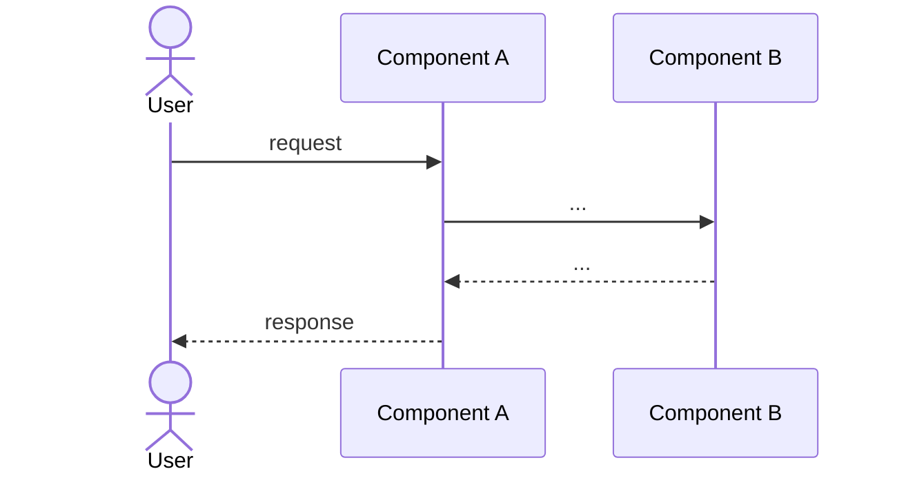

<!--
Template: SystemDesignDoc.
Authored by: architecture.design-system.
Required sections: Components, Data Flow, NFRs, Trust Boundaries.
Cross-refs: cite ADRs for individual decisions; cite PRD for product context.
Remove this comment before promoting.
-->

# System Design: <subsystem name>

- **Status:** proposed
- **Date:** <YYYY-MM-DD>
- **Architect:** <name>
- **PRD:** <link or id>
- **Related ADRs:** <list>

## Goals

<≤ 3 bullets. What this design must achieve. From the PRD's success metrics.>

## Non-Goals

<≤ 3 bullets. What this design explicitly does NOT solve.>

## Components

<2–5 components from `methodology.decompose`. Each:
- **Name + responsibility** (one sentence)
- **Inputs / outputs**
- **State it owns**>

### <Component A>

- **Responsibility:**
- **Inputs:**
- **Outputs:**
- **State:**

### <Component B>

- **Responsibility:**
- **Inputs:**
- **Outputs:**
- **State:**

## Data Flow

<Where does request enter, what each component does in sequence, where state
persists. ASCII diagram or Mermaid flowchart preferred.>

## Non-Functional Requirements (NFRs)

| Concern | Target | Measurement |
| --- | --- | --- |
| Latency p95 | <e.g., ≤ 300 ms> | <how measured> |
| Throughput | <e.g., 1000 req/s> | <how measured> |
| Availability | <e.g., 99.9%> | <SLO window> |
| Durability | <e.g., RPO ≤ 1 min> | <backup cadence> |
| Recovery | <e.g., RTO ≤ 30 min> | <DR drill cadence> |

## Trust Boundaries

<Where untrusted data crosses into trusted territory. `security` plugin
threat-models against these.>

- **Boundary 1:** <where + what crosses>
- **Boundary 2:** <where + what crosses>

## Required Reviews

- [ ] Security threat model (`security.threat-model`)
- [ ] Privacy impact assessment if PII flows (`security.run-pia`)
- [ ] Accessibility review if UI surfaces (`quality.audit-a11y`)
- [ ] Performance baseline (`quality.benchmark`)

## Risks

<Per `methodology.risk-assess`. Medium/high risks named with mitigation.>

## References

- PRD: <link>
- ADRs: <ids>
- Related designs: <list>
